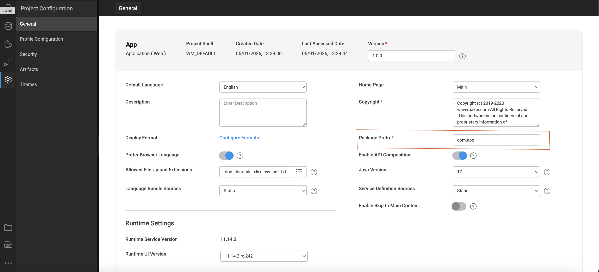

# API Composition Toolkit

The **API Composer Toolkit** in WaveMaker provides a way to orchestrate and compose APIs by combining multiple service endpoints into a single, unified backend API. It simplifies the creation of composite APIs and enables you to write custom business logic that aggregates responses from multiple services, which can then be bound to UI components or used elsewhere in your application. 

---

## What the API Composer Toolkit Does

The **API Composer Toolkit** allows you to create APIs that are optimized for frontend consumption. Instead of making multiple backend calls from the UI, you can design a single API that delivers exactly the data your application needs.

### Backend-for-Frontend API Composition

With the API Composer Toolkit, you can combine multiple backend services—such as **REST services, imported APIs, database services, and Java Services**—into a single composed API. You can also add custom business logic within a Java Service to orchestrate, transform, and aggregate responses from different services.

Once created, the composed API can be used as a variable in WaveMaker pages, enabling direct binding to widgets or client-side logic. This approach follows the **backend-for-frontend (BFF) pattern**, where APIs are tailored specifically to UI requirements, reducing complexity, improving performance, and simplifying frontend development.

---

## Supported Service Types

The API Composer Toolkit supports composing APIs from the following service types:

- REST Services  
- Imported APIs  
- Database Services  
- Java Services 

---

## Discovering Dependencies

When you import a service into your project:

- WaveMaker automatically generates Java code representing that service’s methods and models.  
- These generated classes are available when building a Java Service and can be autowired directly.  
- You can view and enable these dependencies via the service panel in the Java Service editor.  
- Selecting a method adds the necessary import and `@Autowired` declaration automatically. 

Once injected, you can invoke the service method from within your Java Service to implement aggregation logic. 

---

## Controlling API Composition

API Composition is enabled by default in WaveMaker. For existing projects, you can control this behavior through the Project Settings in WaveMaker Studio. Open Settings, navigate to Project Settings, and update the API Composition option as needed—either enabling or disabling it based on your requirements.

After changing this setting, make sure to reload the project and apply the update for the changes to take effect.

> **Warning:** Disabling API Composition when your code depends on generated service classes may cause compilation errors.

---

## Summary

The API Composer Toolkit empowers developers to:

- Create rich composite APIs by orchestrating multiple service endpoints in a Java Service.  
- Autowire and use any supported service type without writing repetitive boilerplate code.  
- Build backend APIs tailored for UI consumption or integration needs.

By enabling API composition, WaveMaker streamlines the process of aggregating and transforming data across services into meaningful, reusable backend APIs.
