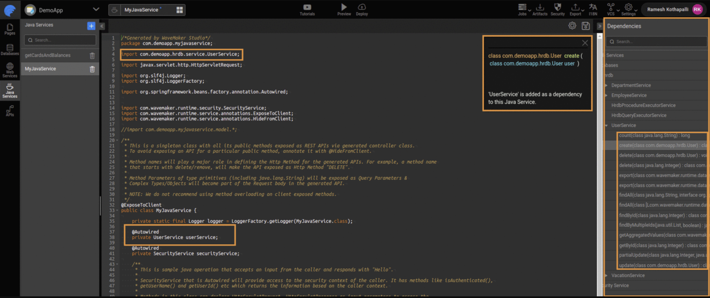
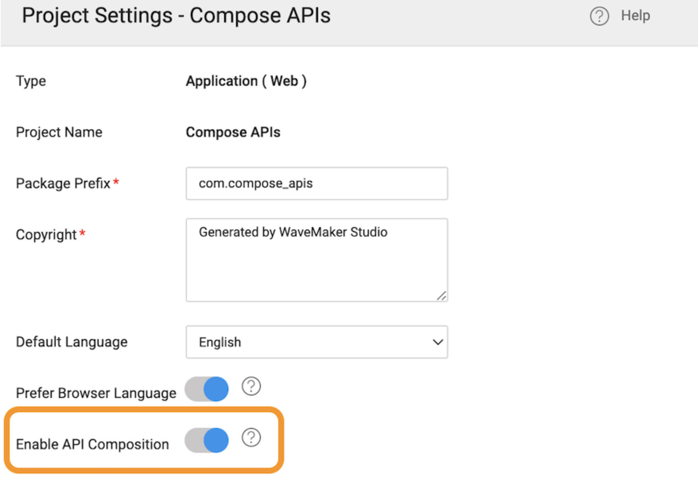
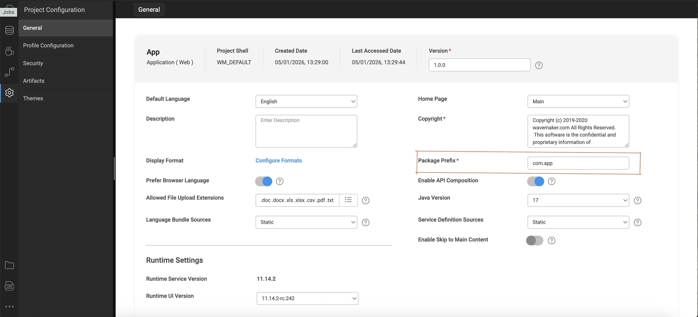

# API Orchestration using API Composition Toolkit

The **API Composer Toolkit** in WaveMaker provides a way to orchestrate and compose APIs by combining multiple service endpoints into a single, unified backend API. It simplifies the creation of composite APIs and enables you to write custom business logic that aggregates responses from multiple services, which can then be bound to UI components or used elsewhere in your application. 

---

## What API Composer Toolkit Does

### Backend-for-Frontend API Composition

With the API Composer Toolkit, you can:

- Combine multiple service endpoints (REST services, imported APIs, database services, Java Services) into a single API.  
- Write custom business logic in a Java Service that orchestrates responses from different services.  
- Use the composed API as a variable in WaveMaker pages and bind it directly to widgets or client logic. 
This approach supports a **backend-for-frontend** pattern where a tailored API aggregates and shapes data specifically for UI requirements. 

---

## Supported Service Types

The API Composer Toolkit supports composing APIs from the following service types:

- REST Services  
- Imported APIs  
- Database Services  
- Java Services 

---

## Discovering Dependencies

When you import a service into your project:

- WaveMaker automatically generates Java code representing that service’s methods and models.  
- These generated classes are available when building a Java Service and can be autowired directly.  
- You can view and enable these dependencies via the service panel in the Java Service editor.  
- Selecting a method adds the necessary import and `@Autowired` declaration automatically. 

Once injected, you can invoke the service method from within your Java Service to implement aggregation logic. 

---

## Controlling API Composition

API Composition is enabled by default in WaveMaker. It can be controlled as follows:

<!-- ### For New Projects

When creating a new project, you can choose whether to enable or disable API Composition.

 -->

### For Existing Projects

You can update the API Composition setting via the **Project Settings** dialog:

1. Open **Settings** in WaveMaker Studio.  
2. Select **Project Settings**.  
3. Enable or disable API Composition as required.

Once the setting is changed, you will need to reload the project and apply the update.  
> **Warning:** Disabling API Composition when your code depends on generated service classes may cause compilation errors.

---

## Summary

The API Composer Toolkit empowers developers to:

- Create rich composite APIs by orchestrating multiple service endpoints in a Java Service.  
- Autowire and use any supported service type without writing repetitive boilerplate code.  
- Build backend APIs tailored for UI consumption or integration needs.

By enabling API composition, WaveMaker streamlines the process of aggregating and transforming data across services into meaningful, reusable backend APIs.
