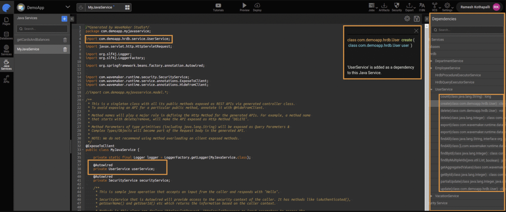

# Integrating Database Services in Java Services

WaveMaker automatically generates REST APIs when a database is added to your application. However, sometimes you need finer control or custom business logic that goes beyond the default APIs. In such cases, you can use the underlying database service classes directly within your Java Services.

By using Spring's `@Autowired` annotation, you can inject database service beans into a Java Service and call their methods to perform CRUD operations or execute business logic with full control. This reduces the boilerplate code needed for dependency management.

---

## Accessing Database Services from a Java Service

To work with database operations (such as create, retrieve, update, delete), follow these steps:

1. In the Java Service editor, open the **Dependencies** panel on the right.
2. Expand the database service (for example, `UserService`) you want to use.
3. Select the specific method you want to include and click **Add**.
   WaveMaker adds the necessary import and autowired declaration for you.

Once injected, you can use the service instance to call its methods directly inside your Java Service. For example, this lets you access the `User` table of a connected database.



---

## Handling Multiple Service Beans

Sometimes, there may be more than one bean of the same service type (for example, two implementations of `UserService`). In such cases, you must use the `@Qualifier` annotation along with `@Autowired` to specify which bean should be injected:

```java
import org.springframework.beans.factory.annotation.Autowired;
import org.springframework.beans.factory.annotation.Qualifier;
import com.<project_name>.hrdb.service.UserService;
import com.<project_name>.hrdb.User;

@ExposeToClient
public class MyJavaService {

    @Autowired
    @Qualifier("hrdb.userService")
    private UserService userService;

    public User getMyUser(int userId) {
        return userService.findById(userId);
    }
}
```

In this example:

- The `UserService` bean for the `hrdb` database is injected.
- The method `getMyUser` uses it to retrieve a user by ID.

## Using Transactions in Java Services

When you have multiple database operations that should be treated as a single unit of work, you can use Spring transactions within your Java Service methods. A transaction ensures that either all operations succeed (commit) or none are applied (rollback).

For example, consider creating and retrieving an employee:

```java
import org.springframework.beans.factory.annotation.Autowired;
import org.springframework.transaction.annotation.Transactional;
import com.hrdb.Employee;
import com.hrdb.service.EmployeeService;

@ExposeToClient
public class HrdbManager {

    @Autowired
    private EmployeeService employeeService;

    @Transactional(rollbackFor = Exception.class, value = "hrdbTransactionManager")
    public Employee createEmployee() {
        Employee employee = new Employee();
        // set properties...
        Employee saved = employeeService.create(employee);

        // This retrieval is part of the same transaction
        return employeeService.getById(saved.getEid());
    }
}
```

If any operation within the transaction fails, all changes will be rolled back, leaving the database in a consistent state.

## Accessing Named Queries

WaveMaker supports named queries defined in the database query editor. For each named query, WaveMaker generates a corresponding REST API and makes it available under the API Designer panel. These can be invoked using Java Services just like other database operations.


## Summary

By integrating database services within Java Services, you can:

- Directly leverage generated database service classes for CRUD operations.
- Use Spring's dependency injection to access services inside Java code.
- Handle complex logic, including transactions and multiple operations, with full control.
- Execute and integrate named queries programmatically.

This approach provides flexibility to implement custom business rules while still using WaveMaker's generated data access layer.

## How-To Guides

Learn more about working with APIs and Java services through these practical guides:

- [Accessing REST APIs from Java Service](/docs/guide/migrated-docs/accessing-rest-apis-java-service) - Call external REST APIs from Java code
- [Pre and Post Processing for Database Service APIs](/docs/guide/migrated-docs/pre-post-processing-db-service-apis) - Add hooks to database operations
- [Custom Status Code and Error Messages](/docs/guide/migrated-docs/custom-status-code-error-message-java-service) - Handle errors and HTTP responses


