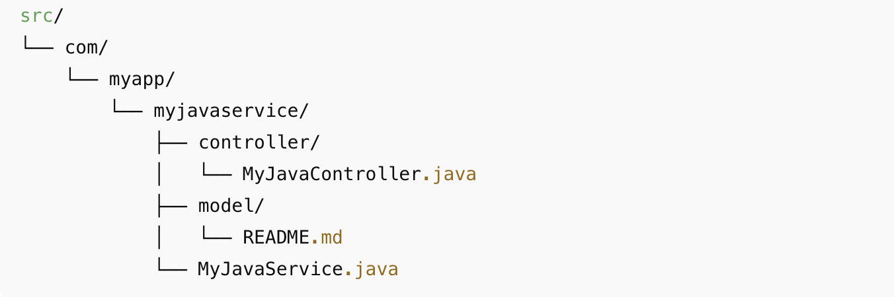

# Generated Code


WaveMaker enables developers to rapidly build backend services using standard Java by automatically generating a complete Java Service structure. This includes REST controllers, service classes, Spring configurations, and design-time metadata required for API exposure and management.

Built on proven enterprise frameworks such as Java and Spring, WaveMaker follows established backend design patterns that make Java services easy to develop, extend, and maintain. Developers have full access to the generated Java source code and can confidently customize business logic without impacting future platform upgrades.

---

## Folder Structure Overview

The following illustrates the folder structure generated by WaveMaker for a sample Java Service (`MyJavaService`):

```text
services/
├── authService/
├── hrdb/
└── MyJavaService/
    ├── designtime/
    │   ├── javaservice-rest-patch.json
    │   ├── MyJavaService_API.json
    │   └── service-info.json
    │
    ├── src/
    │   └── com/
    │       └── myapp/
    │           └── myjavaservice/
    │               ├── controller/
    │               │   └── MyJavaController.java
    │               │
    │               ├── model/
    │               │   └── README.md
    │               │
    │               └── MyJavaService.java
    │
    ├── servicedefs/
    │   └── MyJavaService-service-definitions.json
    │
    └── service_MyJavaService.spring.xml
```

---

## Design-time Artifacts

### `designtime/`

The designtime/ folder contains metadata used exclusively by WaveMaker Studio during application design and API configuration.

- **`MyJavaService_API.json`**  
  Defines REST API metadata for the Java Service, including endpoints, HTTP methods, and request/response definitions.

- **`javaservice-rest-patch.json`**  
  Stores customizations applied to the generated REST APIs, such as modified HTTP methods or parameter mappings.

- **`service-info.json`**  
  Holds general metadata about the Java Service, including service name and configuration details.

> **Note:**  
> These files are used exclusively at design time. Runtime execution depends only on the generated Java source code.

---

## Runtime Source Code

### `src/`

The src/ directory contains the Java source code that is compiled and executed at runtime.
<!-- 
 -->


- **`controller/`**  
  Contains REST controllers that expose Java methods as APIs.

- **`MyJavaController.java`**  
  Each public method in this controller is automatically exposed as a REST API.

- **`MyJavaService.java`**  
  Implements the core business logic invoked by the controller.

- **`model/`**  
  Holds request/response objects or helper classes used by the service.

---

## Service Definitions

### `servicedefs/`

This folder contains internal service definition metadata managed by the WaveMaker platform.

- **`MyJavaService-service-definitions.json`**  
  Describes the service interface and operation mappings managed by the platform.

---

## Spring Configuration

### `service_MyJavaService.spring.xml`

Defines Spring bean configurations for the Java Service, including dependency injection and wiring between controllers and service classes.

---

## How It Works

1. Business logic is implemented in `MyJavaService.java`.
2. Controller methods in `MyJavaController.java` expose the logic as REST APIs.
3. WaveMaker generates and maintains API metadata in the `designtime` folder.
4. APIs appear in **[API Explorer](../../../studio/workspaces/api-explorer.mdx) → Core APIs**.
5. Updates made in the API Designer are reflected in the design-time metadata automatically.

---

## Summary

- Design-time files support Studio configuration and API management.
- Runtime execution depends only on standard Java source code.
- APIs are automatically generated from controller methods.
- The structure provides transparency, extensibility, and full developer control.
