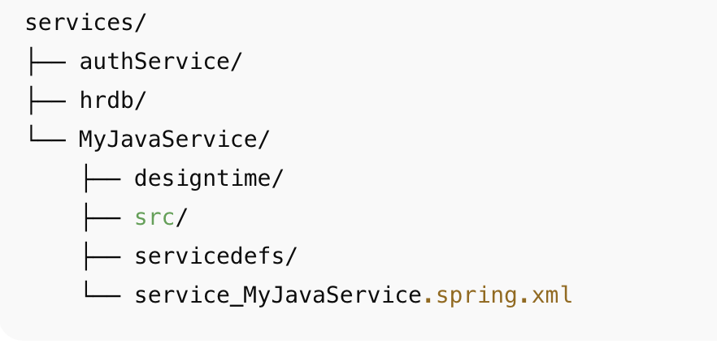
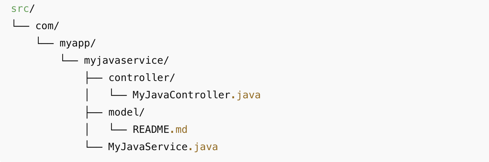

# Generated Code

### Java Service Structure (MyJavaService)

A Java Service in WaveMaker is composed of **design-time metadata** and **runtime Java source code**. This separation ensures that WaveMaker Studio can manage API definitions and configurations at design time, while runtime execution relies solely on standard Java code.

---

### Folder Structure Overview

---

## Design-time Artifacts

### `designtime/`

Contains metadata used by WaveMaker Studio during application design.

- **`MyJavaService_API.json`**  
  Defines REST API metadata for the Java Service, including endpoints, HTTP methods, and request/response definitions.

- **`javaservice-rest-patch.json`**  
  Stores customizations applied to the generated REST APIs, such as modified HTTP methods or parameter mappings.

- **`service-info.json`**  
  Holds general metadata about the Java Service, including service name and configuration details.

> **Note:**  
> These files are used exclusively at design time. Runtime execution depends only on the generated Java source code.

---

## Runtime Source Code

### `src/`

Contains the Java source code that is compiled and executed at runtime.

- **`controller/`**  
  Contains REST controllers that expose Java methods as APIs.

- **`MyJavaController.java`**  
  Each public method in this controller is automatically exposed as a REST API.

- **`MyJavaService.java`**  
  Implements the core business logic invoked by the controller.

- **`model/`**  
  Holds request/response objects or helper classes used by the service.

---

## Service Definitions

### `servicedefs/`

Contains service definition metadata used internally by WaveMaker.

- **`MyJavaService-service-definitions.json`**  
  Describes the service interface and operation mappings managed by the platform.

---

## Spring Configuration

### `service_MyJavaService.spring.xml`

Defines Spring bean configurations for the Java Service, including dependency injection and wiring between controllers and service classes.

---

## How It Works

1. Business logic is implemented in `MyJavaService.java`.
2. Controller methods in `MyJavaController.java` expose the logic as REST APIs.
3. WaveMaker generates and maintains API metadata in the `designtime` folder.
4. APIs appear in **API Designer → Core APIs**.
5. Updates made in the API Designer are reflected in the design-time metadata automatically.

---

## Key Takeaways

- Design-time files support Studio configuration and API management.
- Runtime execution depends only on standard Java source code.
- APIs are automatically generated from controller methods.
- The structure provides transparency, extensibility, and full developer control.
