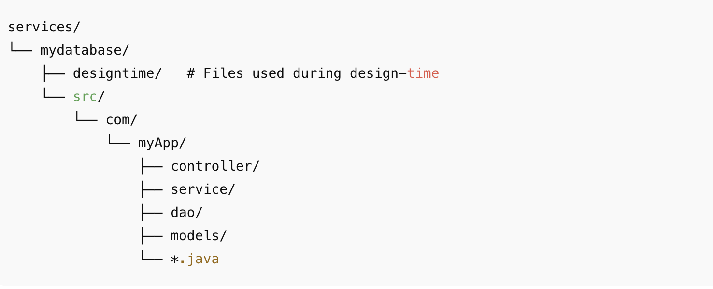
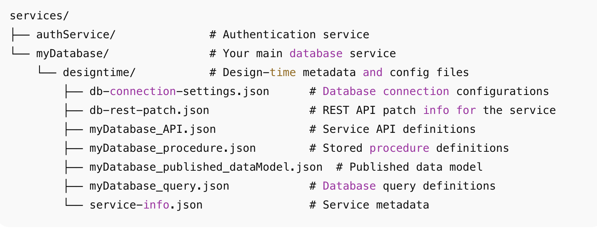

---
last_update:
  author: "Priyanka Bhadri"
---

# Generated Backend Code

## Overview

WaveMaker generates **fully readable, standards-based Java backend code**.  
The code is **not black-boxed** and follows established enterprise patterns using **Java, Spring, and Hibernate/JPA**.

Developers have full access to the source code and can safely extend it without impacting platform upgrades.

---

## Backend Architecture

WaveMaker generates a standard layered backend architecture.

- **REST Controllers** handle HTTP requests
- **Service layer** contains business logic
- **DAO / Repository layer** manages persistence using Hibernate/JPA
- **Entity models** represent database tables
- **Design-time metadata** supports Studio features only

This architecture aligns with common **Spring Boot** application practices.

---

## Project Structure

Generated backend code is organized under the `services` directory using a conventional Java package layout.

Each layer has a clear responsibility, making the codebase easy to understand, debug, and customize.

---

## Layers

### Controller Layer (`controller`)

**Purpose**
- Exposes REST APIs to clients

**Key Responsibilities**
- Request and response handling
- Input validation and authorization
- JSON serialization and deserialization

**Notes**
- Implemented using Spring REST controllers
- Supports adding custom endpoints and security logic

---

### Service Layer (`service`)

**Purpose**
- Contains application and business logic

**Key Responsibilities**
- Business rule implementation
- Transaction management
- Coordination between controllers and repositories

**Notes**
- Recommended layer for custom logic
- Not overwritten during regeneration or upgrades

---

### DAO / Repository Layer (`dao`)

**Purpose**
- Handles database access using ORM

**Key Responsibilities**
- CRUD operations via Hibernate/JPA
- Query execution and result mapping
- Database abstraction

**Generated Features**
- CRUD APIs per entity
- Pagination and filtering
- Count and export operations
- Support for **custom SQL queries and stored procedures**

**Notes**
- Uses standard JPA repositories
- No proprietary data-access framework

---

### Model Layer (`models` / Entities)

**Purpose**
- Maps database schema to Java objects

**Key Responsibilities**
- Field and relationship definitions
- JPA annotations for table mapping

**Notes**
- Plain Java POJOs
- Fully extensible and reusable

---

### Design-time Configuration (`designtime`)

**Purpose**
- Stores metadata used by WaveMaker Studio

**Includes**
- Database definitions
- API metadata
- Query and stored procedure definitions

**Notes**
- Used only at design time
- Runtime execution relies solely on generated Java code

---

## Summary

WaveMaker generates a **clean, layered, and extensible Java backend** aligned with standard Spring practices.

Developers can inspect, extend, and maintain the codebase while benefiting from **rapid API generation** and **upgrade-safe customization**.
