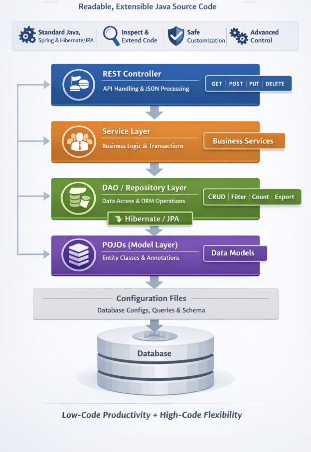

---
last_update:
  author: "Priyanka Bhadri"
---

# Generated Backend Code

## Overview

WaveMaker generates **fully readable, standards-based Java backend code**.  
The code is **not black-boxed** and follows established enterprise patterns using **Java, Spring, and Hibernate/JPA**.

Developers have full access to the source code and can safely extend it without impacting platform upgrades.

---

## Backend Architecture

WaveMaker generates a standard layered backend architecture.

- **REST Controllers** handle HTTP requests
- **Service layer** contains business logic
- **DAO / Repository layer** manages persistence using Hibernate/JPA
- **Entity models** represent database tables
- **Design-time metadata** supports Studio features only

This architecture aligns with common **Spring Boot** application practices.



---

## Project Structure

Generated backend code is organized under the `services` directory using a conventional Java package layout.

Each layer has a clear responsibility, making the codebase easy to understand, debug, and customize.

```text
services/
└── mydatabase/
    ├── designtime/                 # Files used during design-time
    └── src/
        └── com/
            └── myApp/
                ├── controller/
                ├── service/
                ├── dao/
                ├── models/
                └── *.java
```

---

## Layers

### Controller Layer (`controller`)

- Exposes REST APIs to clients
- Handles request and response processing, input validation and authorization, and JSON serialization/deserialization
- Implemented using Spring REST controllers and supports adding custom endpoints and security logic

---

### Service Layer (`service`)

- Contains application and business logic
- Responsible for business rule implementation, transaction management, and coordinating between controllers and repositories
- Recommended layer for custom logic; changes here are not overwritten during regeneration or upgrades

---

### DAO / Repository Layer (`dao`)

- Handles database access using ORM (Hibernate/JPA)
- Implements CRUD operations, query execution, and result mapping
- Provides pagination, filtering, count and export operations; supports custom SQL queries and stored procedures
- Uses standard JPA repositories and does not rely on a proprietary data-access framework

---

### Model Layer (`models` / Entities)

- Maps database schema to Java objects, defining fields and relationships
- Includes JPA annotations for table mapping
- Generated models are plain Java POJOs that are fully extensible and reusable

---

### Design-time Configuration (`designtime`)

- Stores metadata used by WaveMaker Studio
- Used at design time; runtime uses generated Java code


**Structure**
```text
services/
└── myDatabase/                      # Main database service
    └── designtime/                  # Design-time metadata and configuration
        ├── db-connection-settings.json
        ├── db-rest-patch.json
        ├── myDatabase_API.json
        ├── myDatabase_procedure.json
        ├── myDatabase_published_dataModel.json
        ├── myDatabase_query.json
        └── service-info.json
```
---

## Summary

WaveMaker generates a **clean, layered, and extensible Java backend** aligned with standard Spring practices.

Developers can inspect, extend, and maintain the codebase while benefiting from **rapid API generation** and **upgrade-safe customization**.
