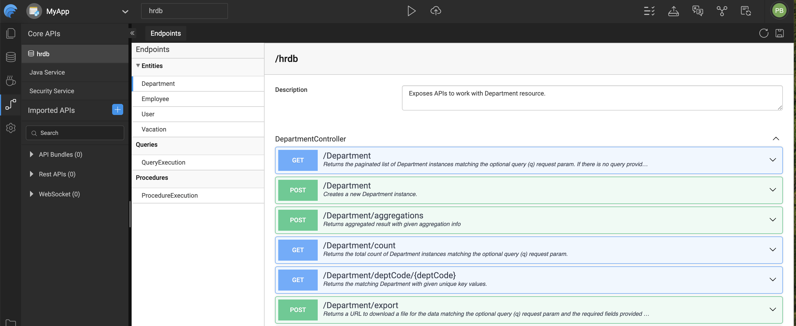
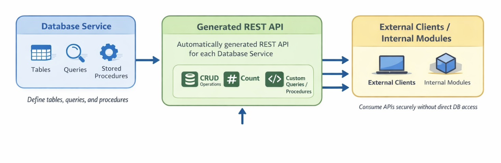

# Generated APIs

WaveMaker provides an API-driven approach, automatically generating REST APIs for Database Services, Java Services, and Security Services. The **API Designer** allows you to explore, manage, and test these APIs within the WaveMaker Studio.

---

## 1. API Designer

The **API Designer** is the central interface for managing all service APIs in your application. It provides:

- **API Exploration**: View all available APIs, their endpoints, and metadata.
- **Testing**: Test API calls directly within WaveMaker Studio without external tools.
- **Customization**: Modify Java Service APIs and control which endpoints are exposed.

All APIs—whether from Database Services or custom Java Services—can be viewed and configured here.

---

## 2. Database APIs

WaveMaker automatically generates REST APIs for every **Database Service**, providing secure access to tables, queries, and stored procedures. These APIs allow both internal modules and external clients to interact with your database efficiently.

### Key Features

- **CRUD Operations**: Create, Read, Update, and Delete records in tables.
- **Query & Procedure Access**: Expose custom queries and stored procedures as REST endpoints.
- **Design-time Control**: Use API Designer to configure request/response formats and endpoint visibility.
- **Security Integration**: Enforces authentication and authorization rules automatically.

### CRUD and Count Operations

WaveMaker Database APIs automatically expose CRUD operations for every table in your Database Service, along with a **Count** operation to efficiently determine the number of records in a table.

#### Create (POST)
- Adds a new record to a database table.
- Request body includes all required fields.
- Returns the created record with its unique identifier.

#### Read (GET)
- Retrieves data from tables.
- Supports fetching all records, filtering using query parameters, fetching by unique ID, pagination, and sorting.
  
#### Update (PUT / PATCH)
- Modifies existing records.
- `PUT` replaces the entire record.
- `PATCH` updates only the provided fields.

#### Delete (DELETE)
- Removes a record by its unique identifier.
- Ensures deletion respects database constraints and business rules.

#### Count (GET /count)
- Returns the total number of records in a table, optionally filtered by query parameters.
- Useful for pagination, analytics, or determining dataset sizes without fetching full records.

**Notes:**
- All operations enforce authentication and authorization automatically.
- Input validation, error handling, and standardized responses are managed by WaveMaker.
- CRUD and Count operations can be combined with custom queries and stored procedures for advanced workflows.

**Explanation:**

1. **Database Service**: Represents your database tables, queries, and stored procedures.
2. **Generated REST API**: WaveMaker exposes these as secure endpoints supporting CRUD and custom operations.
3. **Clients / Modules**: Consume APIs without direct database access, while respecting security and authorization rules.

---

## 3. Benefits

- **Rapid Development**: No manual coding needed to expose database functionality.
- **Consistency**: Standardized REST endpoints for all Database Services.
- **Security**: Automatically inherits the app’s authentication and authorization settings.
- **Extensibility**: APIs can be customized using Java Services or additional logic.
