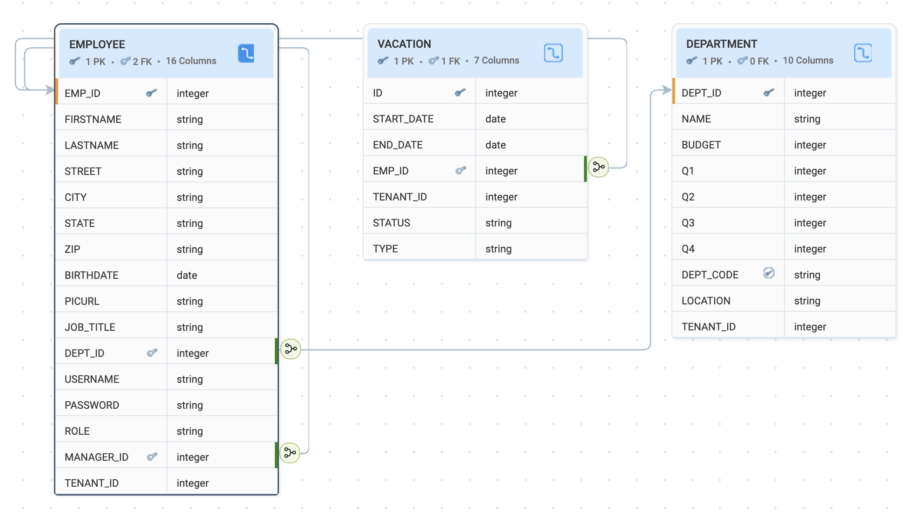

import RedocDocs from '@site/src/components/swaggerfile';

# Generated APIs

WaveMaker provides an API-driven approach for Database Services, automatically generating a comprehensive set of REST APIs for each service. These APIs cover:

- **Full CRUD lifecycle** – create, read, update, and delete records
- **Partial and complete updates** – update specific fields or entire entities
- **Filtering and counting** – query data with conditions and retrieve record counts
- **Aggregation and analytics** – perform sums, averages, and other aggregate calculations
- **Relationship navigation** – access related entities and traverse relationships
- **Data export capabilities** – download results in Excel or CSV formats
- **Query & Procedure Access** – expose custom queries and stored procedures as REST endpoints  
- **Design-time Control** – configure request/response formats and endpoint visibility 

These APIs are fully secured, configurable, and ready for immediate consumption by internal modules or external clients. This eliminates the need for manual REST API development, ensuring consistent, predictable, and production-ready endpoints for all Database Services.

They are easily accessible and manageable within WaveMaker. All APIs can be viewed and configured here [API Explorer](../../../studio/workspaces/api-explorer.mdx)

---

<!-- ## How It Works

**Database Service**: Represents your database tables, queries, and stored procedures.  

**Generated REST API**: WaveMaker exposes these as secure endpoints supporting CRUD and custom operations.  

**API Integration**: Consume APIs without direct database access, while respecting security and authorization rules. -->

<!-- ## Database APIs

WaveMaker generates multiple REST APIs for each database entity to support data management, querying, aggregation, export, and relationship handling. Below is an overview of the commonly generated APIs and their purpose.

### Key Features

- **CRUD Operations**: Create, Read, Update, and Delete records in tables.
- **Query & Procedure Access**: Expose custom queries and stored procedures as REST endpoints.
- **Design-time Control**: Use API Designer to configure request/response formats and endpoint visibility.
- **Security Integration**: Enforces authentication and authorization rules automatically. -->

<!-- ## Database APIs Swagger

The following Swagger documentation is generated for this database service reference. It provides a complete overview of the REST APIs automatically generated by WaveMaker for the database, including all tables, queries, and stored procedures. -->

<!-- ## How It Works

**Database Service**  
Consider an HR database service that includes tables such as `EMPLOYEE`, `DEPARTMENT`, and `VACATION`, along with related queries and stored procedures. These database artifacts together form the Database Service.

**Generated REST APIs**  
For each table and database artifact in this HR database, WaveMaker automatically generates secure REST APIs.  
For example, the `EMPLOYEE` and `DEPARTMENT` tables are exposed through APIs that support CRUD operations, filtering, aggregation, relationship navigation, and data export. -->

 ## Generated Database APIs

<!-- ### Database Service -->
<!-- Consider an HR database service that includes tables such as `EMPLOYEE`, `DEPARTMENT`, and `VACATION`, along with related queries and stored procedures. Together, these database artifacts form the Database Service. Details about table structure, relationships, and schema design can be explored from the [Database Workspace](../../../studio/workspaces/database-workspace.md). -->

Consider an HR database service that includes tables such as `EMPLOYEE`, `DEPARTMENT`, and `VACATION`, along with related queries and stored procedures. Together, these database artifacts form the Database Service. The database schema for this service is shown below. These tables can also be viewed directly in the [Database Explorer](../../../studio/workspaces/database-explorer.mdx)

<!-- ### Generated REST APIs
For each table and database artifact in this HR database, WaveMaker automatically generates secure REST APIs.  
For example, the `EMPLOYEE` and `DEPARTMENT` tables are exposed through APIs that support CRUD operations, filtering, aggregation, relationship navigation, and data export.

### API Integration
Application modules or external systems interact with the HR database by consuming these generated APIs rather than accessing the database directly. This ensures consistent enforcement of authentication, authorization, and security rules. For a detailed overview of how security is configured and applied, refer to the [Security documentation](../../security). -->

---

Based on these tables—such as `EMPLOYEE`, `DEPARTMENT`, and `VACATION`—WaveMaker automatically generates REST APIs for data access and operations. The API reference lists all such endpoints, along with their request and response models, supported parameters, and security details.

**Notes:**
- All operations enforce authentication and authorization. For a detailed overview of how security is configured and applied, refer to the [Security documentation](../../security).
- Input validation, error handling, and standardized responses are managed by WaveMaker.
- CRUD and Count operations can be combined with custom queries and stored procedures for advanced workflows.

This reference can be used to explore and test APIs derived from each database table, query, and stored procedure before integrating them into application modules or external systems.

<!-- Use this Swagger to explore, test, and integrate the APIs with your internal modules or external clients without needing direct database access. -->

<RedocDocs specUrl="/swagger.json" />

<!-- **Explanation:**

1. **Database Service**: Represents your database tables, queries, and stored procedures.
2. **Generated REST API**: WaveMaker exposes these as secure endpoints supporting CRUD and custom operations.
3. **Clients / Modules**: Consume APIs without direct database access, while respecting security and authorization rules. -->

---

## Summary

- **Rapid Development**: No manual coding needed to expose database functionality.
- **Consistency**: Standardized REST endpoints for all Database Services.
- **Security**: Automatically inherits the app's authentication and authorization settings.
- **Extensibility**: APIs can be customized using Java Services or additional logic.

---

## How-To Guides

Learn more about working with databases and generated APIs through these practical guides:

- [Fetching Records from Database](/docs/guide/migrated-docs/fetch-default-number100-records-database) - Control default record retrieval behavior
- [Working with One-to-Many Relationships](/docs/guide/migrated-docs/one-many-relationship) - Handle entity relationships in APIs
- [Working with Temporals](/docs/guide/migrated-docs/working-with-temporals) - Manage date and time data types
- [Row-Level Security Using CRUD Event Listeners](/docs/guide/migrated-docs/rowlevel-security-using-crud-event-listeners) - Implement fine-grained access control
- [Validations Using CRUD Listeners](/docs/guide/migrated-docs/validations-using-crudListeners) - Add custom validation logic
- [Custom Business Logic Using CRUD Event Listeners](/docs/guide/migrated-docs/custom-business-logic-using-crud-event-listeners) - Extend database operations with custom code

---

<!-- ## Summary

WaveMaker automatically generates a comprehensive set of APIs that cover:

- Full CRUD lifecycle
- Partial and complete updates
- Filtering and counting
- Aggregation and analytics
- Relationship navigation
- Data export capabilities

These APIs are fully secured, configurable through the API Designer, and ready for consumption by internal modules or external clients—eliminating the need for manual REST API development. -->
