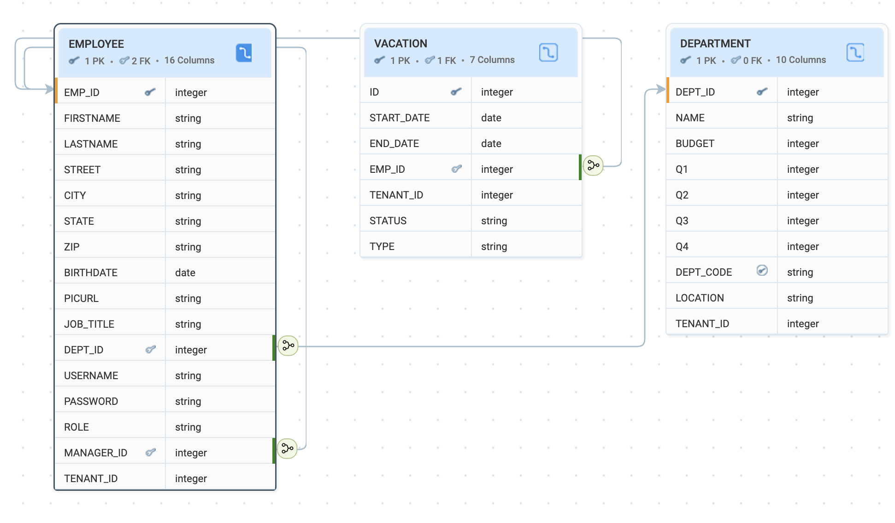

import RedocDocs from '@site/src/components/swaggerfile';

# Generated APIs

WaveMaker provides an API-driven approach for Database Services, automatically generating a comprehensive set of REST APIs for each service. These APIs cover:

- **Full CRUD lifecycle** – create, read, update, and delete records
- **Partial and complete updates** – update specific fields or entire entities
- **Filtering and counting** – query data with conditions and retrieve record counts
- **Aggregation and analytics** – perform sums, averages, and other aggregate calculations
- **Relationship navigation** – access related entities and traverse relationships
- **Data export capabilities** – download results in Excel or CSV formats
- **Query & Procedure Access** – expose custom queries and stored procedures as REST endpoints  
- **Design-time Control** – configure request/response formats and endpoint visibility 

These APIs are fully secured, configurable, and ready for immediate consumption by internal modules or external clients. This eliminates the need for manual REST API development, ensuring consistent, predictable, and production-ready endpoints for all Database Services.

They are easily accessible and manageable within WaveMaker. All APIs can be viewed and configured here [API Workspace](../../../studio/workspaces/api-workspace.md)

---

## How It Works

**Database Service**: Represents your database tables, queries, and stored procedures.  

**Generated REST API**: WaveMaker exposes these as secure endpoints supporting CRUD and custom operations.  

**Clients / Modules**: Consume APIs without direct database access, while respecting security and authorization rules.

<!-- ## Database APIs

WaveMaker generates multiple REST APIs for each database entity to support data management, querying, aggregation, export, and relationship handling. Below is an overview of the commonly generated APIs and their purpose.

### Key Features

- **CRUD Operations**: Create, Read, Update, and Delete records in tables.
- **Query & Procedure Access**: Expose custom queries and stored procedures as REST endpoints.
- **Design-time Control**: Use API Designer to configure request/response formats and endpoint visibility.
- **Security Integration**: Enforces authentication and authorization rules automatically. -->

## Database APIs Swagger

The following Swagger documentation is generated for this database service reference. It provides a complete overview of the REST APIs automatically generated by WaveMaker for the database, including all tables, queries, and stored procedures.

Use this Swagger to explore, test, and integrate the APIs with your internal modules or external clients without needing direct database access.

<RedocDocs specUrl="/swagger.json" />

**Notes:**
- All operations enforce authentication and authorization.
- Input validation, error handling, and standardized responses are managed by WaveMaker.
- CRUD and Count operations can be combined with custom queries and stored procedures for advanced workflows.

<!-- **Explanation:**

1. **Database Service**: Represents your database tables, queries, and stored procedures.
2. **Generated REST API**: WaveMaker exposes these as secure endpoints supporting CRUD and custom operations.
3. **Clients / Modules**: Consume APIs without direct database access, while respecting security and authorization rules. -->

---

## Summary

- **Rapid Development**: No manual coding needed to expose database functionality.
- **Consistency**: Standardized REST endpoints for all Database Services.
- **Security**: Automatically inherits the app’s authentication and authorization settings.
- **Extensibility**: APIs can be customized using Java Services or additional logic.

<!-- ## Summary

WaveMaker automatically generates a comprehensive set of APIs that cover:

- Full CRUD lifecycle
- Partial and complete updates
- Filtering and counting
- Aggregation and analytics
- Relationship navigation
- Data export capabilities

These APIs are fully secured, configurable through the API Designer, and ready for consumption by internal modules or external clients—eliminating the need for manual REST API development. -->
