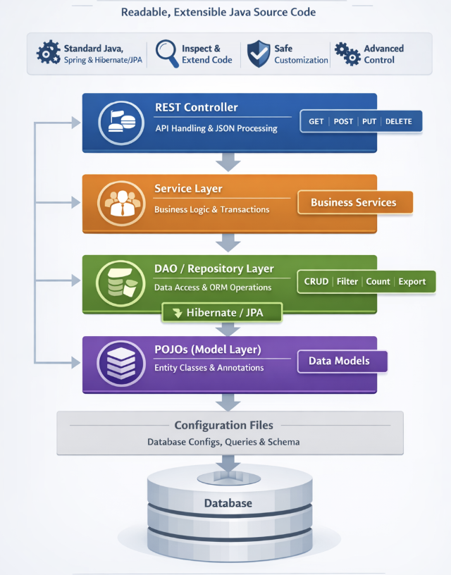

# Generated Code

## Overview

WaveMaker is **not a black box**. The platform generates **fully readable, standards-based Java source code** that follows proven enterprise architecture patterns. All backend artifacts are built using **Java, Spring, and Hibernate/JPA**, providing complete transparency and control to developers.

This approach enables teams to achieve **low-code development speed** while retaining the **flexibility, extensibility, and governance** expected from traditional enterprise applications.

---

## Key Characteristics

- Backend services are generated using **standard Java frameworks**
- Source code is **fully accessible and inspectable**
- Custom business logic can be added without impacting platform upgrades
- Generated code follows **layered architectural best practices**
- Suitable for advanced enterprise and integration-driven use cases

---

**WaveMaker Generated Backend Architecture**

This diagram illustrates the layered backend architecture generated by WaveMaker. Client requests are handled by REST controllers, processed through service-layer business logic, and persisted using DAO/repository components backed by Hibernate/JPA. Entity models represent database tables, while design-time configuration supports application development without impacting runtime execution. The architecture follows standard Java and Spring practices, ensuring transparency, extensibility, and enterprise readiness.

---

## Generated Project Structure

WaveMaker generates a conventional Java project structure under the `services` directory, aligned with industry-standard backend design principles.

Each layer has a clearly defined responsibility, ensuring separation of concerns, maintainability, and extensibility.

---

## Layered Architecture

### REST Controller Layer (`controller`)

**Purpose**  
Acts as the API entry point for client applications.

**Responsibilities**
- Expose RESTful endpoints
- Handle request and response lifecycle
- Perform authorization and request validation
- Marshal and unmarshal JSON payloads

**Implementation Notes**
- Implemented using standard Spring REST controllers
- Can be extended to add custom endpoints or security logic

---

### Service Layer (`service`)

**Purpose**  
Encapsulates business logic and application workflows.

**Responsibilities**
- Implement business rules
- Validate input data
- Manage transactions
- Coordinate interactions between controllers and DAO layer

**Implementation Notes**
- Recommended layer for adding custom logic
- Isolated from regeneration during platform upgrades

---

### DAO / Repository Layer (`dao`)

**Purpose**  
Provides database access using ORM abstractions.

**Responsibilities**
- Interact with the database via Hibernate/JPA
- Execute persistence operations
- Abstract database-specific logic

**Generated Capabilities**
- CRUD APIs for each entity
- Filter APIs
- Count APIs
- Export APIs
- Support for custom queries and stored procedures

**Implementation Notes**
- Uses standard JPA repositories
- Avoids proprietary data-access abstractions

---

### Model Layer (`models` and Entity Classes)

**Purpose**  
Represents database tables as Java objects.

**Responsibilities**
- Define entity fields and relationships
- Map database schema using JPA annotations
- Serve as data carriers across application layers

**Implementation Notes**
- Plain Old Java Objects (POJOs)
- Fully extensible and reusable

---

### Design-time Configuration (`designtime`)

**Purpose**  
Stores metadata required by WaveMaker Studio during application design.

**Contents**
- Database connection definitions
- API specifications
- Query and procedure metadata
- Schema information

**Implementation Notes**
- Used exclusively at design time
- Runtime execution depends only on generated Java source code

---

## ORM Artifacts

WaveMaker generates ORM artifacts that conform to Hibernate/JPA standards:

- Entity classes
- Repository interfaces
- Generated CRUD methods
- Query definitions and mappings

---

## Summary

WaveMaker combines the productivity of low-code development with the robustness of high-code architectures by generating transparent, layered, and standards-based backend services. Developers retain full ownership and control of the code while benefiting from rapid application delivery.
