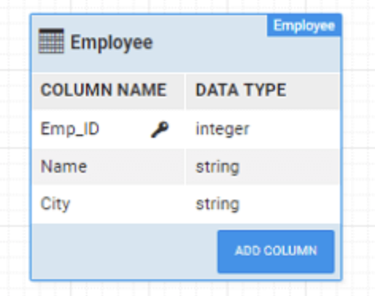
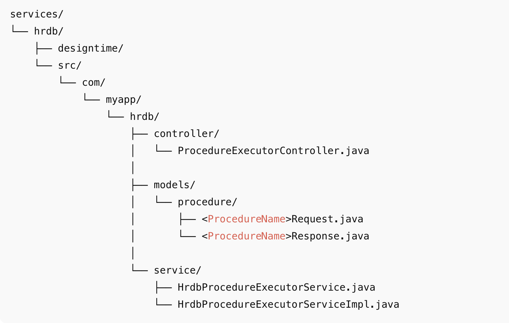

# Stored Procedures

In enterprise-grade applications, standard CRUD APIs are often insufficient for implementing complex database logic such as multi-step transactions, batch operations, conditional processing, or reusable routines shared across applications.  

For these scenarios, **stored procedures** provide a reliable and efficient mechanism to encapsulate business logic directly at the database level.

WaveMaker enables seamless integration with existing database stored procedures by allowing you to configure and invoke them without writing custom backend code. Once configured, stored procedures are automatically exposed as secure **REST APIs**, making them easy to consume from the UI or other services.

A **stored procedure** is a precompiled SQL program stored in the database that can:
- Accept input parameters
- Return output values
- Produce one or more result sets

---

## When to Use Stored Procedures

Use stored procedures in WaveMaker when:

- Business logic already exists in the database
- Multiple SQL operations must be executed atomically
- Performance-sensitive operations must run close to the data
- The same database logic must be reused across applications
- Database-level validation or conditional logic is required

---

## Procedure Tab in Database Designer

Stored procedures are configured using the **Procedure** tab within the **[Database Explorer](../../../studio/workspaces/database-explorer.mdx)** of a Database Service.

Using this tab, you can:

- Invoke existing stored procedures or functions
- Configure parameter modes and data types
- Execute and validate procedures
- Save procedures to generate REST APIs

Once saved, the procedure is available as a **Database API** and can be accessed from the **API Designer** or consumed directly in the application.

---

## Procedure Parameters

WaveMaker automatically detects the parameters defined in the stored procedure and allows you to configure them explicitly.

### Parameter Modes

Each parameter must be assigned one of the following modes:

- **IN** – Input-only parameter passed from the client
- **OUT** – Output-only parameter returned by the procedure
- **IN-OUT** – Used both as input and output

### Parameter Data Types

Each parameter must be mapped to a compatible data type that matches the database definition.

:::note
Supported parameter types depend on the underlying database. Certain database-specific types (for example, Oracle cursors) are supported only on compatible databases.
:::

---

## Server-Side and Environment Parameters

In addition to client-provided values, stored procedure parameters can be bound to server-side values that are resolved automatically at runtime.

### Supported Server Properties

- Logged-in User ID
- Logged-in User Name
- Current Date
- Current Time
- Current Date and Time

### App Environment Properties

Parameters can also be bound to **App Environment Properties**, enabling different values to be supplied based on the deployment environment (development, testing, production).

---

## Handling Result Sets and Cursors

Stored procedures may return one or more result sets, also referred to as **cursors**.

### Undefined Cursors

When a procedure returns an undefined cursor:

- WaveMaker generates a `content` field in the response model
- A corresponding POJO is generated to represent the cursor structure
- The result set is automatically mapped to the generated model

Each cursor is represented as a structured Java object, making it easy to bind the results to UI components such as tables or charts.

---

## Creating Stored Procedures

Stored procedures and functions must be created directly in the database using the database’s native SQL tools.

Once created:

- They are automatically discovered by WaveMaker
- They become visible in the Database Designer
- They can be invoked using the **Procedure** tab
- No additional import or configuration is required

---

## Example: Employee Stored Procedure

The database contains an `Employee` table with the following columns:




### Stored Procedure Example

```sql
DELIMITER ;;
CREATE PROCEDURE emp_in_out(IN in_city varchar(255), OUT total integer)
BEGIN
    SELECT COUNT(Emp_ID)
    INTO total
    FROM Employee
    WHERE City = in_city;
END;;
DELIMITER ;
```

### Function Example

```sql
DELIMITER ;;
CREATE FUNCTION emp_in_out(in_city varchar(255)) RETURNS integer
BEGIN
    DECLARE emp_tot INT;
    SELECT COUNT(Emp_ID)
    INTO emp_tot
    FROM Employee
    WHERE City = in_city;
    RETURN emp_tot;
END;;
DELIMITER ;
```

---

## Invoking Stored Procedures in WaveMaker

To invoke a stored procedure or function:

1. Open the Database Service in **Database Designer**
2. Navigate to the **Procedure** tab
3. Use database-specific syntax to invoke the procedure

**Stored procedure example:**

```sql
CALL my_procedure(:inputParam, :outputParam)
```

**Function example:**

```sql
{{ :result = call my_function(:inputParam) }}
```

4. Use `Ctrl + Space` to view available procedures
5. Configure parameter modes and data types
6. Execute the procedure to validate it
7. Save the procedure to generate the REST API

---

## Database-Specific Invocation Syntax

Stored procedure invocation syntax varies by database:

### MySQL / DB2

```sql
CALL procedure_name(:param1, :param2)
```

### Oracle

```sql
CALL package_name.procedure_name(:param1, :param2)
```

### PostgreSQL

```sql
SELECT procedure_name(:param1, :param2)
```

### SQL Server (MSSQL)

```sql
EXEC schema_name.procedure_name :param1, :param2
```

To invoke SQL Server functions:

```sql
SELECT * FROM function_name(:param1, :param2)
```

---

## Generated Backend Artifacts

When a stored procedure is saved, WaveMaker generates backend code to expose it securely as a REST API.

### Generated Project Structure

```text
services/
└── hrdb/                             # Main HR database service
    ├── designtime/                   # Design-time metadata and configuration
    └── src/
        └── com/
            └── myapp/
                └── hrdb/
                    ├── controller/       # REST controllers for procedure execution
                    │   └── ProcedureExecutionController.java
                    │
                    ├── models/           # Generated request and response POJOs
                    │   └── procedure/
                    │       ├── <ProcedureName>Request.java
                    │       └── <ProcedureName>Response.java
                    │
                    └── service/          # Procedure execution services
                        ├── HrdbProcedureExecutorService.java
                        └── HrdbProcedureExecutorServiceImpl.java
```

<!--  -->

Any query created and saved in this Database Service is mapped into the models, service, and controller layers shown above.

### How Procedures Map to This Structure

Any procedure—whether returning result sets or performing updates—is automatically mapped into this architecture when imported:

- **Procedure output** → `models.procedure`
- **Execution logic** → `service`
- **REST exposure** → `controller`

This ensures consistent API generation, clean separation of concerns, and predictable backend behavior for all database queries.

### Generated Models
For SELECT queries, WaveMaker generates a response POJO in `<service_package>.models.procedure` , with fields corresponding to the query output columns.
Both Request and Response POJO classes are generated as: `<procedureName>Request/Response`


A response model is generated only if the procedure returns:

- OUT parameters
- IN-OUT parameters
- Result sets (cursors)

**Additional notes:**

- Procedures without output return `Void`
- Each cursor generates a corresponding POJO
- Undefined cursors are mapped to a `content` field

---

### Generated Services

WaveMaker generates a service layer for procedure execution `ProcedureExecutorService` in `<service_package>.service`
The following service interface and implementation are generated:

- `<DatabaseName>ProcedureExecutorService` 
- `<DatabaseName>ProcedureExecutorServiceImpl`

For every saved procedure, the following methods are generated:

**Execution method:**`execute<ProcedureName>`

**Method arguments:**

- Request object (if generated), or
- Individual IN parameters

**Return type:**

- Response model, or
- `Void` if no output is returned

---

### Generated Controllers

WaveMaker also generates REST controllers `ProcedureExecutorController` in  `<service_package>.controller`


**Key characteristics:**

- Each procedure is exposed as a REST endpoint
- Rest API is generated for each configured query and procedure. Generated method signature will be same as service layer method signature.

---

## Summary

WaveMaker's stored procedure support enables you to reuse existing database logic while exposing it as REST APIs with minimal configuration. This approach allows you to:

- Execute complex database operations efficiently
- Preserve database-level business logic
- Bind inputs and outputs directly to the UI
- Maintain visibility into generated backend code

