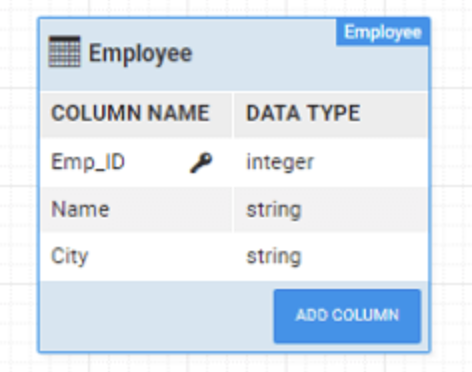
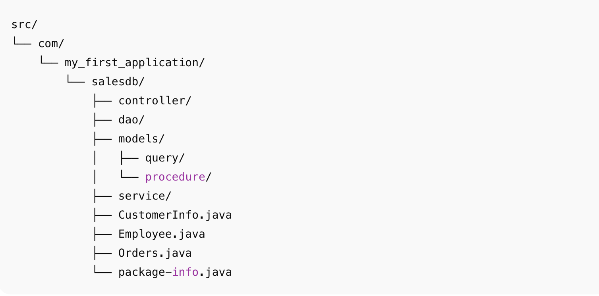

# Stored Procedures

In many enterprise applications, standard CRUD APIs are not sufficient to handle complex business logic such as multi-step transactions, batch processing, conditional logic, or reusable database routines. For these scenarios, **stored procedures** provide a robust and efficient solution.

WaveMaker enables seamless integration with database stored procedures by allowing you to invoke existing procedures, configure parameters, and automatically expose them as secure REST APIs—without writing manual backend code.

A **stored procedure** is a precompiled SQL program stored in the database that can accept input parameters, return output values, and produce result sets.

---

## Procedure Tab in Database Designer

The **Procedure** tab is available within the **Database Designer** of a Database Service. It is used to configure and invoke stored procedures that already exist in the connected database.

Using this tab, you can:
- Write the procedure invocation syntax
- Execute and validate the procedure
- Configure parameters and their types
- Save the procedure to generate REST APIs

Once saved, the procedure becomes available as a Database API and can be accessed from the **API Designer** and used throughout the application.

---

## Procedure Parameters

WaveMaker automatically detects the parameters defined in the stored procedure and allows you to configure them explicitly.

### Parameter Modes

Each parameter must be assigned one of the following modes:

- **IN** – Input-only parameter passed from the client
- **OUT** – Output-only parameter returned by the procedure
- **IN-OUT** – Used both as input and output

### Parameter Data Types

Each parameter must also be mapped to an appropriate data type that matches the database definition. Supported types depend on the underlying database.

> Some database-specific types (for example, cursors in Oracle) are supported only on compatible databases.

---

## Server-Side and Environment Parameters

In addition to user-provided values, stored procedure parameters can be bound to server-side properties that are resolved automatically at runtime.

### Supported Server Properties

- Logged-in User ID
- Logged-in User Name
- Current Date
- Current Time
- Current Date and Time

### App Environment Properties

You can also bind parameters to **App Environment Properties**, allowing different values to be supplied based on the deployment environment (development, testing, production).

---

## Handling Result Sets and Cursors

Stored procedures may return result sets, also referred to as **cursors**.

### Undefined Cursors

When a procedure returns an undefined cursor:
- WaveMaker generates a `content` field in the response
- A corresponding POJO is created to represent the cursor structure
- The result set is mapped to this generated model automatically

Each cursor returned by the procedure is represented as a structured Java object, making it easy to bind results to UI widgets.

---

## Creating Stored Procedures

Stored procedures and functions must be created directly in the database using the database’s native tools or SQL editors.

Once created:
- They become visible in the Database Designer
- They can be selected and invoked using the Procedure tab
- No additional import or configuration is required


The database we used contains an Employee table with EmpID, Name and City details. Here is the _Employee table that we have designed using the DB Designer.




The procedure entered in the DBShell under DB Tools would be:

 ```sql
DELIMITER ;;
CREATE PROCEDURE emp_in_out(IN in_city varchar(255), OUT total integer) 
    BEGIN SELECT COUNT(Emp_ID) 
        INTO total
        FROM Employee 
        WHERE City = in_city; 
    END;;
DELIMITER ;
```

A function would be:

 ```sql
DELIMITER ;;
CREATE FUNCTION emp_in_out(in_city varchar(255)) RETURNS integer 
    BEGIN DECLARE emp_tot INT;
        SELECT COUNT(Emp_ID) 
            INTO emp_tot
            FROM Employee 
            WHERE City = in_city; 
        RETURN emp_tot;
    END;;
DELIMITER ;
```

---

## Invoking Stored Procedures

To invoke a stored procedure in WaveMaker:

1. Open the Database Service in **Database Designer**
2. Navigate to the **Procedure** tab
3. Use database-specific syntax to call the procedure, for example:

   ```sql
   CALL my_procedure(:inputParam, :outputParam)
   ```

   For functions:

   ```sql
   {{ :result = call my_function(:inputParam) }}
   ```

4. Use `Ctrl + Space` to view and select available procedures
5. Configure parameter modes and data types
6. Execute the procedure to validate it
7. Save the procedure to generate the REST API

---

<!-- ## Using Stored Procedures in the Application

After saving a procedure:

1. Create a **Database API Variable** based on the generated procedure API
2. Bind UI input widgets to the procedure's input parameters
3. Configure variable execution (on page load, on button click, etc.)
4. Bind output widgets (labels, tables, charts) to the procedure response
5. Preview the application and execute the procedure

--- -->


## Database-Specific Invocation Syntax

Stored procedure invocation syntax varies by database:

### MySQL / DB2

```sql
CALL procedure_name(:param1, :param2)
```

### Oracle

```sql
CALL package_name.procedure_name(:param1, :param2)
```

### PostgreSQL

```sql
SELECT procedure_name(:param1, :param2)
```

### SQL Server (MSSQL)

```sql
EXEC schema_name.procedure_name :param1, :param2
```

To invoke SQL Server functions:

```sql
SELECT * FROM function_name(:param1, :param2)
```

---

## Stored Procedure Architecture

When a stored procedure is saved, WaveMaker generates backend Java artifacts to execute it securely via REST.



### Generated Models

Request and response POJOs are generated under:

```
<service_package>.models.procedure
```

Naming convention:

```
<ProcedureName>Request
<ProcedureName>Response
```

A response class is generated only if the procedure returns:

- OUT parameters
- IN-OUT parameters
- Result sets (cursors)

**Additional notes:**

- If the procedure does not return output, the service method uses `Void` as the return type
- Each cursor generates a corresponding POJO
- Undefined cursors are mapped to a `content` field in the response

---

### Generated Services

WaveMaker generates a service layer to execute stored procedures:


**Service class:**

```
ProcedureExecutorService
```

**Located under:**

```
<service_package>.service
```

**For each procedure, a method is generated:**

```
execute<ProcedureName>
```

**Method arguments:**

- Request object (if generated), or
- Individual IN parameters

**Return type:**

- Response model, or
- `Void` if no output is returned

---

### Generated Controllers

WaveMaker also generates REST controllers:

**Controller class:**

```
ProcedureExecutorController
```

**Located under:**

```
<service_package>.controller
```

**Key features:**

- Each procedure is exposed as a REST endpoint
- Primitive return values are wrapped using appropriate wrapper classes (for example, `IntegerWrapper`)

---

## Summary

WaveMaker's stored procedure support allows you to:

- Reuse existing database logic
- Execute complex operations efficiently
- Automatically expose procedures as REST APIs
- Bind inputs and outputs directly to the UI
- Maintain full transparency and control over generated backend code

This approach combines low-code productivity with enterprise-grade database integration.