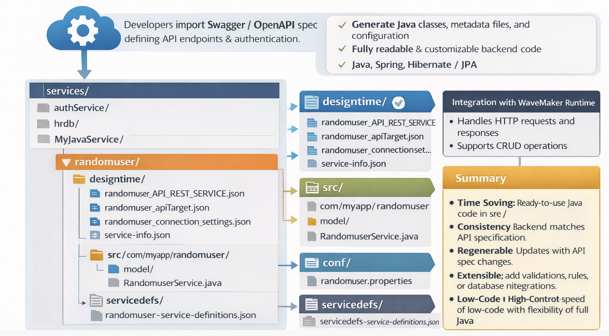

# Generated Code

WaveMaker enables developers to import **third-party APIs** and automatically generate a fully functional backend, including Java classes, service logic, and design-time configurations. It follows proven enterprise patterns built on Java, Spring, and Hibernate/JPA. This makes it easy to quickly integrate and customize APIs.

Developers have complete access to the generated source code and can confidently extend or customize it without affecting future platform upgrades.

---

## Backend Architecture
 
This section describes the structure of a WaveMaker-generated service, using the **[Random User](https://randomuser.me/api/?results=5)** as an example. The same structure and patterns apply to all other third-party APIs imported into WaveMaker.

WaveMaker services represent fully integrated backend components, including design-time configuration, generated Java code, and runtime metadata.

- Developers import a **Swagger/OpenAPI specification** (JSON/YAML) that defines API endpoints, request/response structures, parameters, and authentication requirements.
- WaveMaker interprets this spec to understand the API’s structure and available operations.


<!--  -->

---

###  Folder Structure

```plaintext
services/
├── authService/
├── hrdb/
├── MyJavaService/
└── randomuser/
    ├── designtime/
    │   ├── randomuser_API_REST_SERVICE.json
    │   ├── randomuser_apiTarget.json
    │   ├── randomuser_connection_settings.json
    │   └── service-info.json
    ├── src/
    │   └── com/
    │       └── myapp/
    │           └── randomuser/
    │               ├── model/
    │               └── service/
    │                   └── RandomuserService.java
    ├── conf/
    │   └── randomuser.properties
    └── servicedefs/
        └── randomuser-service-definitions.json
```

---

###  `services/`

- Root folder for all backend services in the project.  
- Each subfolder represents a service, e.g., `authService`, `hrdb`, `MyJavaService`, `randomuser`.

---

###  `randomuser/`

Main folder for the `randomuser` service, containing both design-time configuration and generated backend code.

#### a. `designtime/`

Holds JSON configuration files used by WaveMaker at design-time (in Studio):

- **`randomuser_API_REST_SERVICE.json`** – Defines API endpoints, request/response models, and mappings.  
- **`randomuser_apiTarget.json`** – Contains target configuration for connecting to the API (base URLs, endpoints).  
- **`randomuser_connection_settings.json`** – Stores connection/authentication settings for the API.  
- **`service-info.json`** – Metadata about the service such as name, type, and version.  

#### b. `src/com/myapp/randomuser/`

Java source code generated for the service:

- **`model/`** – Java classes representing API data structures (request/response objects).  
- **`service/`** – Service classes implementing logic to call the API.  
  - **`RandomuserService.java`** – Main service class handling API calls and integrating with business logic.  

#### c. `conf/`

Configuration files for the service at runtime:

- **`randomuser.properties`** – Holds runtime properties such as API endpoints and authentication tokens.  

#### d. `servicedefs/`

Holds service definition JSONs used for WaveMaker Studio and deployment:

- **`randomuser-service-definitions.json`** – Defines all available service methods, parameters, and data structures.  

---

###  Key Points

- WaveMaker generates **fully readable Java code** in `src/`.  
- `designtime/` and `servicedefs/` are used internally by WaveMaker Studio for API integration and **should not be deleted**.  
- Properties in `conf/` allow **runtime customization** without changing code.  
- The structure allows **seamless integration of third-party APIs**.

---
## Integration with WaveMaker Runtime
- The generated backend integrates with WaveMaker runtime automatically:
  - Handles HTTP requests and responses
  - Supports CRUD operations
  - Allows addition of custom business logic
- APIs can be tested immediately.

---

## Application Configuration Properties

Whenever services are imported into WaveMaker, the platform automatically **generates configuration properties** that can be mapped to different environments such as Development, QA, or Production.  
You can view and manage these properties in the **Profiles**.  
For more information, refer to the **[Profiles](../../configurations/profiles.md)** section in the documentation.

For more details on environment-specific configurations, refer to the **[ Profile Settings](../../configurations/profile-settings.md)** section.

<details>
<summary>Click to expand configuration properties</summary>

```properties
# ---------------------------
# WebSocket Configuration
# ---------------------------
websocket.websocket.basepath=
websocket.websocket.host=echo.websocket.org
websocket.websocket.scheme=wss

# ---------------------------
# OAuth2 (Swagger Petstore) Configuration
# ---------------------------
oauth2.swagger_petstore_auth.accessTokenUrl=
oauth2.swagger_petstore_auth.authorizationUrl=https://petstore.swagger.io/oauth/authorize
oauth2.swagger_petstore_auth.clientId=
oauth2.swagger_petstore_auth.clientSecret=
oauth2.swagger_petstore_auth.isPkceRequired=false
oauth2.swagger_petstore_auth.oauth2Flow=IMPLICIT

## Swagger API
rest.swagger.apikey.header.api_key=
rest.swagger.basepath=/v2
rest.swagger.host=petstore.swagger.io
rest.swagger.scheme=https

# ---------------------------
# REST API Configurations
# ---------------------------

## Random User API
rest.randomuser.basepath=
rest.randomuser.host=randomuser.me
rest.randomuser.scheme=https


## WaveMaker Online Services
rest.wavemakeronline.basepath=/pk9yct3s6nqt/MyApp/services
rest.wavemakeronline.host=https://cloud.wavemakeronline.com
rest.wavemakeronline.scheme=https
```
</details>
---


<!-- ##  Importing the REST API** -->


<!-- --- -->

<!-- ## **2. Creating Design-Time Artifacts**
Upon import, WaveMaker generates design-time files under the `designtime/` folder: -->

<!-- | File | Purpose |
|------|---------|
| `service-info.json` | Metadata about the service (name, version, description) |
| `swagger_API_REST_SERVICE.json` | REST API definition interpreted by WaveMaker |
| `swagger_apiTarget.json` | Target API configuration (server URLs, ports) |
| `swagger_connection_settings.json` | Connection setup (authentication, timeouts) |
| `swagger_original_spec.json` | Original Swagger/OpenAPI specification | -->

<!-- **Purpose:** These files allow regenerating or updating the backend automatically without breaking existing custom logic. -->

<!-- --- -->

<!-- ## **3. Generating Java Source Code**
WaveMaker generates Java code under `src/com/myapp/swagger/`:

### **a) Models**
- Java classes representing API data structures, e.g., `User.java`, `Order.java`, `Pet.java`.
- Used for **request and response handling** with strongly-typed objects.

### **b) Service Classes**
- Java classes implementing API logic, e.g., `PetService.java`, `StoreService.java`.
- Stub methods correspond to API operations.
- Developers can **add custom business logic** without modifying generated models.

 -->


<!-- --- -->


##  Summary
1. **Time-Saving:** No need to manually write models or service stubs.
2. **Consistency:** Backend matches API specification perfectly.
3. **Regenerable:** Backend can be updated if the API spec changes.
4. **Extensible:** Add validations, business rules, or database integrations.
5. **Low-Code + High-Control:** Speed of low-code with flexibility of full Java.
This process ensures a **robust, maintainable, and scalable backend** that aligns perfectly with the API specification.

---

<!-- ## **6. Backend Generation Flow**


1. Import Swagger/OpenAPI →  
2. Generate Design-Time Files →  
3. Generate Java Models & Service Classes →  
4. Integrate & Customize →  
5. Test API Endpoints →  
6. API Ready for Use -->

<!-- **Summary:**   -->
<!-- `Import API → Design-Time Files → Java Code → Customize & Test → API Ready` -->

<!-- ---

This process ensures a **robust, maintainable, and scalable backend** that aligns perfectly with the API specification while giving developers the freedom to extend functionality. -->
