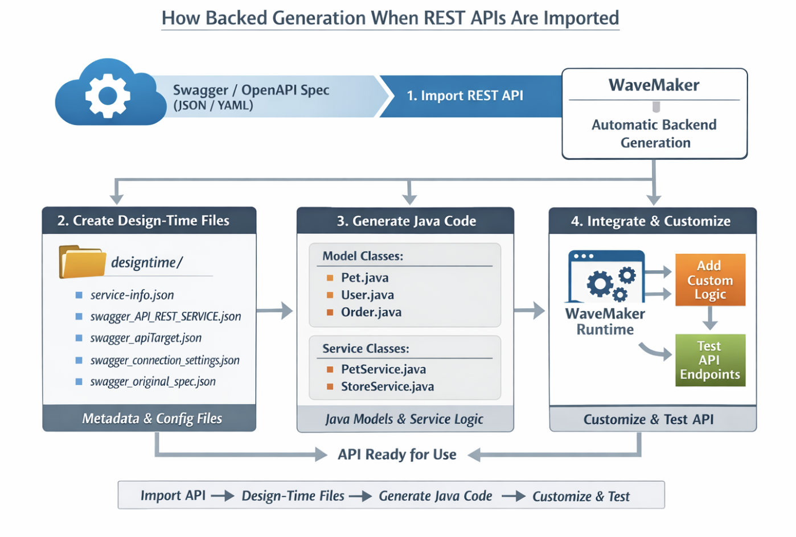
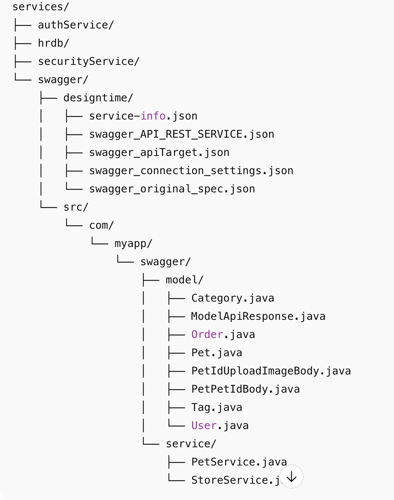

# Generated Code

WaveMaker allows developers to **import REST APIs** and automatically generate a fully functional backend. This includes Java classes, service logic, and design-time configuration, allowing you to quickly integrate and customize APIs.

---

## **1. Importing the REST API**
- Developers import a **Swagger/OpenAPI specification** (JSON/YAML) that defines API endpoints, request/response structures, parameters, and authentication requirements.
- WaveMaker interprets this spec to understand the API’s structure and operations.

---

## **2. Creating Design-Time Artifacts**
Upon import, WaveMaker generates design-time files under the `designtime/` folder:

<!-- | File | Purpose |
|------|---------|
| `service-info.json` | Metadata about the service (name, version, description) |
| `swagger_API_REST_SERVICE.json` | REST API definition interpreted by WaveMaker |
| `swagger_apiTarget.json` | Target API configuration (server URLs, ports) |
| `swagger_connection_settings.json` | Connection setup (authentication, timeouts) |
| `swagger_original_spec.json` | Original Swagger/OpenAPI specification | -->

**Purpose:** These files allow regenerating or updating the backend automatically without breaking existing custom logic.

---

## **3. Generating Java Source Code**
WaveMaker generates Java code under `src/com/myapp/swagger/`:

### **a) Models**
- Java classes representing API data structures, e.g., `User.java`, `Order.java`, `Pet.java`.
- Used for **request and response handling** with strongly-typed objects.

### **b) Service Classes**
- Java classes implementing API logic, e.g., `PetService.java`, `StoreService.java`.
- Stub methods correspond to API operations.
- Developers can **add custom business logic** without modifying generated models.

---

## **4. Integration with WaveMaker Runtime**
- The generated backend integrates with WaveMaker runtime automatically:
  - Handles HTTP requests and responses
  - Supports CRUD operations
  - Allows addition of custom business logic
- APIs can be tested immediately.

---

## **5. Benefits of Generated Backend**
1. **Time-Saving:** No need to manually write models or service stubs.
2. **Consistency:** Backend matches API specification perfectly.
3. **Regenerable:** Backend can be updated if the API spec changes.
4. **Extensible:** Add validations, business rules, or database integrations.
5. **Low-Code + High-Control:** Speed of low-code with flexibility of full Java.

---

<!-- ## **6. Backend Generation Flow**

1. Import Swagger/OpenAPI →  
2. Generate Design-Time Files →  
3. Generate Java Models & Service Classes →  
4. Integrate & Customize →  
5. Test API Endpoints →  
6. API Ready for Use -->

**Summary:**  
`Import API → Design-Time Files → Java Code → Customize & Test → API Ready`

---

This process ensures a **robust, maintainable, and scalable backend** that aligns perfectly with the API specification while giving developers the freedom to extend functionality.
