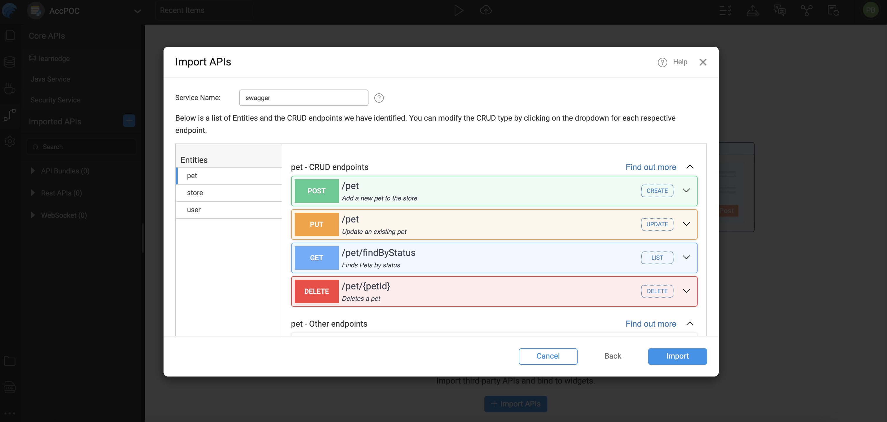

# Open API - Swagger

WaveMaker provides built-in support for importing REST APIs defined using Swagger/OpenAPI specifications (JSON or YAML), allowing developers to quickly integrate external services into their applications. When an API is imported, WaveMaker automatically generates the required backend service definitions and data models.

In WaveMaker, variables act as an abstraction over these generated services, handling request execution and response processing. This enables developers to bind API data directly to UI components without dealing with low-level service calls or backend implementation details. Learn more about [Variables](../../../user-interfaces/web/develop/integrating-with-apis/) 

<!-- --- -->

<!-- ## Supported Widgets for Imported APIs

WaveMaker can generate ready-to-use UI elements for services imported from Swagger/OpenAPI definitions:

- **Web**: DataTable, Form, Cards (read-only), List (read-only)  
- **Mobile**: List with Form 

These widgets help you build UI screens with minimal code by binding REST API data directly to visual components. -->

---
## API Workspace

WaveMaker provides a dedicated **API Workspace** that serves as the central hub for all API-related activities.

From the API Workspace, you can:

- Connect to third-party APIs  
- Browse endpoints, request/response models, and parameters  
- Import API specifications (Swagger/OpenAPI)  
- Automatically generate services and data models  

A short video in this section walks through the API Workspace UI and demonstrates how developers can visually explore and integrate APIs.

**Learn more:** [API Explorer](../../../studio/workspaces/api-explorer.mdx)

---

## Importing a Swagger/OpenAPI Definition

<!-- To bring an external REST API into your WaveMaker project:

1. Go to the **APIs** section in WaveMaker Studio.  
2. Select **Imported APIs**.  
3. Choose how you want to import:
   - **From File** – Upload a local `.json` or `.yaml` OpenAPI/Swagger file.  
   - **From URL** – Provide the URL where the API definition is hosted.

Both JSON and YAML formats are supported.  -->

External REST APIs can be integrated into a WaveMaker project using the **Imported APIs** feature in WaveMaker Studio.

- Supports importing APIs defined using **Swagger/OpenAPI specifications**
- API definitions can be sourced from a **local file** or a **hosted URL**
- Both **JSON** and **YAML** formats are supported
- Imported APIs are processed and made available for use within the application


For example, to import the public Petstore API:

```
https://petstore.swagger.io/v2/swagger.json
```


---


<!-- ## Entities and Endpoints

After importing the Swagger definition:

- WaveMaker groups related endpoints into **Entities** based on the API structure.  
- Each Entity may contain multiple endpoints; for example, a set of CRUD operations for a resource.
- CRUD endpoints are automatically mapped to common operations:

| HTTP Method | Operation | Swagger Mapping |
|-------------|-----------|-----------------|
| POST | Create | CREATE |
| GET | Read/List | LIST |
| PUT | Update | UPDATE |
| DELETE | Delete | DELETE |

Once imported, you can view all identified entities on the left side navigation. Clicking an entity displays its endpoints — organized as CRUD operations and other custom endpoints. You can modify these groupings if needed before finalizing the import. -->

## Entities and Endpoints

After importing the OpenAPI (Swagger) definition, WaveMaker analyzes the API structure and organizes endpoints into **Entities**. This entity-based representation helps map backend resources in a way that can be directly consumed by WaveMaker components.

- **Entities** represent logical business resources exposed by the API (for example, Users, Orders, or Products).
- Each entity groups all related endpoints belonging to the same resource.
- This structured grouping simplifies API discovery and improves reusability across the application.

### Endpoint to Operation Mapping

WaveMaker automatically detects common CRUD-style endpoints and maps them to standardized operations. This enables seamless binding with UI components such as Live Forms, Data Tables, and Lists.

| HTTP Method | Operation | Swagger Mapping |
|------------|-----------|-----------------|
| POST       | Create    | CREATE          |
| GET        | Read/List | LIST            |
| PUT        | Update    | UPDATE          |
| DELETE    | Delete    | DELETE          |

- Endpoints that do not follow standard CRUD conventions are categorized as **custom operations** within the same entity.
- This entity mapping enables seamless consumption of API data by WaveMaker UI components using standardized operations.
<!-- - Reduces manual configuration of API calls. -->
<!-- - Maintains a consistent data model across database and API-based services. -->
<!-- - Improves maintainability by logically grouping related operations. -->

<!-- ### Navigation and Configuration

- All identified entities appear in the **left-side navigation** after import.
- Selecting an entity displays its endpoints, organized into CRUD and custom operations.
- Entity and endpoint groupings can be modified before finalizing the import to align with application requirements. -->




<!-- **Note:** If a particular path doesn't map to an entity, it will appear under an **Others** category. These endpoints can still be used via service variables, but CRUD operations aren't automatically generated. -->

---

## Configuring API Authentication

Once the Swagger API is selected and its metadata is verified:

- You can configure authentication for the API.
- Swagger definitions may include support for **[OAuth 2.0](../../security/providers/openid-authentication.mdx)**.
- If OAuth is required, click **OAuth Provider** in the import dialog and enter the relevant values such as:
  - Access Token URL
  - Client ID
  - Client Secret

Authentication settings allow WaveMaker to communicate securely with protected APIs. For more detailed steps on configuring OAuth providers, refer to the [OAuth Provider Configuration](../../security/providers/openid-authentication.mdx)

For more understanding on configuring proxy, refer [Proxy](proxy.md)


<!--  -->

---

## Generated Code

WaveMaker allows developers to import third-party APIs and automatically generate a complete backend, including Java classes, service logic, and design-time configurations. Built on proven enterprise frameworks, this approach simplifies API integration and customization. 

This section describes the structure of a WaveMaker-generated service, using the **[Pet Store](https://petstore.swagger.io/v2/swagger.json)** as an example.

### Folder Structure

```plaintext
services/
├── authService/
├── hrdb/
├── MyJavaService/
└── swagger/
    ├── designtime/
    │   ├── service-info.json
    │   ├── swagger_API_REST_SERVICE.json
    │   ├── swagger_apiTarget.json
    │   ├── swagger_connection_settings.json
    │   └── swagger_original_spec.json
    ├── src/
    │   └── com/
    │       └── wavemaker/
    │           └── myapp1/
    │               └── swagger/
    │                   ├── model/
    │                   │   ├── Category.java
    │                   │   ├── ModelApiResponse.java
    │                   │   ├── Order.java
    │                   │   ├── Pet.java
    │                   │   ├── PetIdUploadImageBody.java
    │                   │   ├── PetPetIdBody.java
    │                   │   ├── Tag.java
    │                   │   └── User.java
    │                   └── service/
    │                       ├── PetService.java
    │                       ├── StoreService.java
    │                       └── UserService.java
    ├── servicedefs/
    │   └── swagger-service-definitions.json
    ├── service_swagger.spring.xml
    └── swagger_apiTarget.json
```

### services/

The `services` directory is the root container for all backend services in a WaveMaker application.

Each subfolder represents a distinct service type, such as database services, Java services, REST services, or Swagger / OpenAPI integrations.  
This structure keeps backend logic modular, organized, and scalable.


### swagger/

The `swagger` folder represents a backend service generated from a **Swagger / OpenAPI specification**.

WaveMaker consumes the specification and automatically generates configuration, Java models, service classes, and runtime wiring—enabling quick and transparent integration with external APIs.


### Design-Time Configuration (`designtime/`)

Contains configuration files managed by **WaveMaker Studio** during Swagger import.  
These files define how the Swagger service is configured and exposed within the platform.

**Key files:**
- `swagger_API_REST_SERVICE.json` – Endpoint and operation metadata  
- `swagger_apiTarget.json` – Base URLs and target mappings  
- `swagger_connection_settings.json` – Authentication and connection settings  
- `swagger_original_spec.json` – Original Swagger/OpenAPI specification  
- `service-info.json` – Service metadata  

> ⚠️ Platform-managed files — do not modify manually.


### Generated Code (`src/`)

Contains generated, readable, and extensible Java code derived from the Swagger definition.

- **`model/`** – POJOs representing request and response payloads  
- **`service/`** – Java service classes that encapsulate REST calls and response handling  

These classes can be safely used in custom business logic.


### Service Definitions (`servicedefs/`)

- `swagger-service-definitions.json`  

Defines available service operations, input/output types, and mappings between design-time configuration and runtime execution.


### Spring Configuration

- `service_swagger.spring.xml`  

Spring configuration used to wire the Swagger service at runtime, ensuring proper dependency injection and secure invocation.


---


<!-- ## Using Imported REST Services

After successful import and authentication configuration:

- You can drag and drop supported components (like DataTable, Form, List, etc.) onto pages and bind them to the REST API operations.
- This enables CRUD-style interaction with the imported API without writing manual HTTP client code.

--- -->

## Application Configuration Properties

Whenever services are imported into WaveMaker, the platform automatically **generates configuration properties** that can be mapped to different environments such as Development, QA, or Production.  
You can view and manage these properties in the **Profiles**.  
For more information, refer to the **[Profiles](../../configurations/profiles.md)** section in the documentation.

For more details on environment-specific configurations, refer to the **[ Profiles Settings](../../configurations/profile-settings.md)** section.

<details>
<summary>Click to expand configuration properties</summary>

```properties
# ---------------------------
# OAuth2 (Swagger Petstore) Configuration
# ---------------------------
oauth2.swagger_petstore_auth.accessTokenUrl=
oauth2.swagger_petstore_auth.authorizationUrl=https://petstore.swagger.io/oauth/authorize
oauth2.swagger_petstore_auth.clientId=
oauth2.swagger_petstore_auth.clientSecret=
oauth2.swagger_petstore_auth.isPkceRequired=false
oauth2.swagger_petstore_auth.oauth2Flow=IMPLICIT

## Swagger API
rest.swagger.apikey.header.api_key=
rest.swagger.basepath=/v2
rest.swagger.host=petstore.swagger.io
rest.swagger.scheme=https
```
</details>

---


## Summary

Importing Swagger/OpenAPI definitions in WaveMaker allows you to:

- Bring external REST APIs into your application with minimal effort.
- Configure authentication and secure API access.
- Use CRUD and service variables to integrate REST operations into your pages and components.
- Accelerate development by leveraging standardized API descriptions.

This feature lets you combine the power of external services with WaveMaker's low-code UI and binding framework, enabling rapid development of data-driven applications.

<VideoCard
  videoUrl="https://next-academy.wavemaker.com/Watch?wm=8B1B895200"
  title="Import APIs"
  description="Watch for a step-by-step guide on Importing Swagger APIs in WaveMaker App"
  thumbnailText="Import APIs"
/>
