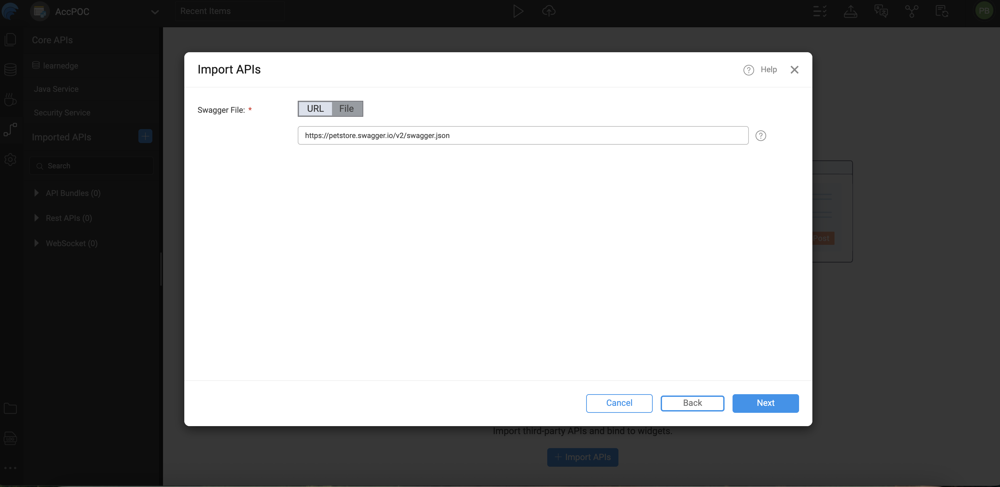
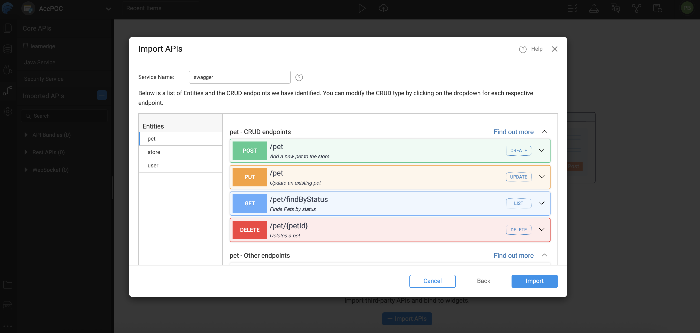
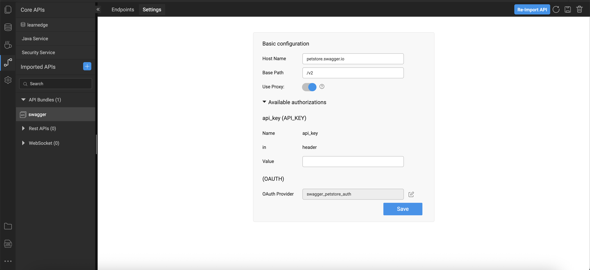
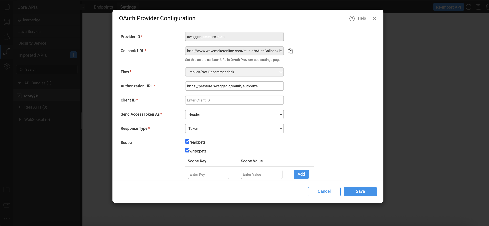

# Import Swagger/Open API

WaveMaker supports importing REST APIs that are defined using the **Swagger/OpenAPI** specification. This allows you to integrate external REST services into your application and take advantage of automatically generated metadata for building UI functionality and service integrations. Many modern backend frameworks (such as Spring Boot or .NET Core) automatically generate Swagger/OpenAPI documentation for their APIs, which makes them easy to consume in WaveMaker. 

---

## Supported Widgets for Imported APIs

WaveMaker can generate ready-to-use UI elements for services imported from Swagger/OpenAPI definitions:

- **Web**: DataTable, Form, Cards (read-only), List (read-only)  
- **Mobile**: List with Form 

These widgets help you build UI screens with minimal code by binding REST API data directly to visual components.

---

## Importing a Swagger/OpenAPI Definition

To bring an external REST API into your WaveMaker project:

1. Go to the **APIs** section in WaveMaker Studio.  
2. Select **Imported APIs**.  
3. Choose how you want to import:
   - **From File** – Upload a local `.json` or `.yaml` OpenAPI/Swagger file.  
   - **From URL** – Provide the URL where the API definition is hosted.

Both JSON and YAML formats are supported. 

For example, to import the public Petstore API:

```
https://petstore.swagger.io/v2/swagger.json
```



---

## Entities and Endpoints

After importing the Swagger definition:

- WaveMaker groups related endpoints into **Entities** based on the API structure.
- Each Entity may contain multiple endpoints; for example, a set of CRUD operations for a resource.
- CRUD endpoints are automatically mapped to common operations:

| HTTP Method | Operation | Swagger Mapping |
|-------------|-----------|-----------------|
| POST | Create | CREATE |
| GET | Read/List | LIST |
| PUT | Update | UPDATE |
| DELETE | Delete | DELETE |

Once imported, you can view all identified entities on the left side navigation. Clicking an entity displays its endpoints — organized as CRUD operations and other custom endpoints. You can modify these groupings if needed before finalizing the import.



**Note:** If a particular path doesn't map to an entity, it will appear under an **Others** category. These endpoints can still be used via service variables, but CRUD operations aren't automatically generated.

---

## Configuring API Authentication

Once the Swagger API is selected and its metadata is verified:

- You can configure authentication for the API.
- Swagger definitions may include support for **OAuth 2.0**.
- If OAuth is required, click **OAuth Provider** in the import dialog and enter the relevant values such as:
  - Access Token URL
  - Client ID
  - Client Secret

Authentication settings allow WaveMaker to communicate securely with protected APIs. For more detailed steps on configuring OAuth providers, refer to the OAuth Provider Configuration for REST Services documentation.




---

## Using Imported REST Services

After successful import and authentication configuration:

- You can drag and drop supported widgets (like DataTable, Form, List, etc.) onto pages and bind them to the REST API operations.
- This enables CRUD-style interaction with the imported API without writing manual HTTP client code.

---


## Summary

Importing Swagger/OpenAPI definitions in WaveMaker allows you to:

- Bring external REST APIs into your application with minimal effort.
- Automatically generate UI components and service metadata from the API spec.
- Configure authentication and secure API access.
- Use CRUD and service variables to integrate REST operations into your pages and widgets.
- Accelerate development by leveraging standardized API descriptions.

This feature lets you combine the power of external services with WaveMaker's low-code UI and binding framework, enabling rapid development of data-driven applications.
