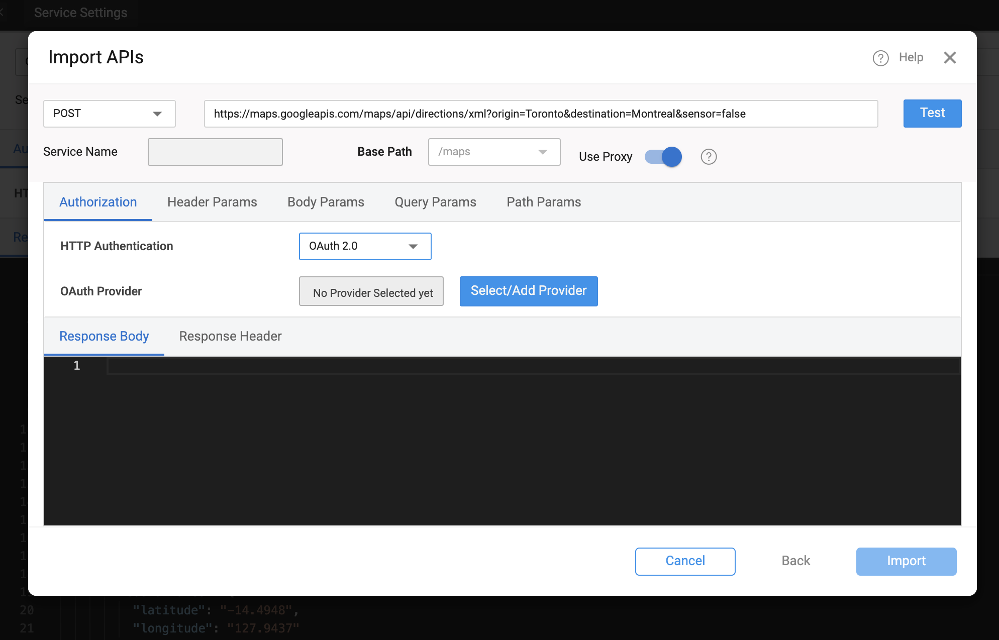
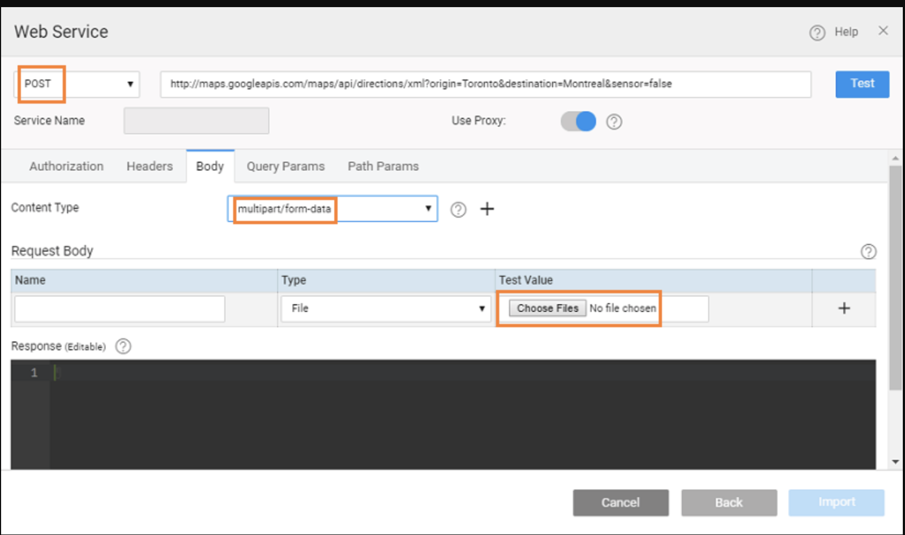

# Individual REST Endpoints

A WaveMaker provides a way to integrate REST API hosted separately, outside of a Swagger/OpenAPI definition as an **individual REST endpoint**. These REST services are lightweight, scalable services that expose resources over HTTP, allowing clients to interact using standard methods such as GET, POST, PUT, PATCH, and DELETE. These services typically return responses in JSON or XML formats. 

WaveMaker enables developers to import such endpoints, configure request parameters and authorization, and consume them using **[variables](../../../user-interfaces/web/develop/integrating-with-apis/variables.mdx)**, which can then be bound directly to UI components for seamless data display and interaction. This approach makes it easy to work with standalone APIs without requiring a formal API specification.


---


## Importing a REST Service

To integrate a third-party REST API into a WaveMaker application, developers start by creating a new REST service under **Resources → Web Services** in WaveMaker Studio. The service URL is specified along with the HTTP method (GET, POST, PUT, PATCH, DELETE, etc.), and any necessary proxy settings are configured to handle CORS or firewall restrictions for web apps. Mobile app calls are made directly, with proxy applied behind the scenes if needed during testing.

Authorization settings can be defined as required, including None, Basic (username/password), or OAuth 2.0, with the option to select or configure an OAuth provider. Developers can also define query, path, or header parameters to match the API signature. After configuring these details, the service can be tested to ensure it returns valid responses. 

Once the test succeeds, the **Import** option becomes available, bringing the REST service into the project for use with variables and UI components.

 

<!--  -->

---

## Configuring REST Parameters

When setting up a REST service, you can configure several types of parameters:

- **Query Parameters** – Appended to the URL after `?`, and separated using `&`.  
- **Path Parameters** – Specified directly within curly braces `{}` in the URL.  
- **Header Parameters** – Configured via the headers section for additional metadata or auth tokens.  
- **Body Parameters** – Used for methods that accept input (e.g., POST or PUT). For file uploads or mixed content, set the content type to `multipart/form-data`, and specify parameter types such as File or Text. 

These parameters automatically appear as **input fields** in the service variable definition and can be bound to UI elements or variables. 
For more understanding on configuring proxy, refer [Proxy](proxy.md)

---

## Authentication and Security

WaveMaker supports different authentication models when configuring REST services:

- **No Authentication** — Default option when the service does not require credentials.  
- **Basic Authentication** — Uses username and password.  
- **OAuth 2.0** — Allows integration with OAuth providers. You can select from pre-configured providers or define new ones during REST service configuration.
For more details on [OAuth 2.0](../../../guide/migrated-docs/rest-services-using-oauth20.md)

When securing REST calls, consider using **App Environment Properties** or **Server Side Properties** to store sensitive information such as API keys, tokens, or passwords. This ensures that sensitive values are not exposed in the UI or network calls. For more details refer [Secure Server Side Properties](../../../guide/migrated-docs/secure-server-side-properties).


 


<!-- ## Overview of Properties

WaveMaker supports two primary property types for securing sensitive data:

### App Environment Properties

- These are **custom properties** you define and manage.
- They can be used throughout your application wherever environment-specific values are needed.
- Ideal for values like API keys, tokens, endpoints, and other configuration parameters that may differ across environments.
- Once created, App Environment Properties appear in the REST service configuration dialog under **Header** and **Query** parameter options. 

### Server-Side Properties

- These are **built-in variables** provided by WaveMaker.
- Server-Side Properties typically represent dynamic runtime information (for example, current date/time or logged-in user details).
- Like App Environment Properties, they help keep sensitive values off the client and out of direct network calls.

> Both property types help ensure sensitive values are not exposed on the UI or transmitted directly from the client.

--- -->

<!-- ## Configuring REST Services to Use a Proxy

To prevent sensitive values from being exposed in requests made directly from the client, you can enable the **Use Proxy** option when setting up REST services:

1. Add the REST service as usual, providing the endpoint URL and any required parameters.  
2. For each **Header** or **Query** parameter that should not be sent directly from the client, assign it either a **Server-Side Property** or an **App Environment Property**.  
3. Toggle **Use Proxy** to enable proxy routing for this REST service.  
   - When proxy is enabled, REST calls are made from the server side through the proxy, not directly from the client browser or device.  
   - This hides the sensitive parameter values from both network traces and UI variables.
WaveMaker enforces the use of the proxy server whenever Server-Side or App Environment Properties are used in REST service parameters.


--- -->

<!-- ## How This Affects UI and Network Calls

When sensitive values (such as keys or credentials) are bound to REST service **Header** or **Query parameters**, they may appear in the Variables dialog input fields at design time. Without protection, these values could leak through UI bindings or client-side scripts. 

By enabling the proxy:

- Parameter values are **sent from the server**, not from the client.  
- The client cannot see or intercept these values in the UI or network traffic.  
- This ensures that confidential information stays on the server side and is not exposed to end users. 

--- -->

<!-- ## Best Practices and Considerations

- If App Environment Properties are not listed under Header or Query parameter selections, ensure they are added correctly to your configuration profile.  
- You **must enable Use Proxy** before you can assign Server-Side or App Environment Properties to REST parameters.  
- If you modify the REST service URL or other configurations, re-test the service before saving to ensure proper behavior. 
- Using **App Environment Properties** for reusable configuration values across environments.  
- Leveraging **Server-Side Properties** for dynamic runtime values.  
- Enabling **Use Proxy** so that API keys, passwords, and other sensitive data are never sent directly from the client.  
- Ensuring that confidential parameters are handled server-side and remain hidden from UI and network traffic. 

These practices help you maintain secure integration with third-party services and safeguard critical application data. -->

---

<!-- ## Testing a REST API

WaveMaker provides in-built testing as part of the import flow:

- After entering the service URL and optional parameters, use the **Test** button to validate that the REST endpoint returns a successful response.  
- You can verify response formats (JSON or XML) and adjust configuration like headers and parameters if needed.  
- Testing before import ensures that the service definition matches the expected input/output contract. 

--- -->

<!-- ## REST Services with Input Data

Some REST endpoints require data input (e.g., text or file uploads):

- When such endpoints are imported, set the **Content Type** to `multipart/form-data` under the Body tab.  
- You can specify input types as **File** or **Text**, allowing upload of files (e.g., images) or submission of textual data.  
- For internal WaveMaker REST APIs, `application/json` or `text/plain` types are also supported. 
<!-- # Import REST Services -->
<!--  -->


## Generated Backend Code

WaveMaker allows developers to import third-party APIs and automatically generate a complete backend, including Java classes, service logic, and design-time configurations. Built on proven enterprise frameworks, this approach simplifies API integration and customization. 
 
This section describes the structure of a WaveMaker-generated service, using the **[Random User](https://randomuser.me/api/?results=5)** as an example.

###  Folder Structure

```plaintext
services/
├── authService/
├── hrdb/
├── MyJavaService/
└── randomuser/
    ├── designtime/
    │   ├── randomuser_API_REST_SERVICE.json
    │   ├── randomuser_apiTarget.json
    │   ├── randomuser_connection_settings.json
    │   └── service-info.json
    ├── src/
    │   └── com/
    │       └── myapp/
    │           └── randomuser/
    │               ├── model/
    │               └── service/
    │                   └── RandomuserService.java
    ├── conf/
    │   └── randomuser.properties
    └── servicedefs/
        └── randomuser-service-definitions.json
```

---

###  `services/`

- Root folder for all backend services in the project.  
- Each subfolder represents a service, e.g., `authService`, `hrdb`, `MyJavaService`, `randomuser`.

---

###  `randomuser/`

Main folder for the `randomuser` service, containing both design-time configuration and generated backend code.

#### a. `designtime/`

Holds JSON configuration files used by WaveMaker at design-time (in Studio):

- **`randomuser_API_REST_SERVICE.json`** – Defines API endpoints, request/response models, and mappings.  
- **`randomuser_apiTarget.json`** – Contains target configuration for connecting to the API (base URLs, endpoints).  
- **`randomuser_connection_settings.json`** – Stores connection/authentication settings for the API.  
- **`service-info.json`** – Metadata about the service such as name, type, and version.  

#### b. `src/com/myapp/randomuser/`

Java source code generated for the service:

- **`model/`** – Java classes representing API data structures (request/response objects).  
- **`service/`** – Service classes implementing logic to call the API.  
  - **`RandomuserService.java`** – Main service class handling API calls and integrating with business logic.  

#### c. `conf/`

Configuration files for the service at runtime:

- **`randomuser.properties`** – Holds runtime properties such as API endpoints and authentication tokens.  

#### d. `servicedefs/`

Holds service definition JSONs used for WaveMaker Studio and deployment:

- **`randomuser-service-definitions.json`** – Defines all available service methods, parameters, and data structures.  

---

###  Key Points

- WaveMaker generates **fully readable Java code** in `src/`.  
- `designtime/` and `servicedefs/` are used internally by WaveMaker Studio for API integration and **should not be deleted**.  
- Properties in `conf/` allow **runtime customization** without changing code.  
- The structure allows **seamless integration of third-party APIs**.

---


## Application Configuration Properties

Whenever services are imported into WaveMaker, the platform automatically **generates configuration properties** that can be mapped to different environments such as Development, QA, or Production.  
You can view and manage these properties in the **Profiles**.  
For more information, refer to the **[Profiles](../../configurations/profiles.md)** section in the documentation.

For more details on environment-specific configurations, refer to the **[ Profile Settings](../../configurations/profile-settings.md)** section.

<details>
<summary>Click to expand configuration properties</summary>

```properties
# ---------------------------
# REST API Configurations
# ---------------------------

## Random User API
rest.randomuser.basepath=
rest.randomuser.host=randomuser.me
rest.randomuser.scheme=https

```
</details>

---


## Summary

REST Services in WaveMaker allow seamless integration of external HTTP APIs into your low-code application:

- Import REST services via the imported APIs.  
- Configure URL, HTTP method, parameters, and authentication.  
- Test endpoints before importing.  
- Create service variables to invoke the API and bind responses to UI components.  
- Use proxy configuration and environment properties to handle CORS and secure credentials.

---


## How-To Guides

Learn more about working with REST services and web APIs through these practical guides:

- [Using App Environment Properties](/docs/guide/migrated-docs/using-app-environment-properties) - Configure environment-specific values for APIs
- [Using POST Method to Send Data to REST API](/docs/guide/migrated-docs/using-post-method-send-data-rest-api) - Send data to external APIs
- [Request and Response Processing for REST Services](/docs/guide/migrated-docs/request-response-processing-rest-services) - Handle API request/response transformation
- [Intercept Requests and Responses for API Calls](/docs/guide/migrated-docs/intercept-requests-responses-api-calls-one-place) - Add middleware logic to API calls
- [Working with APIs with Different Pagination Formats](/docs/guide/migrated-docs/working-api-with-different-pagination-formats) - Handle various pagination strategies
- [Adding UI for API with Server-Side Pagination](/docs/guide/migrated-docs/adding-ui-for-api-server-side-pagination) - Implement paginated data displays

-[Rest request timeouts](/docs/guide/migrated-docs/rest-request-timeouts.md) - Rest request timeouts


---

<!-- By treating REST services as first-class citizens within the platform, WaveMaker makes it simple to consume external APIs and integrate them with your app’s pages and logic. -->
