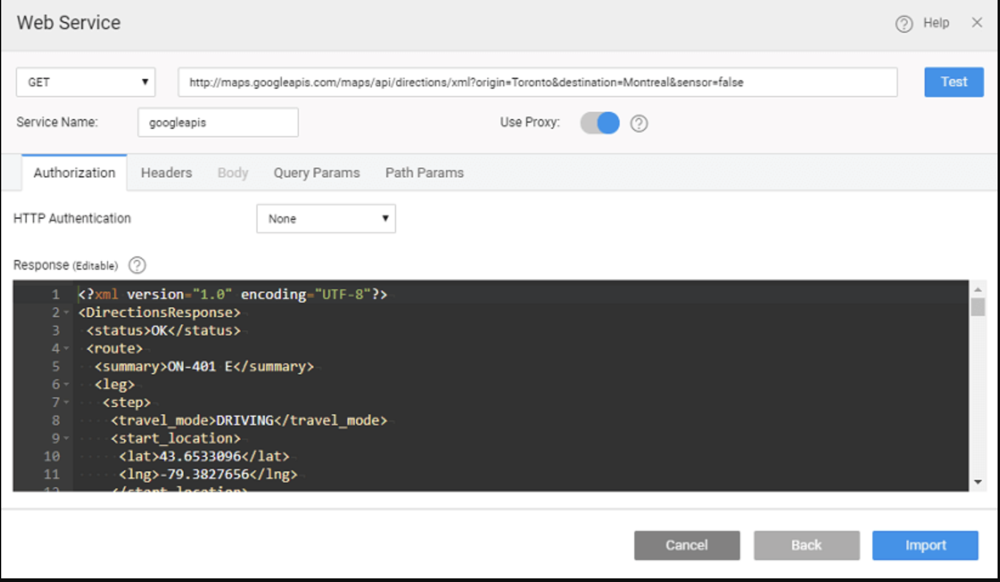

# Import REST Services

REST Services (Representational State Transfer) are web services designed to provide lightweight, scalable, and maintainable APIs that communicate over standard HTTP protocols. In a RESTful service, resources are exposed via URLs and clients interact with them using standard HTTP methods such as GET, POST, PUT, PATCH, and DELETE. These services typically return responses in JSON or XML formats. WaveMaker makes it easy to integrate external REST services into your application and consume them using variables that can be bound to widgets for data display. 

---

## What is a REST Service?

A **REST Service** is a type of web service that exposes resources over HTTP. Instead of relying on complex messaging protocols, REST services use standard HTTP methods meaning:

- **GET** requests retrieve data  
- **POST** requests create resources or perform operations  
- **PUT/PATCH** requests update data  
- **DELETE** requests remove resources 

WaveMaker treats REST services as first-class data sources that can be imported, configured, and invoked from within your application. 

---

## Importing a REST Service

To integrate a third-party REST API into your WaveMaker app:

1. Go to **Resources → Web Services** in WaveMaker Studio.  
2. Click the **+** button and choose the **REST** service option.  
3. In the REST service dialog:
   - Enter the full service URL.
   - Choose the HTTP method (GET, POST, PUT, PATCH, DELETE, etc.).
   - Optionally configure **Use Proxy** (for web apps) if you need to route calls through a proxy server due to CORS or firewall restrictions.  
     - For web apps, proxy is optional and enables bypassing CORS restrictions during testing.
     - For mobile apps, calls are made directly to the service (if CORS issues occur during import testing, proxy may be applied behind the scenes).  
4. Configure **Authorization** if required:
   - **None** (default)
   - **Basic** (username/password)
   - **OAuth 2.0** – select or define an OAuth Provider and provide client details.  
5. Define any required **query parameters**, **path parameters**, or **header parameters** to match the API signature.  
6. Click **Test** to verify the service returns a valid response.  
7. Once verified, click **Import** to bring the service into your project. 
 The **Import** option becomes active only after a successful test. 
 

---

## Configuring REST Parameters

When setting up a REST service, you can configure several types of parameters:

- **Query Parameters** – Appended to the URL after `?`, and separated using `&`.  
- **Path Parameters** – Specified directly within curly braces `{}` in the URL.  
- **Header Parameters** – Configured via the headers section for additional metadata or auth tokens.  
- **Body Parameters** – Used for methods that accept input (e.g., POST or PUT). For file uploads or mixed content, set the content type to `multipart/form-data`, and specify parameter types such as File or Text. 

These parameters automatically appear as **input fields** in the service variable definition and can be bound to UI elements or variables. 

---

## Using the REST Service in the App

After importing a REST service:

1. Create a **Variable** for the REST method you want to use.  
2. Map input fields (query, header, path, or body parameters) as required.  
3. Invoke the variable from UI events (such as button clicks) or page load logic.  
4. The variable’s `dataSet` property receives the response, which can be bound to widgets such as lists, grids, or charts for display. 

REST services behave like any other data source in WaveMaker, enabling seamless integration with the UI via data binding. 

---

## Authentication and Security

WaveMaker supports different authentication models when configuring REST services:

- **No Authentication** — Default option when the service does not require credentials.  
- **Basic Authentication** — Uses username and password.  
- **OAuth 2.0** — Allows integration with OAuth providers. You can select from pre-configured providers or define new ones during REST service configuration. 

When securing REST calls, consider using **App Environment Properties** or **Server Side Properties** to store sensitive information such as API keys, tokens, or passwords. This ensures that sensitive values are not exposed in the UI or network calls. 

---

## Testing a REST API

WaveMaker provides in-built testing as part of the import flow:

- After entering the service URL and optional parameters, use the **Test** button to validate that the REST endpoint returns a successful response.  
- You can verify response formats (JSON or XML) and adjust configuration like headers and parameters if needed.  
- Testing before import ensures that the service definition matches the expected input/output contract. 

---

## REST Services with Input Data

Some REST endpoints require data input (e.g., text or file uploads):

- When such endpoints are imported, set the **Content Type** to `multipart/form-data` under the Body tab.  
- You can specify input types as **File** or **Text**, allowing upload of files (e.g., images) or submission of textual data.  
- For internal WaveMaker REST APIs, `application/json` or `text/plain` types are also supported. 

---

## Summary

REST Services in WaveMaker allow seamless integration of external HTTP APIs into your low-code application:

- Import REST web services via the Web Services panel.  
- Configure URL, HTTP method, parameters, and authentication.  
- Test endpoints before importing.  
- Create service variables to invoke the API and bind responses to UI widgets.  
- Use proxy configuration and environment properties to handle CORS and secure credentials.

By treating REST services as first-class citizens within the platform, WaveMaker makes it simple to consume external APIs and integrate them with your app’s pages and logic.
