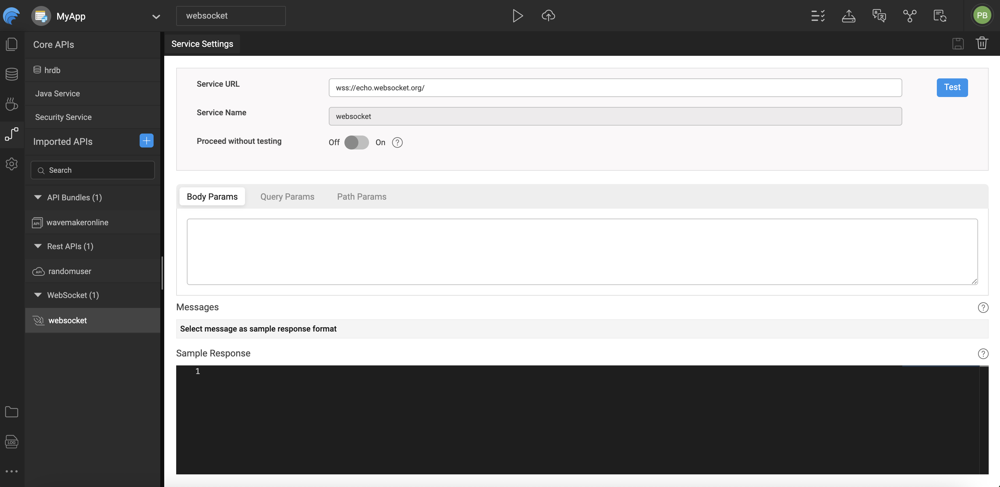

# WebSockets

WebSockets provide a **full-duplex, bidirectional communication channel** over a single TCP connection. Unlike traditional request/response protocols, WebSockets allow both the client and server to send messages at any time without repeated HTTP calls. This makes them ideal for **real-time applications** such as live dashboards, chat systems, notifications, and other interactive features. 


WaveMaker supports integrating any third-party WebSocket service into your app. Similar to REST services, you can import a WebSocket service, create a WebSocket Variable, and bind it to Components such as charts, tables, and lists to reflect real-time updates in the UI. 

<!-- --- -->

<!-- ## What Are WebSockets?

WebSockets start with an HTTP handshake that upgrades the connection to a persistent socket. Once established, data flows in both directions — client to server and server to client — without repeated handshakes. This makes WebSockets suitable for use cases where the server needs to push updates to clients as soon as data changes. 

In WaveMaker, WebSocket services are imported like any other web service. After importing, you create a Variable to interact with the service and bind its data to UI widgets.  -->

---

## Importing a WebSocket Service

<!-- WebSocket services are handled similarly to other web services in WaveMaker:

1. Go to the **Web Service import** flow in WaveMaker Studio.  
2. Enter the **WebSocket service URL (WSS)** and test the connection.  
3. Provide sample request and response bodies — this allows WaveMaker to generate accurate metadata for message structures, making it easier to bind data to widgets later.  
4. Include any **Query, Path, or Body parameters** required by the WebSocket service.  
5. Complete the import; the new WebSocket service will appear under **Web Services**.  
6. Select the service name to access its settings and metadata.  -->

WebSocket services in WaveMaker are imported by defining the WebSocket (WSS) endpoint and validating the connection to ensure the service is reachable. During this process, sample request and response payloads are provided so WaveMaker can generate accurate metadata for message structures, making it easier to bind data to UI components.

Any required query, path, or body parameters are captured as part of the service definition. Once the import is complete, the WebSocket service becomes available under **Imported APIs**, where its configuration, parameters, and generated metadata can be viewed and managed.




---

## Handling WebSocket Data

When your app receives data from a WebSocket service, you can choose how it should be handled in the Variable’s dataset:

### As a Snapshot

- **Refresh on new data**: Always replace the dataset with the most recent message from the WebSocket service.
- Use this option when only the latest value matters.
### Append Data

- **Add as last record**: Append incoming messages to the end of the dataset.
- Best suited for time-series or trend data, such as stock prices or sensor readings.
- For performance and UI responsiveness, it's recommended to specify a **maximum limit** for the dataset size.

### Prepend Data

- **Add as first record**: Insert incoming messages at the beginning of the dataset.
- This option is useful for list views where you want the newest entries shown at the top (for example, real-time match scores or weather updates).
- Like appending, setting a dataset limit helps maintain performance. 

---


## Limitations

Because WaveMaker Studio runs over HTTPS, WebSocket services using the insecure `ws://` protocol may not work in browsers due to security restrictions. When a `ws://` URL is entered:

- WaveMaker detects the insecure protocol and shows a warning.  
- The **Test** button may be disabled.  
- You can bypass the restriction by enabling **Proceed without Test**, but this is not recommended.  
- Best practice is to use secure `wss://` endpoints to ensure compatibility and security. 

---

## Using WebSocket Services in the App

Once the WebSocket service is imported, you must create a **WebSocket Variable** to interact with it:

- The Variable serves as the bridge between your app and the WebSocket server.  
- It supports operations like **opening/closing connections**, **sending messages**, and automatically reflects **incoming server messages** in its dataset.  
- Data received through the WebSocket connection can be bound directly to UI components such as charts, tables, or lists for real-time display. 

WebSocket Variables also include properties and event hooks that control behavior such as whether the connection opens automatically on page load or how new messages are added to the dataset. 

---

## Generated Code

<!-- WaveMaker enables developers to import **third-party APIs** and automatically generate a fully functional backend, including Java classes, service logic, and design-time configurations. It follows proven enterprise patterns built on Java, Spring, and Hibernate/JPA. This makes it easy to quickly integrate and customize APIs.

Developers have complete access to the generated source code and can confidently extend or customize it without affecting future platform upgrades. -->

WaveMaker allows developers to import third-party APIs and automatically generate a complete backend, including Java classes, service logic, and design-time configurations. Built on proven enterprise frameworks, this approach simplifies API integration and customization. 
 
This section describes the structure of a WaveMaker-generated service, using the **[Web Socket](wss://echo.websocket.org/)** as an example.


### Folder Structure

```plaintext
services/
├─ authService/
├─ securityService/
├─ websocket/
│  ├─ designtime/
│  │  ├─ service-info.json
│  │  ├─ websocket_API_WEBSOCKET_SERVICE.json
│  │  ├─ websocket_apiTarget.json
│  │  └─ websocket_connection_settings.json
│  ├─ src/
│  │  ├─ servicedefs/
│  │  │  └─ websocket-service-definitions.json
│  │  ├─ service_websocket.spring.xml
│  │  └─ websocket_apiTarget.json
```

### websocket/

The `websocket` folder represents a backend service generated for **WebSocket-based communication**.

WaveMaker uses this service type to enable real-time, bidirectional messaging between the client and server, making it ideal for live updates, notifications, and streaming data scenarios.


### Design-Time Configuration (`designtime/`)

The `designtime` folder contains configuration files managed by **WaveMaker Studio** that define how the WebSocket service is configured and exposed.

**Key files:**
- `websocket_API_WEBSOCKET_SERVICE.json` – Defines WebSocket endpoints, message mappings, and operation metadata  
- `websocket_apiTarget.json` – Stores target connection details such as WebSocket URLs and paths  
- `websocket_connection_settings.json` – Contains connection and authentication settings  
- `service-info.json` – Holds service metadata such as name, type, and version  

> ⚠️ These files are platform-managed and should not be modified manually.


### Runtime Configuration & Definitions

- **`servicedefs/websocket-service-definitions.json`**  
  Defines available WebSocket operations, message payload types, and mappings used at runtime.

- **`service_websocket.spring.xml`**  
  Spring configuration file that wires the WebSocket service, ensuring proper initialization, dependency injection, and secure message handling.

---


## Application Configuration Properties

Whenever services are imported into WaveMaker, the platform automatically **generates configuration properties** that can be mapped to different environments such as Development, QA, or Production.  
You can view and manage these properties in the **Profiles**.  
For more information, refer to the **[Profiles](../../configurations/profiles.md)** section in the documentation.

For more details on environment-specific configurations, refer to the **[ Profiles Settings](../../configurations/profile-settings.md)** section.

<details>
<summary>Click to expand configuration properties</summary>

```properties
# ---------------------------
# WebSocket Configuration
# ---------------------------
websocket.websocket.basepath=
websocket.websocket.host=echo.websocket.org
websocket.websocket.scheme=wss
```
</details>

---


## Summary

WebSockets enable real-time communication between the client and server in WaveMaker applications. By importing WebSocket services and creating corresponding Variables:

- You can handle live data streams in your apps. 
- Choose how incoming data updates the dataset (refresh, append, prepend).  
- Configure and bind data to UI components for immediate feedback. 
- Use secure `wss://` endpoints to avoid browser security issues. 

WebSocket support in WaveMaker makes it easier to build responsive, real-time applications without custom networking code.

## How-To Guides

Learn more about working with WebSockets and real-time services through these practical guides:

- [WebSocket Usage in Chatroom App](/docs/guide/migrated-docs/websocket-usage-chatroom-app) - Build real-time chat applications with WebSockets

---
