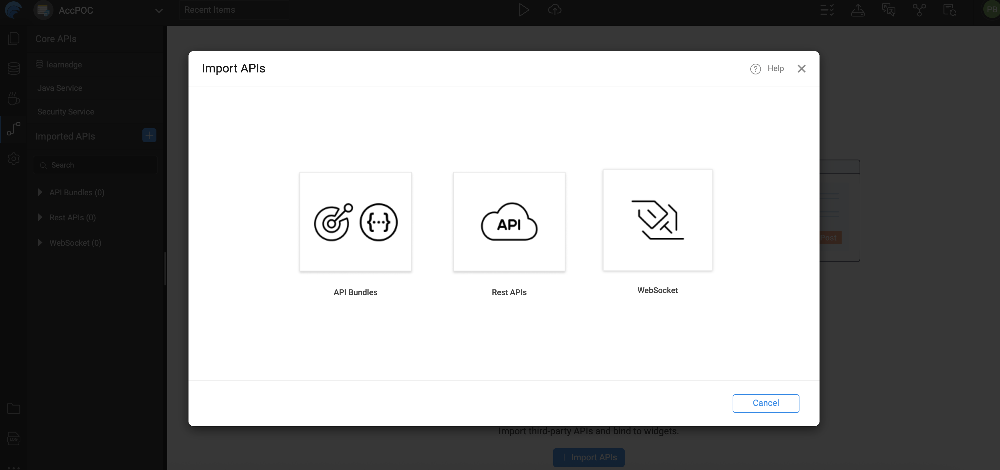
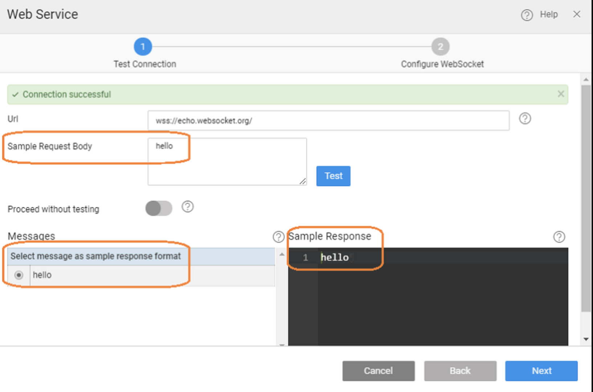
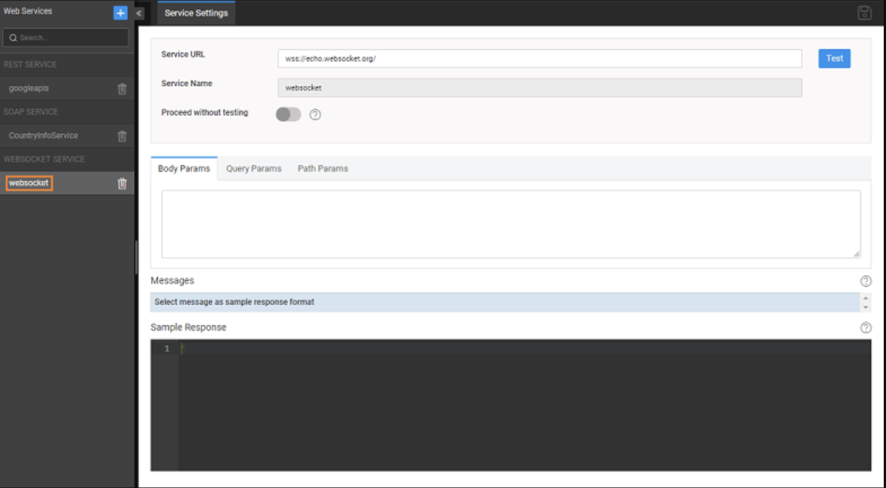

# Working with WebSockets

WebSockets provide a **full-duplex, bidirectional communication channel** over a single TCP connection. Unlike traditional request/response protocols, WebSockets allow both the client and server to send messages at any time without repeated HTTP calls. This makes them ideal for **real-time applications** such as live dashboards, chat systems, notifications, and other interactive features. 

WaveMaker supports integrating any third-party WebSocket service into your app. Similar to REST services, you can import a WebSocket service, create a WebSocket Variable, and bind it to widgets such as charts, tables, and lists to reflect real-time updates in the UI. 

---

## What Are WebSockets?

WebSockets start with an HTTP handshake that upgrades the connection to a persistent socket. Once established, data flows in both directions — client to server and server to client — without repeated handshakes. This makes WebSockets suitable for use cases where the server needs to push updates to clients as soon as data changes. 

In WaveMaker, WebSocket services are imported like any other web service. After importing, you create a Variable to interact with the service and bind its data to UI widgets. 

---

## Handling WebSocket Data

When your app receives data from a WebSocket service, you can choose how it should be handled in the Variable’s dataset:

### As a Snapshot

- **Refresh on new data**: Always replace the dataset with the most recent message from the WebSocket service.
- Use this option when only the latest value matters.
### Append Data

- **Add as last record**: Append incoming messages to the end of the dataset.
- Best suited for time-series or trend data, such as stock prices or sensor readings.
- For performance and UI responsiveness, it's recommended to specify a **maximum limit** for the dataset size.

### Prepend Data

- **Add as first record**: Insert incoming messages at the beginning of the dataset.
- This option is useful for list views where you want the newest entries shown at the top (for example, real-time match scores or weather updates).
- Like appending, setting a dataset limit helps maintain performance. 

---

## Importing a WebSocket Service

WebSocket services are handled similarly to other web services in WaveMaker:

1. Go to the **Web Service import** flow in WaveMaker Studio.  
2. Enter the **WebSocket service URL (WSS)** and test the connection.  
3. Provide sample request and response bodies — this allows WaveMaker to generate accurate metadata for message structures, making it easier to bind data to widgets later.  
4. Include any **Query, Path, or Body parameters** required by the WebSocket service.  
5. Complete the import; the new WebSocket service will appear under **Web Services**.  
6. Select the service name to access its settings and metadata. 

---

## Limitations

Because WaveMaker Studio runs over HTTPS, WebSocket services using the insecure `ws://` protocol may not work in browsers due to security restrictions. When a `ws://` URL is entered:

- WaveMaker detects the insecure protocol and shows a warning.  
- The **Test** button may be disabled.  
- You can bypass the restriction by enabling **Proceed without Test**, but this is not recommended.  
- Best practice is to use secure `wss://` endpoints to ensure compatibility and security. 

---

## Using WebSocket Services in the App

Once the WebSocket service is imported, you must create a **WebSocket Variable** to interact with it:

- The Variable serves as the bridge between your app and the WebSocket server.  
- It supports operations like **opening/closing connections**, **sending messages**, and automatically reflects **incoming server messages** in its dataset.  
- Data received through the WebSocket connection can be bound directly to UI widgets such as charts, tables, or lists for real-time display. 

WebSocket Variables also include properties and event hooks that control behavior such as whether the connection opens automatically on page load or how new messages are added to the dataset. 

---

## Summary

WebSockets enable real-time communication between the client and server in WaveMaker applications. By importing WebSocket services and creating corresponding Variables:

- You can handle live data streams in your apps. 
- Choose how incoming data updates the dataset (refresh, append, prepend).  
- Configure and bind data to UI widgets for immediate feedback. 
- Use secure `wss://` endpoints to avoid browser security issues. 

WebSocket support in WaveMaker makes it easier to build responsive, real-time applications without custom networking code.
