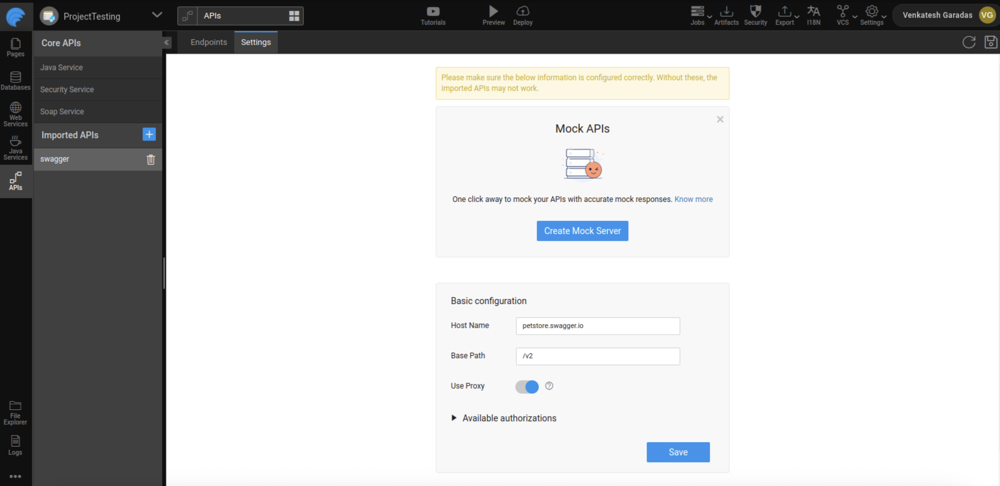
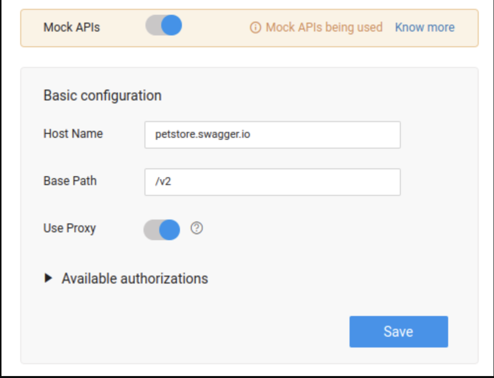

# MockingBird – Mock REST APIs

**MockingBird** is WaveMaker’s API mocking solution that allows you to simulate REST APIs with realistic, live-like responses. It enables frontend development and testing to continue independently while backend APIs are still under development or temporarily unavailable.

By using MockingBird, you can avoid development delays caused by incomplete or unstable backend services and maintain a continuous development workflow.

---

## Why Use MockingBird?
MockingBird is useful in the following scenarios:

- Frontend development needs to start before backend APIs are ready
- Backend APIs are unstable or frequently breaking
- Backend teams are working in different time zones
- UI testing requires consistent and predictable API responses

---

## Key Features
- Mock REST APIs using OpenAPI/Swagger specifications
- Generate realistic mock responses automatically
- Switch easily between mocked and real APIs from WaveMaker Studio
- Smart data generation based on field data types

---

## How MockingBird Works
In WaveMaker Studio, MockingBird can be enabled at the time of importing a REST API.

When enabled:

- WaveMaker creates a **mock server** for the imported API
- Incoming API requests are routed to the mock server
- MockingBird generates realistic responses based on the API contract

MockingBird intelligently understands hundreds of common data types, such as:

- First Name and Last Name  
- Address and Zip Code  
- Phone Numbers  
- Credit Card Numbers  
- Dates and Numeric Fields  

This ensures that the mocked responses closely resemble real-world data.

---

## Prerequisites
Before using MockingBird, ensure that:

- A valid **OpenAPI/Swagger specification** is available
- The API specification is successfully imported into WaveMaker Studio

---

## Creating a Mock Server for an Imported API

### Step 1: Import the API
1. Navigate to **APIs → Import APIs** in WaveMaker Studio.
2. Import the REST API using a valid Swagger/OpenAPI specification.
3. Ensure the API import is successful.

---

### Step 2: Enable API Mocking
1. Go to **APIs → API Resources**.
2. Select the **Imported API** that you want to mock.
3. Navigate to the **Settings** tab.
4. Click **Create Mock Server** to enable mocking for the first time.

Once the mock server is created:

- A **Mock** tag appears next to the imported API
- All variables associated with this API point to the mocked service

---

## Using Mocked APIs
After enabling MockingBird:

- API calls made from the application are served by the mock server
- Responses are generated dynamically based on the API contract
- No backend dependency is required during UI development or testing

---

## Disabling API Mocking
You can switch back to the original API at any time.

### Steps to Disable Mocking
1. Select the imported API with the **Mock** tag.
2. Navigate to the **Settings** tab.
3. Toggle the **Mock APIs** option to disable mocking.

After disabling:

- The API no longer uses the mock server
- Requests are routed to the original backend service
- Mocking can be re-enabled with a single click if needed

---

## Best Practices
- Enable MockingBird early during UI development
- Use mocked APIs for UI testing and demos
- Switch to real APIs during integration testing
- Validate API contracts carefully to ensure accurate mock responses

---

## Summary
MockingBird simplifies frontend development by allowing developers to work with mocked REST APIs that behave like real services. With easy setup, intelligent data generation, and seamless switching between mocked and real APIs, MockingBird helps teams stay productive and maintain a smooth development flow in WaveMaker.
