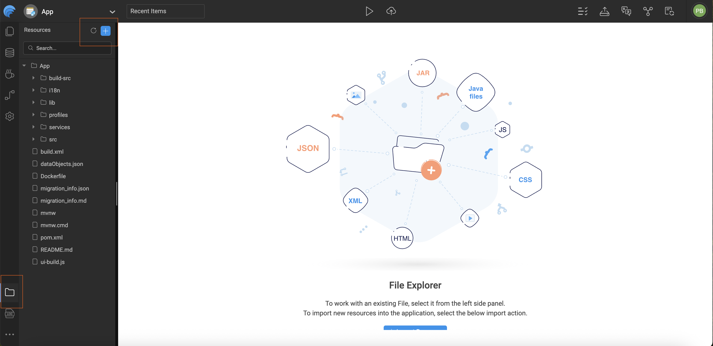
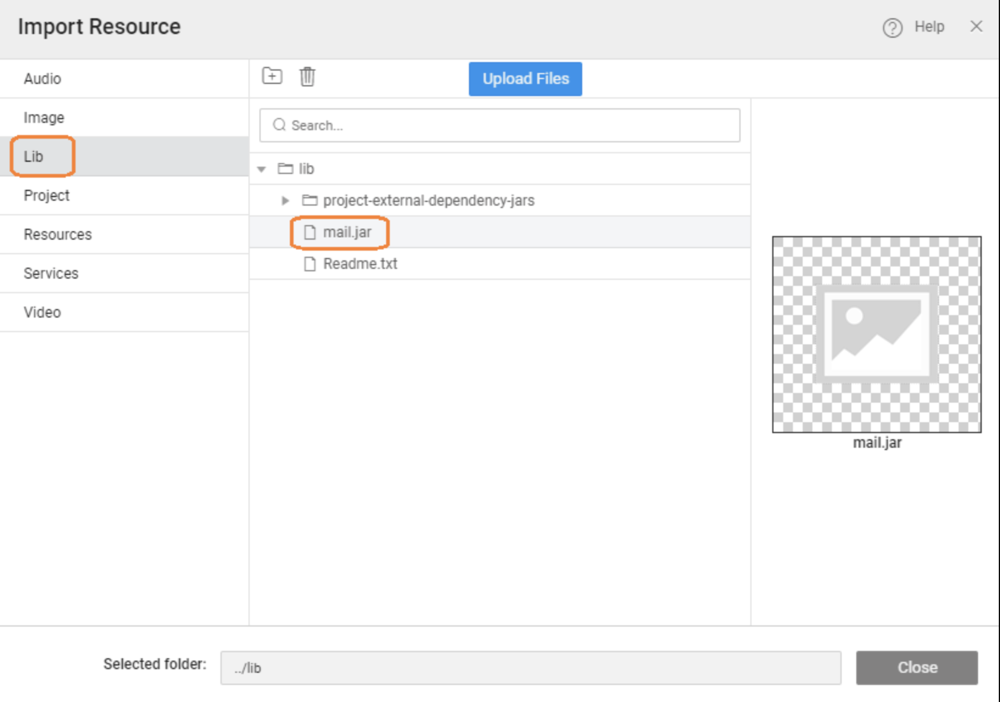

# Integrating Third-Party JAR Files

<!-- WaveMaker allows you to extend your backend capabilities by integrating external Java libraries (JAR files) into your application. Once a JAR is added, its classes become part of the application’s classpath and can be used seamlessly within Java Services or other backend components.

---

 -->

WaveMaker allows you to extend your backend capabilities by bringing in external Java libraries and using them seamlessly within Java Services. Once a JAR is added, its classes become part of the application’s classpath and can be used seamlessly within Java Services or other backend components

## Importing Third-Party JARs

Import the required **third-party JAR** into the application’s **Lib** folder using **Developer Utilities → File Explorer**. Once the JAR is part of the project, it becomes available on the application’s classpath.

From there, your Java Service can directly import the required classes from the JAR, just like any standard Java dependency. These classes can then be used inside your service methods to implement custom logic.

For example, after importing a mail library JAR, you can use its APIs inside a Java Service to send emails as part of your business workflow. This makes it easy to integrate external SDKs, utilities, or enterprise libraries while still keeping your APIs composed and orchestrated within WaveMaker.

This approach helps you:
- Extend backend logic beyond built-in services  
- Reuse existing Java libraries  
- Implement advanced integrations inside composed (BFF) APIs  


<!--  -->




---

<!-- ## Using Classes from the JAR

After the JAR is imported:

- Add the necessary `import` statements in your Java Service class for the classes you want to use from the JAR.
- Use the library’s classes and APIs in your service methods just as you would with any other Java code. 

For example, if you import a mail library JAR, you could write code in a Java Service to send emails using that library’s API.

--- -->

## Using Third-Party JARs in Java Services

Below is an example snippet showing how you might use an imported mail JAR in a Java Service. This code sets up email properties, creates a message, and sends it using SMTP.
Once your Java Service code is ready, you can invoke it from the frontend

```java
import java.util.Properties;
import jakarta.mail.Message;
import jakarta.mail.MessagingException;
import jakarta.mail.Session;
import jakarta.mail.Transport;
import jakarta.mail.internet.InternetAddress;
import jakarta.mail.internet.MimeMessage;

public String sendEmail(String userName, String password,
                        String toEmailAddress, String emailSubject,
                        String emailMessage) {
    try {
        Properties props = System.getProperties();
        props.put("mail.smtp.starttls.enable", "true");
        props.put("mail.smtp.host", "smtp.gmail.com");
        props.put("mail.smtp.port", "587");
        props.put("mail.smtp.auth", "true");
        props.put("mail.smtp.starttls.required", "true");

        Session session = Session.getDefaultInstance(props, null);

        MimeMessage message = new MimeMessage(session);
        message.setFrom(new InternetAddress(userName));

        String[] recipientList = toEmailAddress.split(",");
        InternetAddress[] recipientAddress = new InternetAddress[recipientList.length];
        int counter = 0;
        for (String recipient : recipientList) {
            recipientAddress[counter] = new InternetAddress(recipient.trim());
            counter++;
        }
        message.setRecipients(Message.RecipientType.TO, recipientAddress);

        message.setSubject(emailSubject);
        message.setContent(emailMessage, "text/html");

        Transport tr = session.getTransport("smtp");
        tr.connect("smtp.gmail.com", 587, userName, password);
        message.saveChanges();
        tr.sendMessage(message, message.getAllRecipients());
        tr.close();

        return "Mail sent successfully.";
    } catch (MessagingException e) {
        return "Error in sendEmail: " + e;
    }
}
```


<!-- ---


- WaveMaker supports importing external JAR files into the `Lib` folder.
- After import, classes in the JAR can be used in your Java Services.
- Java Services using third-party libraries can be triggered via variables and bound to UI elements for interaction. -->

---

## Summary

Third-party JAR support in WaveMaker makes it easy to extend your backend beyond built-in capabilities. By importing external Java libraries into the application, you can reuse existing SDKs, utilities, and frameworks directly within Java Services.

Once added to the `Lib` folder, JAR classes become part of the application classpath and can be used like any standard Java dependency. This enables you to implement advanced business logic, integrate external systems, and build composed (BFF-style) APIs that can be securely exposed to the frontend.

Overall, this approach helps you keep your APIs flexible, powerful, and tailored to your application’s needs—while still benefiting from WaveMaker’s low-code development experience.

---

## How-To Guides

Learn more about working with third-party files through these practical guides:

- [Synchronizing WaveMaker Apps with IDEs](/docs/guide/migrated-docs/synchronizing-wavemaker-apps-ides-beta.md) - Synchronizing WaveMaker Apps with IDEs
