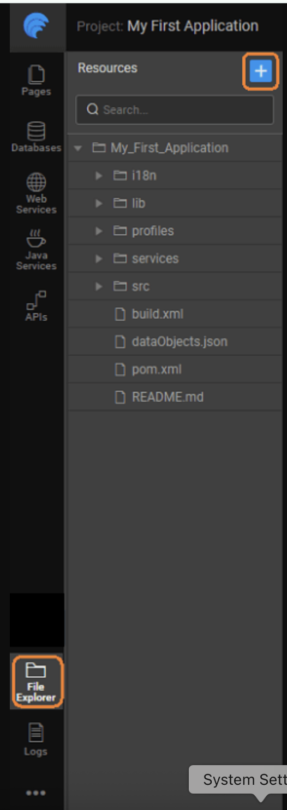
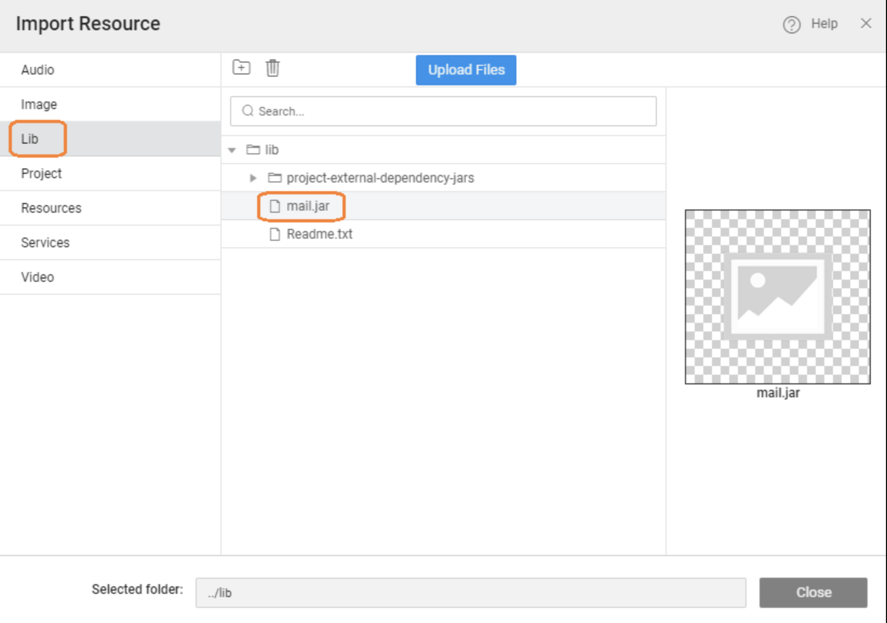

# Using Third-Party JAR Files

WaveMaker allows you to include and use external Java libraries (JAR files) within your application. Once imported, these JARs can be used just like any other Java class in your Java Services or backend logic.

---

## Adding a Third-Party JAR

To use an external JAR file in your WaveMaker application:

1. Open **Developer Utilities** and go to **File Explorer**.  
2. Choose **Import Resource** and select the `Lib` folder as the destination.  
3. Select the JAR file you want to add (for example, `mail.jar`) and import it into the project’s `Lib` folder.





---

## Using Classes from the JAR

After the JAR is imported:

- Add the necessary `import` statements in your Java Service class for the classes you want to use from the JAR.
- Use the library’s classes and APIs in your service methods just as you would with any other Java code. 

For example, if you import a mail library JAR, you could write code in a Java Service to send emails using that library’s API.

---

## Example: Using a Mail Library

Below is an example snippet showing how you might use an imported mail JAR in a Java Service. This code sets up email properties, creates a message, and sends it using SMTP:

```java
import java.util.Properties;
import jakarta.mail.Message;
import jakarta.mail.MessagingException;
import jakarta.mail.Session;
import jakarta.mail.Transport;
import jakarta.mail.internet.InternetAddress;
import jakarta.mail.internet.MimeMessage;

public String sendEmail(String userName, String password,
                        String toEmailAddress, String emailSubject,
                        String emailMessage) {
    try {
        Properties props = System.getProperties();
        props.put("mail.smtp.starttls.enable", "true");
        props.put("mail.smtp.host", "smtp.gmail.com");
        props.put("mail.smtp.port", "587");
        props.put("mail.smtp.auth", "true");
        props.put("mail.smtp.starttls.required", "true");

        Session session = Session.getDefaultInstance(props, null);

        MimeMessage message = new MimeMessage(session);
        message.setFrom(new InternetAddress(userName));

        String[] recipientList = toEmailAddress.split(",");
        InternetAddress[] recipientAddress = new InternetAddress[recipientList.length];
        int counter = 0;
        for (String recipient : recipientList) {
            recipientAddress[counter] = new InternetAddress(recipient.trim());
            counter++;
        }
        message.setRecipients(Message.RecipientType.TO, recipientAddress);

        message.setSubject(emailSubject);
        message.setContent(emailMessage, "text/html");

        Transport tr = session.getTransport("smtp");
        tr.connect("smtp.gmail.com", 587, userName, password);
        message.saveChanges();
        tr.sendMessage(message, message.getAllRecipients());
        tr.close();

        return "Mail sent successfully.";
    } catch (MessagingException e) {
        return "Error in sendEmail: " + e;
    }
}
```

This code uses classes from the external JAR to configure and send an email.


Once your Java Service method uses the imported library, you can invoke it from the frontend

---


- WaveMaker supports importing external JAR files into the `Lib` folder.
- After import, classes in the JAR can be used in your Java Services.
- Java Services using third-party libraries can be triggered via variables and bound to UI elements for interaction.

---

## Summary

Using third-party JARs allows you to extend your application with custom logic that leverages existing Java libraries.
