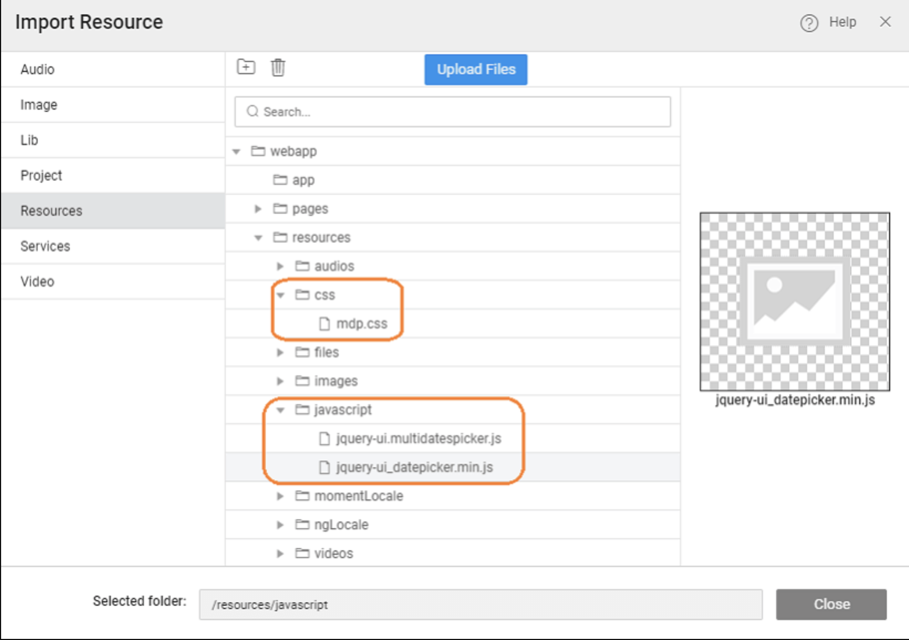
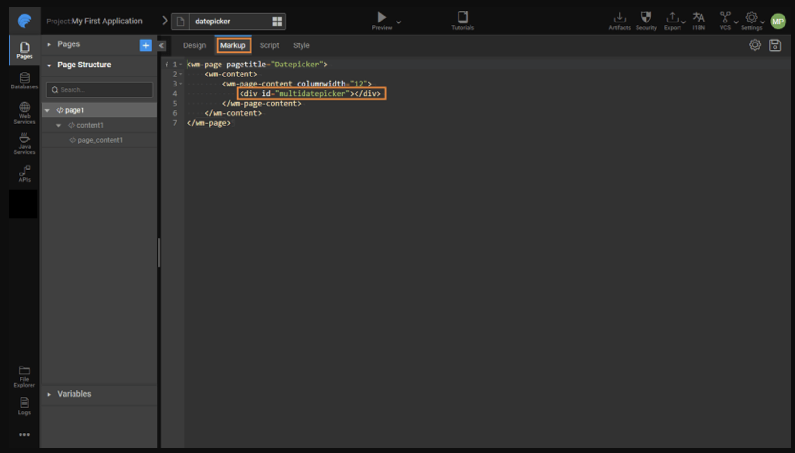
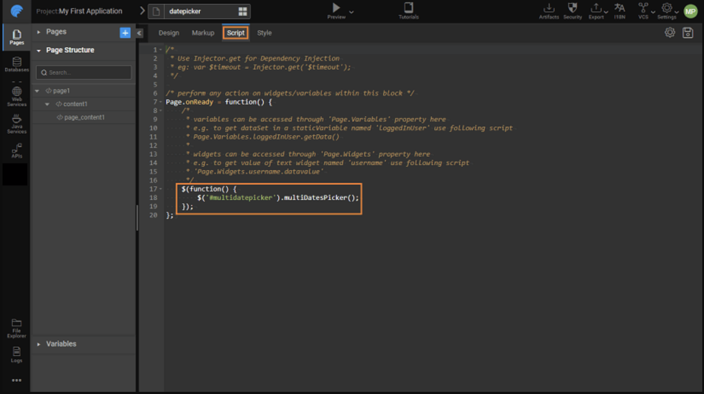

# Using Third-Party JavaScript Files 

WaveMaker supports incorporating external JavaScript and CSS files into your application. This enables you to use libraries and styles that extend the built-in functionality of the platform — for example, adding specialized UI controls or client-side behaviors that aren’t available by default. 

---

## Overview

To use external JavaScript or CSS libraries in your WaveMaker app, the general steps are:

1. Import the JavaScript and CSS files into your project and place them in appropriate resource folders.  
2. Add references to these files in your application’s `index.html` so they are loaded at runtime.  
3. Invoke the functions or UI behaviors from your app script code as needed. 

---

## Step-by-Step Process

### 1. Import Files

Use **Developer Utilities → File Explorer** to import the external JavaScript and CSS resources:

- Import the JavaScript file (e.g., a library or plugin) into a folder such as `resources/javascript`.  
- Import the corresponding CSS file (if any) into a folder like `resources/css`.  
- Create these folders if they do not already exist. :contentReference

For example, to enable a multi-date selection UI, you might import:
- `jquery-ui.multidatespicker.js` — the JavaScript code  
- `mdp.css` — the stylesheet for the date picker UI 


---

### 2. Reference the Files

After importing, edit your application’s **index.html** to include the JavaScript and CSS imports. Place `<script>` and `<link>` tags pointing to the imported resource paths so they are loaded when the app starts. 

Example (in `index.html`):

```html
<link rel="stylesheet" href="resources/css/mdp.css">
<script src="resources/javascript/jquery-ui.multidatespicker.js"></script>
```

Make sure the paths match the folders where you imported the files.

---

### 3. Use the Imported Library in Your App Script

Once the external files are referenced, you can call their functions from your page's script section.

For example, after importing a multi-date picker plugin, On the main page mark the position for the display of the date-picker using a div tag.



Now add the following logic to initialize it:


```javascript
$(function() {
    $('#multidatepicker').multiDatesPicker();
});

```


This attaches the multi-date picker functionality to an element with ID `multidatepicker` when the page loads.

---

## Example Use Case

Suppose your app's default calendar widget supports only a single date selection, but you want to allow users to select multiple dates. You can:

1. Download the MultiDatesPicker JavaScript and CSS files.
2. Import both into your project (JS under `resources/javascript` and CSS under `resources/css`).
3. Reference these files in `index.html`.
4. Use JavaScript in your page to initialize and attach the multi-date picker behavior.

When running the app, the multi-date picker UI appears, enabling users to choose multiple dates.

---

## Summary

Using third-party JavaScript libraries in a WaveMaker application involves:

- Importing JavaScript and CSS files into the project.
- Updating your `index.html` to load these resources at runtime.
- Calling library functions in your page script to enhance UI behavior or add features not natively supported by WaveMaker.

This approach makes it possible to integrate external UI components, plugins, and utilities seamlessly into your WaveMaker app.
