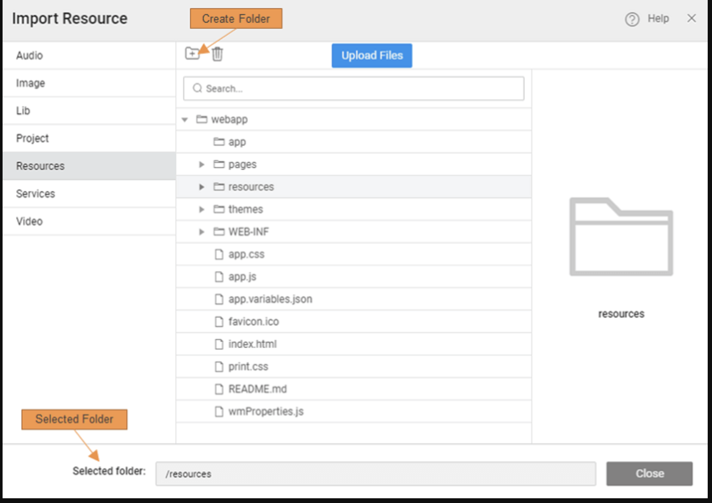

# Resources and Third-Party Libraries 

WaveMaker provides support for using external resources and libraries within your application. This includes images, audio/video files, JavaScript files, UI assets, and more. These resources can be imported into your project and utilized in your app logic or UI design. 

---

## File Explorer and External Resources

The **File Explorer** view in Developer Utilities displays the structure of your application, including the xgenerated Angular code (in `generated-angular-app`) alongside other project files. While most of these files are read-only, you can import additional resources that your app needs. 

---

## Importing External Resources

There are times when your application requires external assets or libraries. These could be:

- Static files such as images, audio, or video  
- JavaScript libraries  
- UI design assets  
- Other resource files

WaveMaker allows you to import these directly into your project. 

### Steps to Import Resources

1. Open **Developer Utilities** and go to **File Explorer**.  
2. Click the **+** button to open the **Import Resource** dialog.  
3. Select the appropriate destination folder inside your project structure.  
4. Upload the files you want to include. You can import multiple files at once.  
5. Use proper folder organization so WaveMaker can filter and use resources correctly (for example, images should be in an `Images` folder if they are to be used with image widgets).  
6. You can create sub-folders or nested folders by using `/` as the separator, such as `resources/images/icons`. :contentReference[oaicite:3]{index=3}

After importing, the resources are available in your project and can be referenced or bound to widgets and logic.

---

## Different Resource Types and Usage

Depending on the type of resource imported, WaveMaker supports different usage patterns:

**Images, Audio, or Video Files**  
- These can be bound directly to the appropriate widgets (such as Image or Media widgets) for display or playback.

**JavaScript Files**  
- After importing the JS file, you can reference it in your app (for example, via `<script>` tags or by invoking functions exposed by the library).  
- Usage of external JavaScript may require some familiarity with the library and how it integrates with your WaveMaker pages.
---

## Summary

WaveMaker lets you include and manage various external resources in your application:

- You can import images, audio/video, JavaScript files, and UI assets.  
- Imported resources appear under **File Explorer** and can be used across your app pages.  
- Proper folder organization helps in filtering and binding the resources appropriately.  
- Using external libraries extends functionality and gives you more flexibility in how your application behaves.

By leveraging these capabilities, you can enhance your WaveMaker applications with rich assets and custom logic beyond the built-in components. 
