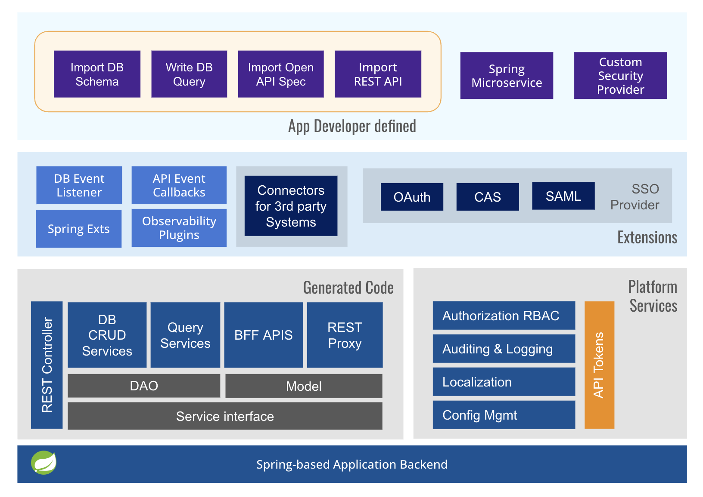

# Architecture

WaveMaker application backend architecture is composed of the following:
1. Developer defined artifacts for APIs & microservices
    - Imported Open API/Swagger spec, database schema
    - Custom Java/Spring services created for API orchestration, business logic and connector integrations
2. Platform provided services for
    - Authentication 
    - Auditing
    - Logging
    - Language support - i18n
3. Security provider integrations for authentication & SSO support
4. Extensions provided by Platform for DB, API callbacks, observability etc.
    - Leverage existing developer ecosystem with Spring Data and Spring REST for event listeners
    - Other Spring integrations such as EFK, GraphQL, AI etc.
5. Connectors for 3rd party systems such as kafka, mongodb, camunda, jasper etc.
6. Generated code artifacts for ORM, REST controller and microservices

## Detailed Architecture

## Related Documentation

- [Overview](./overview.md) - Concepts overview
- [TechStack](./techstack.md) - Technology stack
- [Security](../security) - Security best practices
