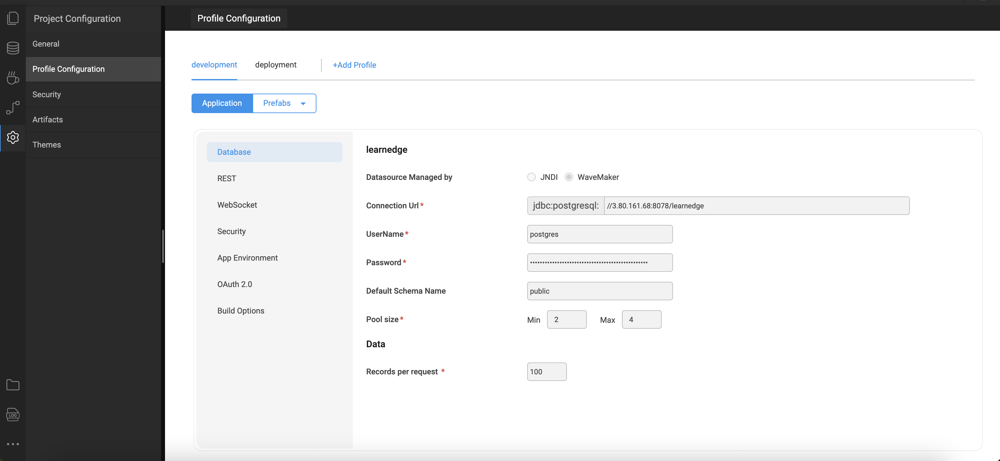

# Configuration Profiles

Configuration Profiles in WaveMaker allow you to define environment-specific settings for your application, such as database connections, API endpoints, and other external service configurations. This ensures that the same application can run seamlessly across multiple environments (development, testing, staging, production) without changing the codebase.

---

## Key Concepts

- **Profile**: A named set of configuration values that correspond to a specific environment.
- **Environment Variables**: Values like URLs, credentials, and file paths that vary between environments.
- **Externalizable Properties**: Application properties that can be parameterized in configuration profiles for easy switching between environments.

By using configuration profiles, developers can easily deploy the same application to different environments while maintaining consistent behavior.

---

## Creating Configuration Profiles

1. In WaveMaker Studio, navigate to **Deploy → Configuration Profiles**.
2. Click **New Profile** to create a new environment profile.
3. Provide a **Name** and configure properties such as:
   - Database connection strings
   - API URLs
   - Authentication credentials
   - Any other environment-specific parameters
4. Save the profile. You can create multiple profiles for different environments (e.g., Development, QA, Production).

---

## Using Configuration Profiles

- When deploying an application, you can select a specific profile to inject its values into the runtime environment.
- All externalizable properties referenced in the application will automatically pick up the values from the selected profile.
- This eliminates the need to modify the application code or rebuild the project for different environments.

---

## Benefits

- **Consistency**: Ensures that the same application behaves consistently across environments.
- **Flexibility**: Easily switch between different environments without manual code changes.
- **Simplified Deployment**: Reduces deployment errors by centralizing environment-specific configurations.
- **Reusability**: Profiles can be reused across multiple applications within the same WaveMaker workspace.

---

## Example Use Case

Suppose your application interacts with a REST API and a database. Instead of hardcoding URLs or credentials:

- Create a **Development** profile with a local database and a test API endpoint.
- Create a **Production** profile with the live database and production API endpoint.
- When deploying, simply select the appropriate profile, and all services in your application will automatically connect to the correct endpoints.

This approach streamlines application deployment and environment management.  

