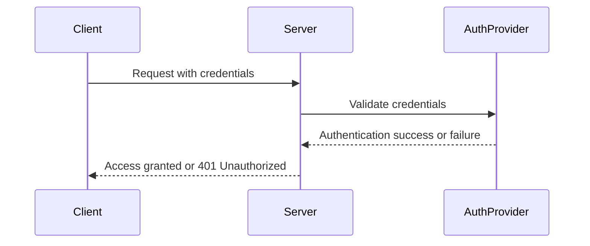
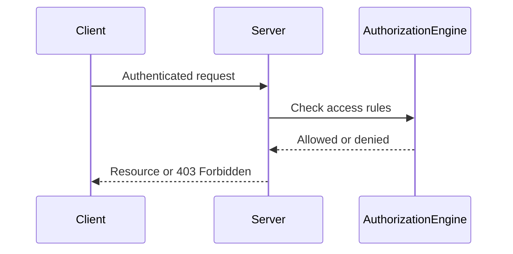
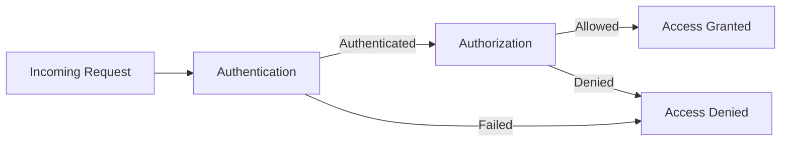
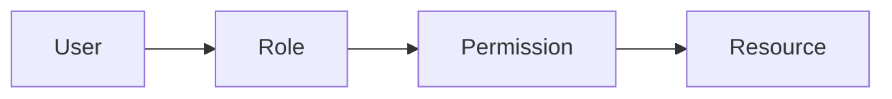
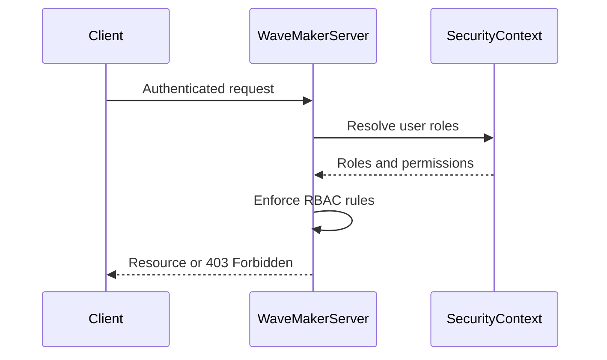

# Authentication & Authorization

Authentication and authorization form the core of application security. Together, they ensure that only valid users can access an application and that each user can perform only the actions they are permitted to perform.

This chapter explains these concepts in detail, introduces Role-Based Access Control (RBAC), and describes how WaveMaker enforces authentication and authorization consistently across application layers.

## Authentication

Authentication is the process of verifying the identity of a user or system attempting to access an application. It answers the question:

**Who is making this request?**

Authentication typically involves validating credentials such as usernames and passwords, tokens, or certificates, and establishing a trusted identity for the duration of a session or request.

### Authentication Flow

If authentication fails, the server rejects the request and returns an HTTP 401 (Unauthorized) response. If authentication succeeds, the authenticated identity is associated with the request context and passed to subsequent authorization checks.

## Authorization

Authorization determines what an authenticated user is allowed to do. It answers the question:

**Is this user permitted to access this resource or perform this action?**

Authorization is evaluated only after successful authentication and is based on access rules such as roles, permissions, or policies.

### Authorization Flow

If authorization fails, the server responds with HTTP 403 (Forbidden), indicating that the user is authenticated but does not have sufficient privileges.

## Authentication vs Authorization

Authentication verifies identity and always occurs first. Authorization verifies permissions and occurs only after authentication.

## Role-Based Access Control (RBAC)

Role-Based Access Control (RBAC) is a widely adopted authorization model in which permissions are assigned to roles, and roles are assigned to users. Instead of managing permissions for individual users, RBAC simplifies access control by grouping permissions into well-defined roles.

### Core RBAC Concepts

- **User** – An authenticated identity  
- **Role** – A named collection of permissions  
- **Permission** – Approval to perform an action or access a resource  
- **Resource** – APIs, services, pages, or data  

### RBAC Model

This model enables centralized permission management, reduces duplication of access rules, and clearly separates identity from access control logic.

## RBAC in WaveMaker

WaveMaker implements RBAC as a server-enforced authorization model, ensuring that access rules are consistently applied and cannot be bypassed from the client.

In WaveMaker:

- Users are authenticated using a configured security provider  
- Authenticated users are associated with one or more roles  
- Roles define access to APIs, services, data operations, and UI actions  

Authorization rules are evaluated on every request, regardless of whether the request originates from the application UI, a REST API call, or an external integration.

### WaveMaker RBAC Enforcement Flow

## Securing Application Layers

WaveMaker enforces authentication and authorization across multiple layers of an application:

- **API layer** – Controls access to exposed services  
- **Service layer** – Enforces business-level permissions  
- **Data layer** – Restricts create, read, update, and delete operations  
- **UI layer** – Conditionally enables, disables, or hides actions based on roles  

This layered approach ensures that security does not rely solely on client-side controls and remains effective even when APIs are accessed directly.

