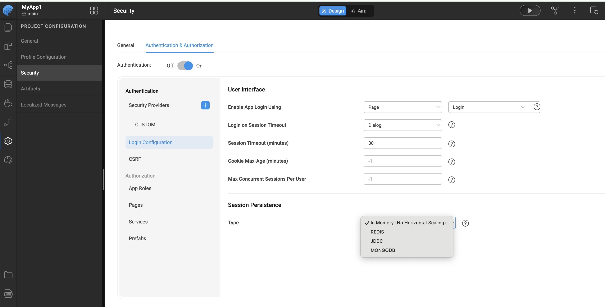

# Concurrent Sessions

At WaveMaker, application security is a continuous priority. **Concurrent Sessions** add an additional layer of protection by controlling how many active sessions a single user can maintain at the same time.

By leveraging the **Spring Security framework** in the WaveMaker-generated application code, concurrent session control prevents users from authenticating to the same application more than a configured number of times simultaneously.

---

## How It Works

WaveMaker allows developers to configure a maximum number of concurrent sessions per user using Spring Security.

Once enabled:
- A limit is enforced on the number of active sessions a user can maintain.
- When the maximum number of concurrent sessions is reached, a predefined policy determines the behavior.
- One such policy is to **invalidate the least recently used session** to allow a new login.

The maximum concurrent sessions value:
- Can be any **positive number**
- Can be set to **-1** for unlimited sessions
- **Cannot be set to 0**

---

## Configuring Concurrent Sessions in WaveMaker Applications

The Concurrent Sessions feature is **disabled by default** and is set to **-1**, allowing unlimited concurrent sessions.

To configure this setting:

1. Navigate to **Security** → **Authentication** → **Login Configuration** → **Max Concurrent Sessions per User**.
2. Specify the allowed number of **Max Concurrent Sessions per User**.

---

## Security Best Practices

When configuring concurrent sessions, consider the following best practices to balance security and user experience:

- Set a **low session limit** (such as 1 or 2) for applications handling sensitive or privileged data.
- Use the **invalidate least recently used session** policy to prevent session hoarding while allowing legitimate re-logins.
- Combine concurrent session limits with **short session timeouts** for enhanced protection.
- Monitor session-related logs to identify unusual login patterns or potential account misuse.
- Avoid setting unlimited sessions (`-1`) for externally accessible or high-risk applications unless explicitly required.

---

## Recommended Configuration Scenarios

| Use Case | Recommended Max Concurrent Sessions |
|--------|-------------------------------------|
| Highly sensitive internal apps | 1 |
| Enterprise business applications | 1–2 |
| Public or low-risk applications | 2–3 |
| Testing or development environments | -1 (Unlimited) |

---

## Important Notes

- Concurrent session control is enforced **server-side** using Spring Security.
- Session limits apply **per user**, not per device.
- Logging out from one session immediately frees up a slot for a new session.
- Changes to concurrent session settings require application redeployment to take effect.

