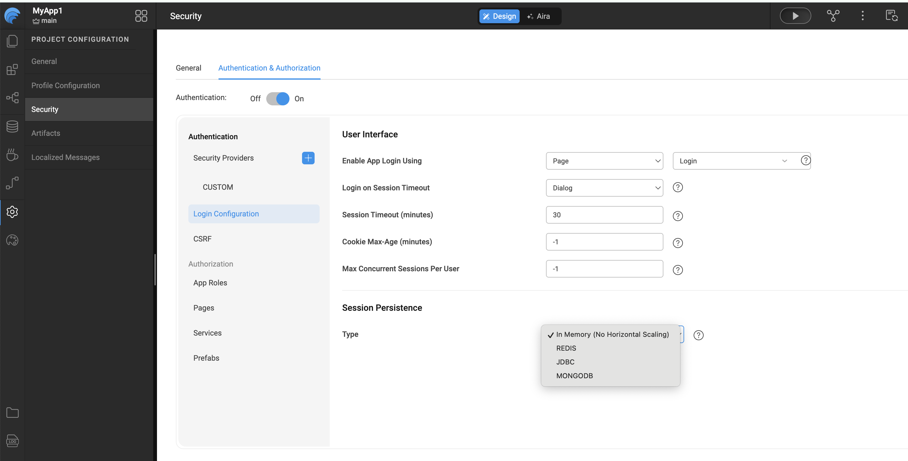

# Session Persistence – Scaling Applications

Session Persistence defines where and how user session data is stored. Configuring session persistence is essential when enabling **horizontal scaling**, as it ensures that user sessions remain available across multiple application instances.

Horizontal scaling involves running the application on multiple nodes or servers. Incoming requests are distributed across these nodes, allowing the application to handle higher traffic and more concurrent users. With proper session persistence in place, there is no practical limit to the number of nodes that can serve the same application.

---

## How to Configure Session Persistence

1. Connect to the application database.
2. Navigate to the **Security** menu.
3. Open the **Authentication and Authorization** tab and enable **Authentication**.
4. From the left navigation, select **Login Configuration**.
5. Scroll down to the **Session Persistence** section.
6. Choose a **Type** from the following options:
   - **In-Memory**
   - **REDIS**
   - **JDBC**
   - **MONGODB**

---

## Session Persistence Types

### In-Memory

**In-Memory** is the default option and is suitable for **single-node deployments**.  
Session data is stored locally within the application instance and is not shared across nodes.

---

### REDIS

When **REDIS** is selected, session data is stored in a centralized Redis cache, making it ideal for horizontally scaled applications.

You must provide the following details:
1. Host  
2. Port  
3. Password  
4. Database  

For more information, refer to **Host, port, password, and database** in the [Redis documentation](https://redis.io/topics/rediscli#host-port-password-and-database)

The default Redis database is **0**, but this can be changed based on your Redis setup.

---

### JDBC

With **JDBC** session persistence, user session data is stored in a relational database.

- The configuration displays a dropdown containing all databases imported into the project.
- Applications may have multiple active login sessions, and each session—along with its timeout information—is stored in database tables.

To configure JDBC session persistence:
1. Select a database from the dropdown.

:::note
The selected database must be in **editable mode** and not configured as read-only.
:::

2. Click **Save** to apply the settings.

---

### MongoDB

MongoDB can also be used to store application session data.

To configure MongoDB session persistence:
1. Open the **Security** window and select **Session Persistence**.
2. Choose **Type** as `MONGODB`.
3. Provide the required details:
   - Database Name
   - Host
   - Port
   - Username
   - Password
4. Click **Save**.

WaveMaker automatically imports the required drivers and configuration files, enabling the application to connect to MongoDB seamlessly.

---

## Summary

Session Persistence enables WaveMaker applications to maintain user sessions reliably, especially in **horizontally scaled environments**. By externalizing session storage, applications can distribute load across multiple nodes without losing session continuity.

WaveMaker supports multiple session persistence strategies—**In-Memory, Redis, JDBC, and MongoDB**—allowing teams to choose the most appropriate option based on deployment size, scalability requirements, and infrastructure preferences. With built-in configuration and automatic dependency management, WaveMaker simplifies session persistence while ensuring secure and consistent se

