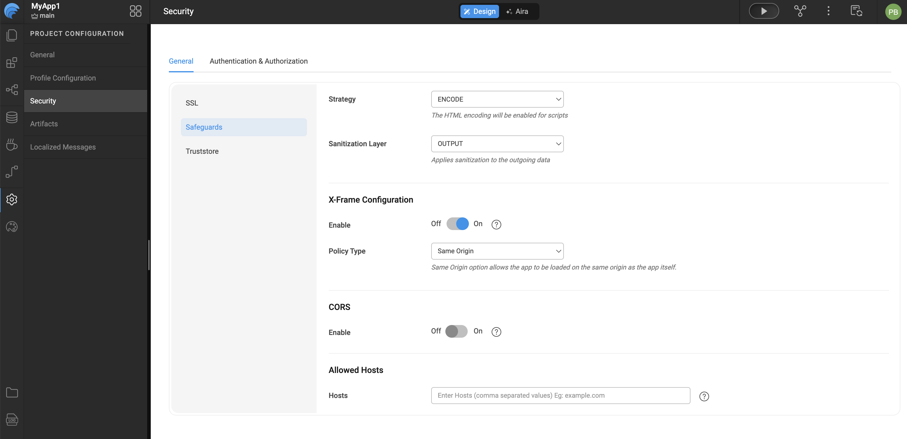

# Prevent HostHeader Injection

WaveMaker emphasizes building secure applications that are resilient against common web vulnerabilities, including HostHeader attacks.  

Improper handling of the HTTP `Host` header can lead to serious security issues. These attacks often occur because applications **assume the Host header is safe and unmodifiable**, leading to insufficient validation or escaping.

---

## Potential Risks

Attackers can inject malicious payloads into the Host header, which may result in:

- **Web-cache poisoning**  
- **Password reset poisoning**  

For additional details, refer to [OWASP in WaveMaker](owasp.mdx).

---

## Preventing HostHeader Injection

Since the Host header is **user-controllable** and can be manipulated using tools like Burp Proxy, it is critical to:

- **Validate the Host header** in all incoming requests  
- **Whitelist permitted hostnames or domains**

---

## How WaveMaker Mitigates HostHeader Injection

WaveMaker allows you to specify which hostnames are permitted for your application. Requests with a `Host` header **not included in the allowed list will be rejected**.  

- By default, if no hostnames are configured, **all hostnames are allowed**.  
- Configuring allowed hosts ensures that only requests with legitimate host headers are processed, preventing malicious injections.

---

## Configuring Allowed Hosts in WaveMaker

To control which hostnames or domains are permitted to access your WaveMaker application, you can configure the Allowed Hosts setting under the Security Safeguards configuration. This process helps enhance application security by restricting access only to trusted sources.

Begin by opening your WaveMaker application and accessing the Security configuration area. Within Security, navigate to the Safeguards section where application-level protection settings are managed. Locate the Allowed Hosts configuration and specify the hostnames or domains that should be permitted to access the application by entering them in the Hosts field. Once the required host entries are provided, save the configuration to ensure the changes are applied and enforced by the application.

