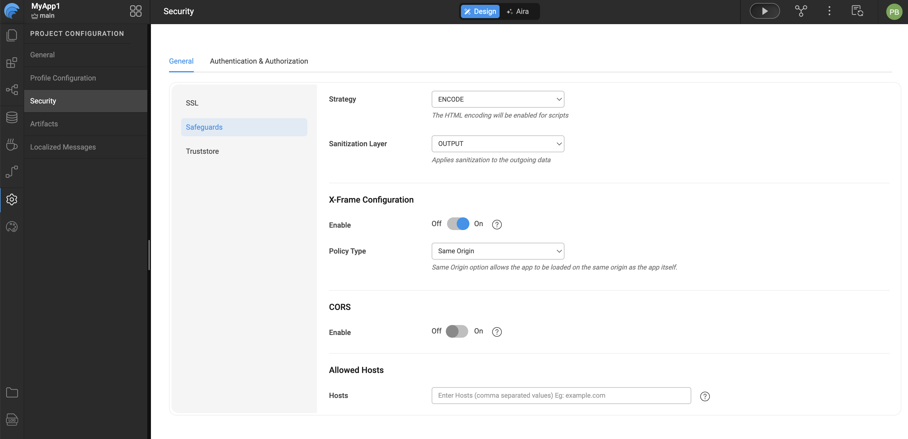

# Prevent HostHeader Injection

WaveMaker emphasizes building secure applications that are resilient against common web vulnerabilities, including HostHeader attacks.  

Improper handling of the HTTP `Host` header can lead to serious security issues. These attacks often occur because applications **assume the Host header is safe and unmodifiable**, leading to insufficient validation or escaping.

---

## Potential Risks

Attackers can inject malicious payloads into the Host header, which may result in:

- **Web-cache poisoning**  
- **Password reset poisoning**  

For additional details, refer to [OWASP in WaveMaker](#).

---

## Preventing HostHeader Injection

Since the Host header is **user-controllable** and can be manipulated using tools like Burp Proxy, it is critical to:

- **Validate the Host header** in all incoming requests  
- **Whitelist permitted hostnames or domains**

---

## How WaveMaker Mitigates HostHeader Injection

WaveMaker allows you to specify which hostnames are permitted for your application. Requests with a `Host` header **not included in the allowed list will be rejected**.  

- By default, if no hostnames are configured, **all hostnames are allowed**.  
- Configuring allowed hosts ensures that only requests with legitimate host headers are processed, preventing malicious injections.

---

## Configuring Allowed Hosts in WaveMaker

To specify allowed hostnames:

1. Open your WaveMaker application.  
2. Navigate to **Security** → **Safeguards**.  
3. In the **Allowed Hosts** section, add the permitted hostnames or domains in the **Hosts** field.  
4. Click **Save** to apply the changes.  

This configuration ensures your application only accepts requests from trusted domains, mitigating HostHeader injection attacks.

