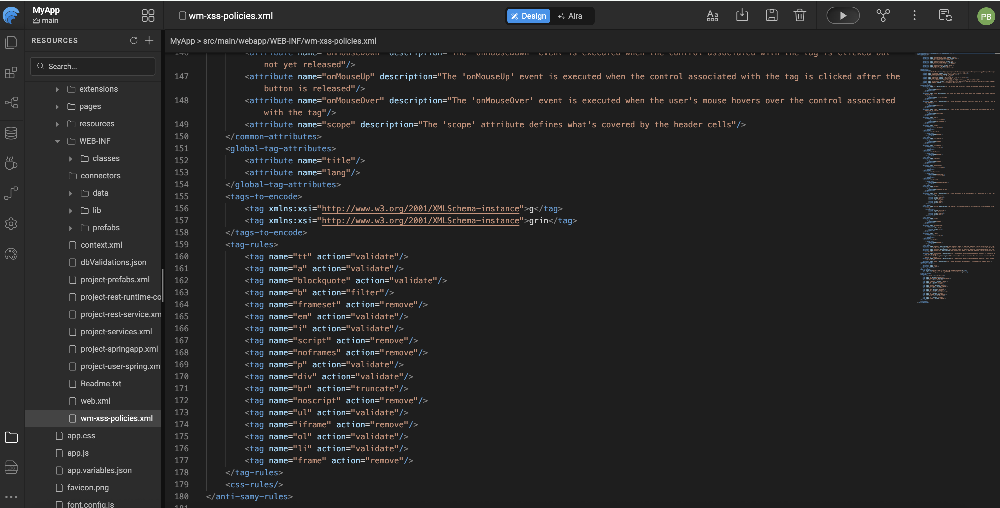
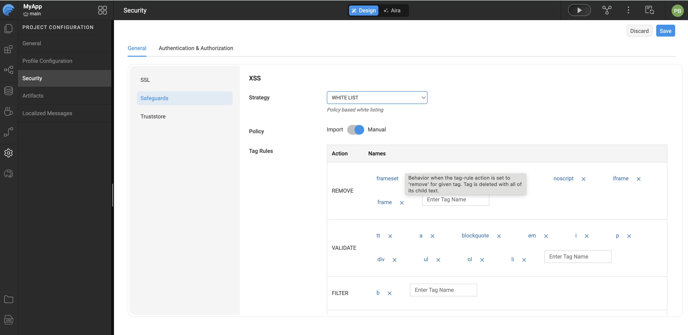

# OWASP

 **OWASP (Open Web Application Security Project)** is a global open community dedicated to helping organizations design, develop, acquire, operate, and maintain applications that can be trusted.

One of OWASP’s most influential resources is the **OWASP Top 10**, which identifies the  
[10 Most Critical Web Application Security Risks](https://www.owasp.org/index.php/Category:OWASP_Top_Ten_Project).

Among these risks, **Cross-Site Scripting (XSS)** and **Cross-Site Request Forgery (CSRF)** consistently rank as some of the most common and dangerous vulnerabilities in web applications.

---

## Understanding XSS and CSRF

### Cross-Site Scripting (XSS)

[XSS](https://www.owasp.org/index.php/Top_10_2013-A3-Cross-Site_Scripting_(XSS)) vulnerabilities occur when an application accepts untrusted input and sends it to the browser without proper validation or escaping. This allows attackers to inject and execute malicious scripts in a victim’s browser.

The impact of XSS attacks includes:
- Hijacking user sessions
- Stealing sensitive information
- Defacing websites
- Redirecting users to malicious sites

### Cross-Site Request Forgery (CSRF)

A [CSRF](https://www.owasp.org/index.php/Top_10_2013-A8-Cross-Site_Request_Forgery_(CSRF)) attack tricks a logged-in user’s browser into sending a forged HTTP request to a vulnerable application. Because the browser automatically includes session cookies and authentication headers, the application treats the request as a legitimate action initiated by the user.

### Same-Origin Policy and CORS

The **Same-Origin Policy** is a core browser security mechanism that prevents JavaScript from making requests to a different origin (for example, a different domain) than the one from which it was loaded. While this policy protects against malicious cross-origin access, it can also block valid communication between trusted systems.

**[Cross-Origin Resource Sharing (CORS)](https://spring.io/understanding/CORS)** provides a controlled way to relax the same-origin policy, allowing web applications to safely consume APIs and resources hosted on different origins.

---

## Preventing XSS Attacks

XSS attacks occur when attackers inject browser-side scripts into a web application that are later executed in another user’s browser. For example, an attacker might submit the following input in a text field:

```html
<script>alert(document.cookie)</script>
```

If not properly handled, this script executes and exposes sensitive data such as cookies.

WaveMaker provides multiple strategies to handle XSS attacks through the Security dialog.

### XSS Protection Modes

#### NONE

No XSS protection is applied. All scripts are allowed to execute.
This is the default configuration and is **not recommended** for production environments.

#### ENCODE

All scripts are encoded before being processed, ensuring they are rendered as plain text instead of executable code.

**Example:**

Input:
```html
<script>alert(document.cookie)</script>
```

Is converted to:
```html
&lt;script&gt;alert(document.cookie)&lt;/script&gt;
```

This prevents the browser from interpreting the input as a script.

#### WHITE LIST
In this case, the scripts will be filtered based on
- **Policy file**: this will implement XSS protection based on the rules defined in `/src/main/webapp/WEB-INF/wm-xss-policies.xml`. The default policy file is `wm-xss-policies.xml`. According to this default policy file, script tags will be removed. However, you can upload your own policy file which will be uploaded to WEB-INF folder. Clicking on to the file name will open it in the editor. Go through the [document](xss-antisamy-policy-configuration.mdx) for more descriptions on AntiSamy rules. 


The default policy removes `<script>` tags. Developers can upload a custom policy file, which is stored in the WEB-INF folder. Clicking the file name opens it in the editor. Refer to the AntiSamy documentation for detailed rule definitions.

  

- **Manual tags**: Custom tag rules can be specified in terms of HTML tags which are categorized based on their actions. The possible actions are Validate, Remove, Truncate and Filter. These rules are used while handling the tags in the XSS attacks. You can add or delete tags against an action. We can specify the action for all Unknown tags also. 

  

---

## Preventing CSRF Attacks

CSRF attacks exploit the trust a user has in a website by forcing their browser to submit malicious requests without explicit user intent. These attacks are often triggered by embedding malicious actions in external websites.

Angular provides built-in CSRF protection. During XHR requests, the `$http` service reads a token from a cookie (default: `XSRF-TOKEN`) and includes it as an HTTP header (`X-XSRF-TOKEN`). Since only JavaScript running on the same domain can read the cookie, the server can verify that the request originated from a trusted source.

> **Note:** The CSRF header is not sent for cross-domain requests.

### WaveMaker CSRF Defaults

- **Cookie Name:** `wm_xsrf_token` (Set at runtime during the login process)
- **Header Name:** `X-WM-XSRF-TOKEN`

These values can be customized using the Security dialog.

---

## Enabling CORS

Cross-Origin Resource Sharing (CORS) allows a web application to request restricted resources from a different domain than the one serving the application. Examples include images, stylesheets, scripts, iframes, and videos.

CORS defines a secure interaction model between the browser and server to determine whether a cross-origin request should be allowed. When CORS is enabled in WaveMaker, the following configuration options are available:

### CORS Configuration Options

- **Allow Credentials**
  Allows cookies and authentication data to be sent with XHR requests.

- **Max Age**
  Specifies the duration (in seconds) for which the pre-flight response is cached by the browser.

- **Path**
  Restricts CORS access to specific resource paths within the WaveMaker application.

- **Origins**
  Defines the list of trusted origins that are allowed to access application resources.

  

---

## Summary

By combining OWASP best practices with WaveMaker's built-in security features, applications can achieve strong protection against common web vulnerabilities while maintaining flexibility and ease of development.