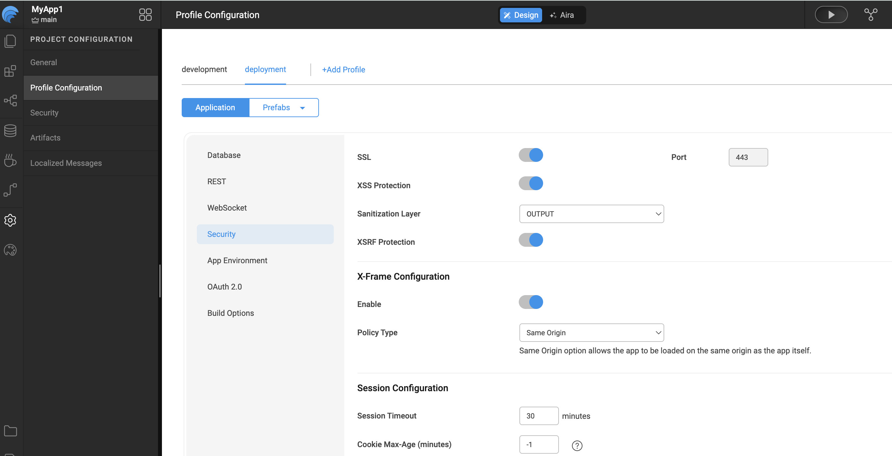

# SSL Encryption

WaveMaker applications can be accessed over the **HTTPS** protocol to ensure a higher level of security.  

Enabling **SSL** ensures that all requests are redirected to a secure URL. For example, if a user enters: `http://www.wavemakeronline.com`

the SSL filter automatically redirects them to: `https://www.wavemakeronline.com`

---

## Configuring SSL in WaveMaker

SSL encryption can be configured in the **[Profile Configuration](#)**, which is accessible via the **Settings** menu in the Project Workspace.

- **Development Profile:** SSL is enabled by default.
- **Deployment Profile:** You can enable or disable SSL based on your deployment requirements.

