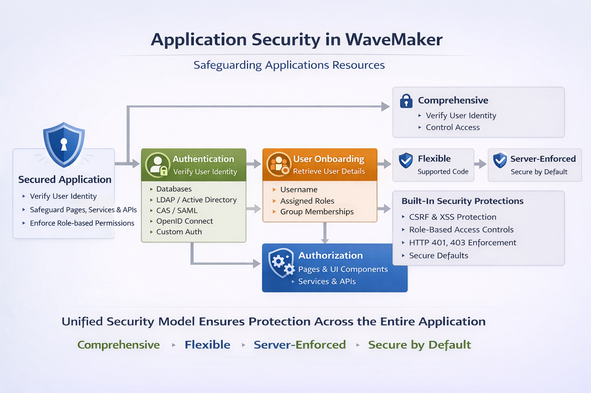

#  Overview

Application security in WaveMaker provides a structured framework to safeguard application resources. It controls who can access the application, verifies user identities using supported authentication mechanisms, and enforces authorization rules to ensure users can perform only permitted actions.

This overview introduces the WaveMaker security model and explains how authentication, user onboarding, and authorization work together to secure the application.

---

## What Is Application Security?

Application security ensures that only authenticated users can access the application and that users can perform actions only within the scope of their assigned roles.

WaveMaker security is based on three core components:

- **Authentication** – Verifies the identity of the user  
- **User Onboarding** – Retrieves user details and maps them to roles  
- **Authorization** – Controls access to application resources  

These components work together to provide a secure and scalable access control mechanism.

---

## Security Workspace

WaveMaker provides a dedicated **Security Workspace** that serves as the central hub for configuring and managing application security.

From the Security Workspace, you can:

- Configure authentication providers (OIDC, LDAP, SAML, CAS, and more)
- Manage users and define application roles
- Set access permissions for pages, services, and APIs
- Enable and customize security features such as SSO and token-based authentication

The Security Workspace offers a visual, configuration-driven approach, allowing developers to implement authentication and authorization without writing boilerplate security code.

A short video in this section walks through the Security Workspace UI and demonstrates how to configure providers, map roles, and enforce access control across the application.

**Learn more:** [Security Configurator](../../studio/workspaces/security-configurator.mdx)

---

## Security Enforcement Flow

The WaveMaker security framework follows a clear, structured sequence:

1. **Request Interception** – Incoming requests are intercepted by the security framework.  
2. **Authentication** – User identity is verified using the configured authentication provider.  
3. **User Onboarding** – Additional user details, roles, and group memberships are retrieved.  
4. **Authorization Evaluation** – Permissions are checked against the user’s assigned roles.  
5. **Access Enforcement** – Access to pages, services, and APIs is granted or denied based on the evaluation.  

This unified approach ensures **consistent security across the entire application stack**, from UI to database.

---

## Core Security Components

WaveMaker’s security framework is built on three core components that work together to protect applications. These components ensure users are authenticated, their roles are mapped, and access to resources is properly controlled.

### Authentication – Verifying User Identity
Authentication is the first step in securing an application. It confirms that a user is who they claim to be before granting access.

WaveMaker supports multiple authentication mechanisms, including:

- **Database-based authentication** – Traditional username/password verification against the application database.  
- **LDAP / Active Directory** – Enterprise directory integration for centralized user management.  
- **Central Authentication Service (CAS) / SAML** – Federated authentication for single sign-on (SSO) capabilities.  
- **OpenID Connect** – Modern OAuth 2.0-based identity verification for cloud applications.  
- **Custom authentication** – Java-based services to implement proprietary authentication logic.

If a user fails authentication, access is denied, returning an HTTP 401 response or redirecting to a login flow.

### User Onboarding – Mapping Users to Roles
After authentication, WaveMaker retrieves additional user details during **onboarding**:

- **Username** – Unique user identifier.  
- **Assigned roles** – Predefined roles that determine access permissions.  
- **Group memberships** – Optional grouping to simplify role assignment and management.  

This information is mapped to application roles, forming the foundation for **role-based access control (RBAC)** and ensuring that users can only perform authorized actions.

### Authorization – Enforcing Access Control
Authorization determines **what an authenticated user can do** within the application. WaveMaker uses a **role-based access control (RBAC) model**, where permissions are assigned to roles rather than individual users. This ensures scalable and maintainable access management.

Authorization is applied consistently across:

- **Application pages and UI components** – Controls visibility and interaction.  
- **Backend services and APIs** – Secures business logic and data endpoints.  
- **Actions and workflows** – Ensures users perform only allowed operations.  

All checks are enforced **server-side**, ensuring security even if client-side code is modified or bypassed.

To Learn More [Authentication and Authorization](authentication-and-authorization)

### Server-Side Enforcement

All authentication and authorization checks are enforced on the server. While the UI can conditionally show or hide features, server-side validation ensures that application resources remain protected even if client-side logic is modified or bypassed.

To Learn more [Secure Server Side Properties](../../guide/migrated-docs/secure-server-side-properties)

### Built-In Protections

WaveMaker includes several **pre-configured security mechanisms** to protect applications against common threats:

- **CSRF (Cross-Site Request Forgery) Protection** – Prevents unauthorized actions triggered from malicious websites.  
- **XSS (Cross-Site Scripting) Protection** – Protects against injection of malicious scripts in UI components.  
- **HTTP 401 / 403 Enforcement** – Ensures proper responses for unauthorized or forbidden access.  
- **Secure Default Settings** – Sensible defaults reduce risk even for applications with minimal security customization.  
- **Role-Based Access Controls (RBAC)** – Fine-grained access control based on roles, ensuring users can perform only authorized operations.

To Learn More [Built-In Protections](hardening-app/xss-antisamy-policy-configuration)

---

## Generated Backend Code

When a security provider is configured, WaveMaker automatically generates backend security code during the build process. This code:

- Integrates security controls into the backend runtime  
- Enforces authentication and authorization consistently  
- Aligns with standard backend security frameworks  

Managed by the platform, it evolves with configuration changes, reducing manual boilerplate and letting developers focus on defining roles, permissions, and application behavior.

---

## Summary

Security in WaveMaker provides a complete and flexible access control framework:

- **Comprehensive** – Combines authentication, user onboarding, and authorization  
- **Flexible** – Supports multiple authentication providers and custom logic  
- **Server-Enforced** – Prevents access through client-side circumvention  
- **Secure by Default** – Includes protections against common web security threats  

By using WaveMaker’s security framework, applications ensure that only authenticated users can access protected resources and that users can perform only the actions permitted by their assigned roles.

