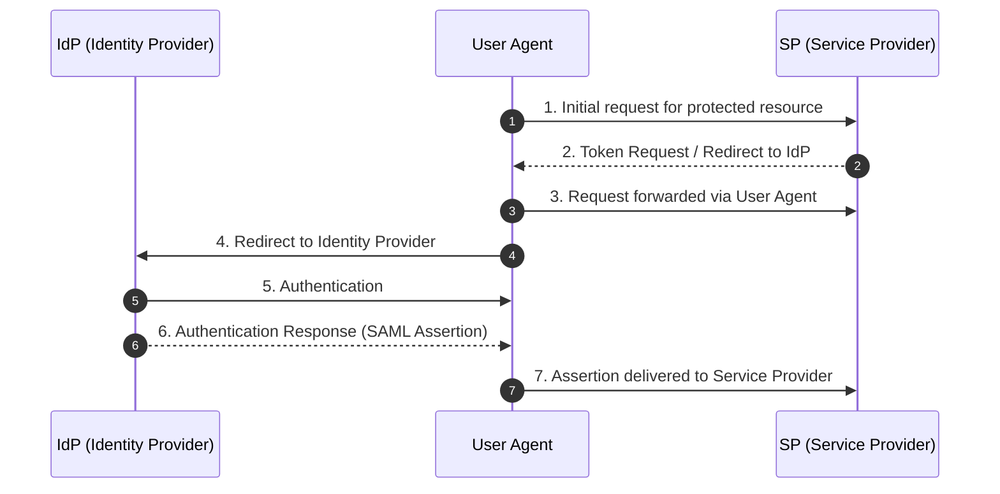
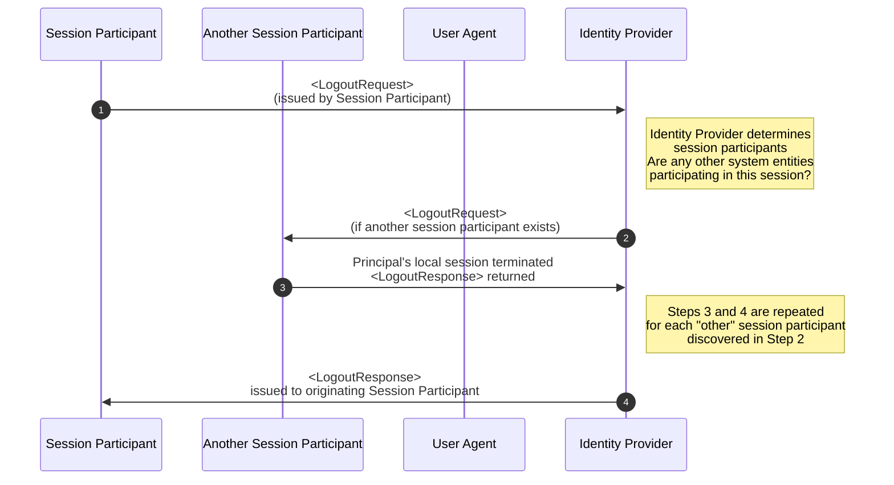
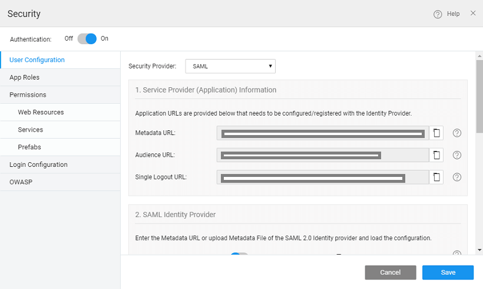
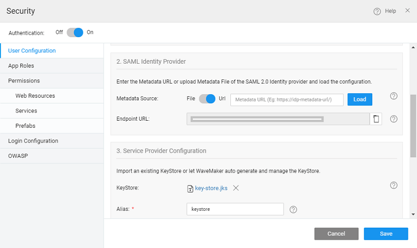
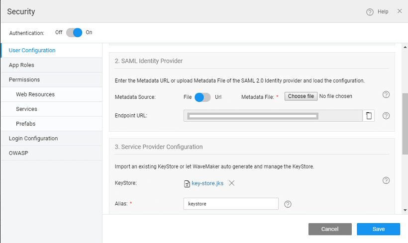
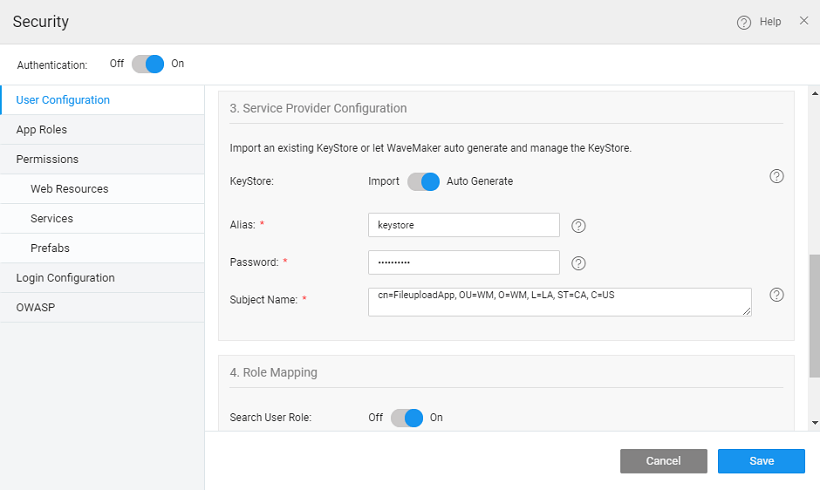
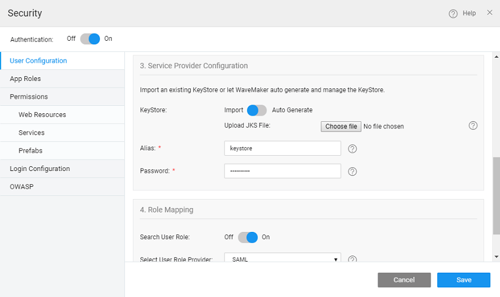
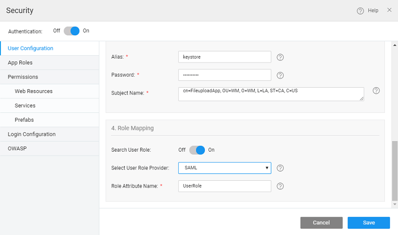
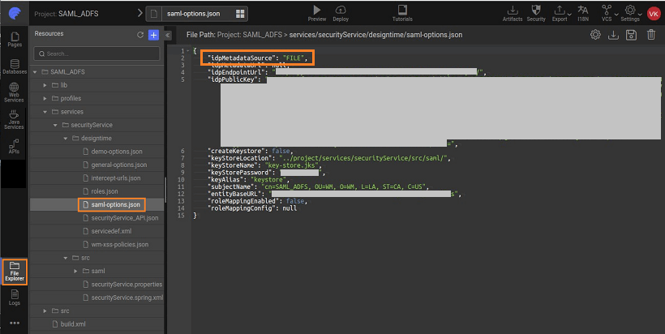
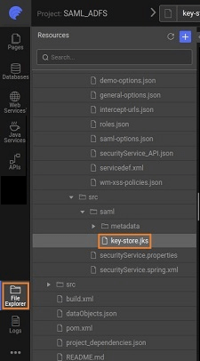

# SAML Integration
---
**Security Assertion Markup Language (SAML)** is an XML-based open standard for exchanging authentication and authorization data between different parties. The SAML exchanges are usually between


- identity provider (IdP) - producer of assertions, and
a service provider (sp) - the consumer of assertions.
- Using Open ID, WaveMaker applications can let their customers login using their already existing identity such as Google Account, Okta, or AuthO. It is also possible to implement SSO by setting up multiple applications use the same Open ID provider. Some well-known Open ID providers include **Google**, **Okta**, and **AuthO**. For example, Twitter uses Open ID authentication where you can select Identity Provider like Google to login.

The identity provider could be any vendor like ADFS, OneLogin, Okta etc. which supports SAML-based Single Sign-On (SSO). The service provider is your WaveMaker application which makes use of Identity Provider to enable single sign-on across all your WaveMaker applications.

The advantages of SAML SSO

- Each and every application do not need to maintain the authentication info (such as user accounts, credentials etc)
The application user does not need to enter credentials for logging into each & every application
- To configure SAML SSO, the Service Provider (SP) needs to know about the identity provider metadata (URL) and the identity provider needs to know about the service provider metadata URL and SSO endpoint URL.

WaveMaker application can be integrated with SAML 2.0 complaint Identity Provider. However, it supports only two profiles - **Web Browser SSO Profile** and **Single Logout Profile** as explained in the sections below.

## SAML Profiles
A SAML profile outlines the set of rules that describe how to embed assertions and extract them from a framework or protocol. Profiles can also define a set of constraints on the use of general SAML protocol or SAML assertions in particular contexts.

### SAML Web Browser SSO Profile
Web Single Sign-On (SSO), as a subset of identity and access management, was proposed to tackle the usability, security, and management issues. With SSO, a user authenticates once to a trusted third-party, called Identity Provider (IdP), and subsequently gains access to all federated websites (i.e. Service Providers) he/she is entitled to – without being prompted with another login dialog.

In an SSO flow (see the figure below) user U navigates user agent U-A (e.g.a browser) and tries to access a restricted resource on SP (1). The user is not authenticated yet, SP generates a token request (2) and redirects U-A with the token request to IdP (3,4). In the following step, U authenticates himself to IdP (5) according to the supported authentication mechanisms. Subsequently, the security token is issued and sent through U-A to SP,


### Single Logout Profile
Once a principal has authenticated to an identity provider, the authenticating entity may establish a session with the principal (typically by means of a cookie, URL re-writing, or some other implementation-specific means). The identity provider may subsequently issue assertions to service providers or other relying parties, based on this authentication event; a relying party may use this to establish its own session with the principal.

In such a situation, the identity provider can act as a session authority and the relying parties as session participants. At some later time, the principal may wish to terminate his or her session with all session participants in a given session managed by the session authority. This case may be satisfied using this profile of the SAML Single Logout protocol.

Note that a principal (or an administrator terminating a principal's session) may choose to terminate this "global" session either by contacting the session authority, or an individual session participant. Also, note that an identity provider acting as a session authority may itself act as a session participant in situations in which it is the relying party for another identity provider's assertions regarding that principle. The SSO flow is shown below.



## SAML Integration with WaveMaker App
### Steps Involved
Register WaveMaker application with Identity Provider
Configure the Identity Provider information in WaveMaker application
Configure Keystore
Configure Role Mapping
### Registering WaveMaker app with Identity Provider
Each and every application that wants to integrate with Identity Provider (IdP) for SAML SSO has to be registered with that IdP by providing application endpoint URL. Once the application is registered with IdP, the IdP provides a metadata URL that contains the IdP certificate, sso endpoint URL etc.

While registering the application with IdP, some IdP providers ask for Service Provider’s (SP) endpoint URL which can be obtained as mentioned in the below section.

### Configure IdP with WaveMaker application


After enabling Security and on selecting SAML as the Security Provider for your app:

1. In the 1st section, Service Provider (Application) Information, three read-only URLs are displayed which are required for application registration with IdP (as mentioned in the above section). They are:

    - Metadata URL - the metadata URL of the service provider which gives information about the service provider.


    ```
        {app-hosted-url} + /saml2/service-provider-metadata/saml
    ```

    - Audience URL - the service provider endpoint where the assertions are received.
    ```
        {app-hosted-url} + /login/saml2/sso/saml
    ```

    - Single Logout URL - This logs out the user from the IdP i.e global log out.
    ```
        {app-hosted-url} + /logout/saml2/slo
    ```
    

2. In the 2nd section - Identity Provider Configuration, enter the Metadata URL of the application registered with IdP as obtained from the above section.

    - Enter the metadata URL of the app and select the load button.
    - Once the load button is clicked, the metadata URL is valid & the IdP endpoint URL should be loaded. This validates the IdP metadata URL.

    

    - You can also choose to upload the Metadata file.
    

3. In the 3rd section: the service provider configuration options are shown:

#### Configure Keystore 
The SAML message exchange requires a public/private key pair for every participating entity in the message exchange. The Idp key pair is maintained by the IdP provider, but the Service Provider’s key pair should be maintained by the service provider, in this case, the WaveMaker application. In most of the production deployments, a valid key pair is recommended to be used, but during application development, WaveMaker helps in auto-generating a key pair for you which should be used only for demo purposes, but not for actual deployment. 

Below configuration gives information about configuring key pair for your application. In this, the user is prompted to choose auto-generate option or upload a valid key pair in JKS format.

- The user can auto-generate or import a Java KeyStore (JKS).
- Auto-Generate - If the user chooses to auto-generate a keystore, WaveMaker will generate a self-signed private-public key pair and store it in the keystore with the following details as input
    - Alias - This is required for the self-signed public key which is generated and imported into the keystore
    - Password - this is the keystore password. This should be a minimum of 6 characters
    - Subject Name - This is the Subject name of the self-signed certificate.

    

- Import - The user can import a java keystore into WaveMaker. The inputs required are
    - Alias - the alias of the public key for the service provider.
    - Password - this is the keystore password. This should be a minimum of 6 characters

    

4. In the 4th section - Role Mapping: The roles of an application user logged in through SAML SSO can be mapped using a SAML attribute or database-backed roles. A SAML attribute that maintains the roles can be configured by selecting the SAML as the user role provider as shown below.
    

In case if the DB is selected as the user role provider, then each and every SAML user must pre-exist in the specified user's table with the roles. You can follow the [steps given here](#) for the same.

## Configuration Files
The SAML Configuration done will be stored in a saml-options.json file under project option in Files tab as shown below :


The keystore.jks file is also available in the project option under the files tab as shown under and it can be downloaded:



Once the configuration is done you can run the app and you will be logged into your app. You will see the message “Redirecting to sso login…”

## Deployment of Application that is Configured with SAML
During the app development in WaveMaker, application URLs like Metadata, Audience and Single Signout URL are configured 
with any of the Identity Provider (for instance- Okta, Onelogin, ADFS, Pingone, etc.). However, these URLs being run URLs
 are temporary in nature, as such cannot be used for the deployed application. When the WaveMaker application is deployed
  in the container, the hostname/*tenantid changes and therefore, the URLs that are to be _configured/registered in the
   SAML IdP* should change. For Example, in WaveMaker Studio,

- The **Audience URL** during development would look like this:

    `https://wavemakeronline.com/studio/services/saml2/service-provider-metadata/saml`

    whereas, for deployment app, the URL should typically look like:

    `(http/https)://{hostname}/{appname}/saml2/service-provider-metadata/saml`

    The Single Signon URL during development would look like this:

    `https://wavemakeronline.com/{tenantid}/{appname}/login/saml2/sso/saml`

    whereas, for deployment app, the URL should typically look like:

    `(http/https)://{hostname}/{appname}/login/saml2/sso/saml`

    The Single Signout URL during development would look like this:

    `https://wavemakeronline.com/studio/services/logout/saml2/slo`

    whereas, for deployment app, the URL should typically look like:

    `(http/https)://{hostname}/{appname}/logout/saml2/slo`
:::note
You can get the hostname by looking at the URL of any deployed app from your account. It will typically be of the format: tenant_id.cloud.wavemakeronline.com for apps deployed to WaveMaker Cloud (ref Managed Deployed App for details).
:::

## Reverting to OpenSAML 3
SAML upgraded to use OpenSAML 4.3.0 library from [WaveMaker 11.3](#), which includes a third-party repository **[Shibboleth](#)** in the pom.xml file.

However, if required, you can remove the repository and revert to the OpenSAML 3.4.6 version by following the steps below.

### Steps to revert Opensaml version
1. Remove the below repository from the pom.xml.
    ```
        <repositories>
            <repository>
            <id>Shibboleth</id>
            <name>Shibboleth</name>
            <url>https://build.shibboleth.net/nexus/content/repositories/releases/</url>
            </repository>
        </repositories>
    ```
2. Add the `<opensaml.version>` property in the pom.xml in the properties section, as shown below.

```
    <opensaml.version>3.4.6</opensaml.version>
```
3. Add the property `security.providers.saml.useOpenSaml3=true` in the `development.properties` file.
4. Add the property `security.providers.saml.useOpenSaml3=${security.providers.saml.useOpenSaml3}`