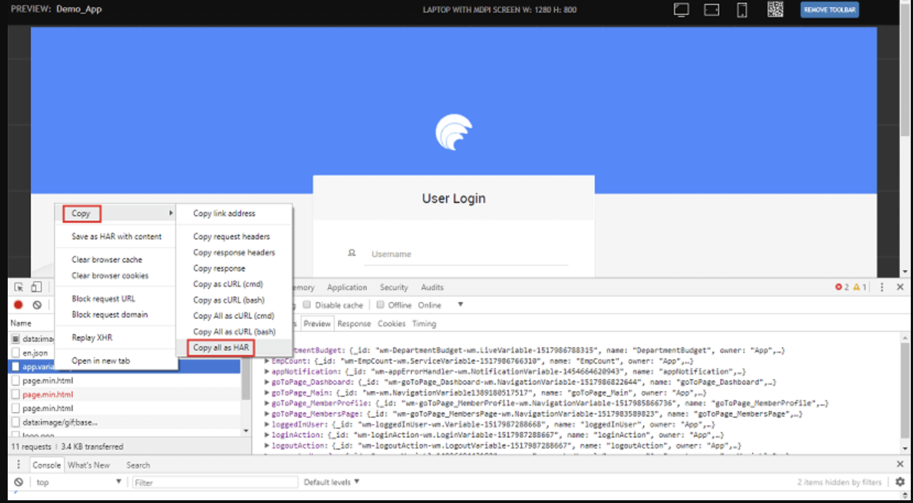
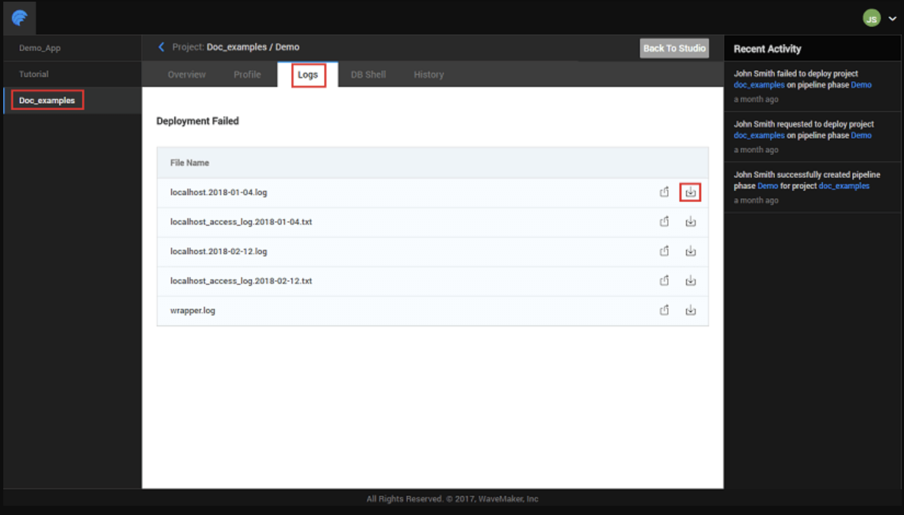

# Debugging 

When developing applications in WaveMaker, there may be times when the app does not behave as expected or shows errors that are hard to diagnose. Debugging helps you investigate and fix such problems. WaveMaker supports debugging through **logs**, **browser JavaScript debugging**, and can also assist with diagnosing issues in deployed applications.

---

## Debugging Using Logs

WaveMaker records log files that provide insight into what is happening in the design and runtime layers.

- **Server Logs** contain backend messages from the WaveMaker platform during development. These are especially useful when errors occur while importing or updating database schemas, or when backend services fail. For example, if a database import fails, the stack trace and root cause are captured in the server logs.
- **Application Logs** capture output from your application while it runs, helping you trace execution and review backend behavior during app usage.

You can access both types of logs from the **footer area** of the project workspace. The logs panel also includes a **download icon** so you can save logs locally for offline review, sharing with teammates, or submitting to support for deeper analysis.


---

## Debugging with HAR Files

In some cases, especially when debugging network issues, the WaveMaker support team may request a HAR (HTTP Archive) file. HAR files capture network traffic and headers for a page session and are useful for diagnosing API or service call issues.

**Steps to generate a HAR file:**

1. Open your running application in the browser.
2. Open **Developer Tools** (e.g., in Chrome, press `Ctrl + Shift + I`).
3. Go to the **Network** tab and enable **Preserve Log** to capture activity across navigations.
4. Refresh the page.
5. Right-click on any network request and choose **Copy → Copy all as HAR**.
6. Paste the copied content into a text editor and save it as a `.har` file.
7. Share the `.har` file with the support team along with the name of the failing service.



---

<!-- ## JavaScript Debugging

WaveMaker applications rely heavily on JavaScript for client-side logic. You can use standard browser developer tools to debug client scripts.

### Using `debugger`

Insert the `debugger` keyword into your page event code where you want execution to pause:

```javascript
Page.button2Click = function ($event, widget) {
    debugger;
    var value = $event.pageX;
};
```

When the app runs and hits the `debugger` statement, the browser's developer tools will pause execution at that line, allowing you to step through logic and inspect variables.

### Using `console.log`

To inspect runtime values without stopping execution, insert `console.log()` statements in your code:

```javascript
Page.button2Click = function ($event, widget) {
    console.log(Page.Variables.HrdbEmployeeData.dataSet);
};
```

Output appears in the Console panel of your browser's developer tools, providing quick insight into variable values and execution flow.

--- -->

## Printing Logger Statements in WaveMaker

Logs are records of events or activities within an application. They are essential for debugging, monitoring, and understanding application behavior. WaveMaker uses the **SLF4J (Simple Logging Facade for Java)** framework, which provides a consistent logging API that works with different underlying logging implementations such as Logback or Log4j2. SLF4J decouples your code from any specific logging library, making it easy to configure or switch logging frameworks based on your needs.

### Add Logger Support

To print logging statements from a Java Service, you need to import the required SLF4J classes:

```java
import org.slf4j.Logger;
import org.slf4j.LoggerFactory;
```

Next, declare a logger object in your Java Service class:

```java
private static final Logger logger = LoggerFactory.getLogger(MyJavaService.class);
```

This creates a logger instance tied to your service class that can be used to record messages at different log levels.

### Printing Log Messages

Once the logger is set up, you can use it to write log entries at various levels (DEBUG, INFO, WARN, ERROR, etc.). There are two primary ways to ensure your log statements appear in the log output:

#### 1. Configure log4j2.xml

The logging configuration in WaveMaker is controlled by the `log4j2.xml` file. To enable detailed logging for your specific service:

1. Open the `log4j2.xml` file in your project.
2. Add a logger entry using your service's package and class name, for example:

```xml
<logger name="com.example.MyJavaService" level="DEBUG"/>
```

This tells the logging framework to record DEBUG-level (and above) messages for that service class. Without this, only higher-level messages (INFO and above) may be logged by default.

#### 2. Adjust Log Level in Code

By default, the generated `log4j2.xml` sets the root log level to INFO. If your service logger uses DEBUG but nothing appears in the logs, update your log statement to a level that matches or exceeds the current configuration:

```java
logger.info("This is an informational message");
```

Switching from `logger.debug(...)` to `logger.info(...)` ensures the message is recorded without adjusting the configuration file.

### Key Points

- SLF4J provides a flexible logging API independent of the logging implementation.
- Use proper log levels (DEBUG, INFO, WARN, ERROR) to capture appropriate detail.
- Adjusting `log4j2.xml` enables you to control logging verbosity for specific classes.
- Logging inside Java Services aids in debugging, monitoring execution paths, and tracing issues.

Logging effectively makes it easier to diagnose problems and understand application behavior during development and in production.

---

## Debugging Deployed Applications

If issues occur after deployment, you can still retrieve logs to investigate what went wrong in a deployed environment:

1. Open the Apps Portal via the **Manage Deployed Apps** button in the Project Dashboard, or through **Deploy → Manage App** from the main menu.
2. Select the deployment phase for which you need logs and choose **Details**.
3. Navigate to the **Logs** tab and use the download icon to retrieve log files for that deployment.

This enables detailed analysis of errors encountered by users in production or staging environments.




---

## Summary

WaveMaker provides several tools to diagnose and resolve issues:

- **Logs** — Access server and application logs to understand backend activity and errors.
- **Logger Statements** — Use SLF4J logging framework to print custom log messages from Java Services with configurable log levels.
- **HAR Files** — Capture and export network traffic for deep debugging of API/service interactions.
<!-- - **JavaScript Debugging** — Use browser developer tools to pause execution and inspect client logic. -->
- **Deployed Application Logs** — Retrieve logs for apps already deployed to understand runtime issues outside the development environment.

Using these debugging techniques together helps you quickly root-cause errors and ensure your WaveMaker application behaves as designed.

## How-To Guides

Learn more about debugging through these practical guides:

- [Debug Performance Issues using Fusion Reactor](/docs/guide/migrated-docs/debug-monitor-performance-issues-using-fusion-reactor.md) - Learn how to setup Fusion Reactor tool for WaveMaker Application Performance Monitoring

