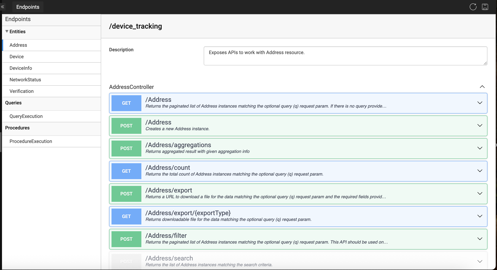
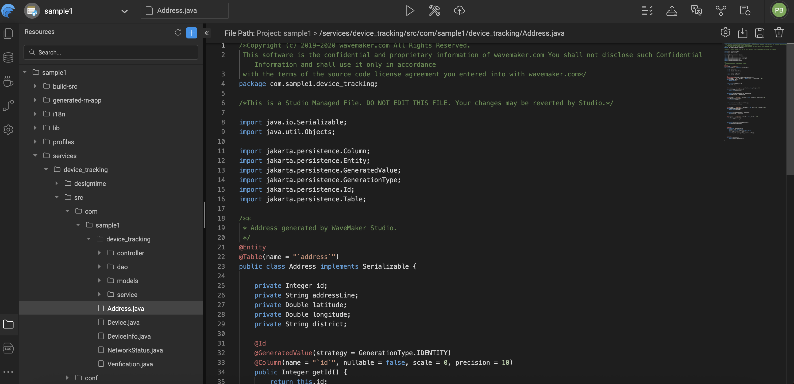
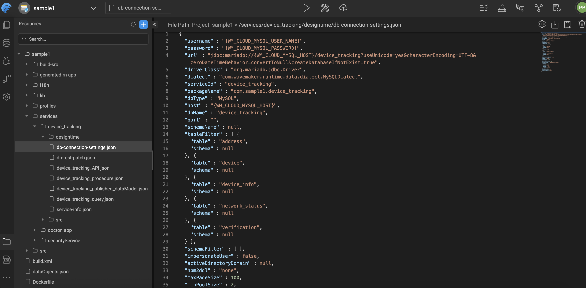

# Overview

WaveMaker provides a robust, developer-friendly approach to working with databases, combining visual productivity with full access to underlying source code. It supports enterprise-grade relational databases and simplifies the complete journey—from connection to API generation and customization.

## Supported Databases (RDBMS)

WaveMaker supports the following databases and versions and the same can be used within your app.

| Database Provider | Supported Versions | JDBC Driver |
|------------------|-------------------|-------------|
| MariaDB | 10.6 | Available in Maven Repository |
| MySQL | 8.0.21, 8.4.3, 9.1.0 | Available in Maven Repository |
| PostgreSQL | 13.18, 17.0 | Available in Maven Repository |
| Oracle | 19c, 23c | Download `ojdbc8.jar` |
| SQL Server | 2019, 2022 | Available in Maven Repository |
| Azure SQL Database | — | Connect using SQL Server JDBC driver |
| IBM DB2 | 11.5 | Download `db2jcc4.jar` |
| HSQLDB | 2.3.3, 2.3.4 | Available in Maven Repository |

This ensures flexibility to work with existing enterprise databases as well as new database setups.

## JDBC-Based Connectivity

All database connections in WaveMaker are established using standard JDBC drivers. This means:

- Reliable, industry-standard database communication
- Secure credential handling
- Compatibility with any database that provides a JDBC driver

Developers can configure database connections directly within the platform without writing boilerplate connection code.

## Database Workspace

WaveMaker offers a dedicated Database Workspace that acts as the central place to manage all database-related activities.

From the Database Workspace, you can:

- Connect to databases
- Browse schemas, tables, views, and procedures
- Import database objects
- Generate APIs automatically

A short video in this section walks through the Database Workspace UI and explains how developers can visually interact with their database.

Learn more: [Database Workspace](../../../studio/Workspaces/database_workspace.md)

## Automatic API Generation

Once a database is connected, WaveMaker can automatically generate CRUD APIs for selected tables and views. These APIs:

- Follow REST standards
- Are production-ready out of the box
- Support pagination, sorting, and filtering
- Can be directly consumed by UI components

This significantly reduces backend development effort while maintaining consistency and reliability.

Learn more: [API Workspace](../../../studio/Workspaces/api_workspace.md)

## Extending APIs with Queries and Procedures

In addition to standard CRUD operations, WaveMaker enables you to extend data access using custom database logic.

- **Custom SQL Queries**  
  Create complex joins, filters, and business-specific data retrieval logic.

- **Stored Procedures and Functions**  
  Seamlessly integrate existing database procedures or functions into the application.

These extensions are exposed as APIs, just like generated CRUD services, allowing reuse while maintaining a clean separation of concerns.

For more details, refer to [Queries and Procedures](./queries_and_procedures.md)  which explain how to define and manage advanced database logic.

## Source Code Transparency and Control

WaveMaker is not a black box. All generated artifacts are backed by readable, extensible Java source code.

Key highlights:

- Generated services use standard Java, Spring, and Hibernate/JPA
- Developers can inspect and understand the generated code
- Custom logic can be added without breaking platform upgrades
- Full control for advanced use cases and enterprise customization

This approach ensures both low-code productivity and high-code flexibility.
The DAO/Repository layer interacts with the underlying database using ORM (Hibernate/JPA). 
WaveMaker generates source code for CRUD operations for each entity in the database, along with Filter, Count, and Export APIs. Each layer has a specific responsibility:

| Layer | Responsibility |
|-------|----------------|
| **REST Controller** | Handles transport of data between client and server, API authorization, and marshaling/unmarshaling of JSON data. |
| **Service Layer** | Implements business logic, validates inputs, and manages transactions. |
| **DAO / Repository Layer** | Interacts with the database using ORM (Hibernate/JPA), executes queries, and handles persistence of POJOs. |
| **POJOs (Model Layer)** | Represents database entities with fields and annotations, used by service and DAO layers. |
| **Design-time Configuration Files** | Stores metadata for database connections, API specifications, queries, procedures, and schema information. |

Learn more: [VCS Workspace](../../../studio/Workspaces/vcs_workspace.md)

## Summary

WaveMaker's database approach is designed to balance speed and control:

- Enterprise RDBMS support via JDBC
- Visual Database Workspace for easy management
- Automatic API generation for faster development
- Support for custom queries and stored procedures
- Transparent and extensible source code

This enables teams to build data-driven applications quickly while retaining the freedom to customize and scale as needed.

## Related Documentation

- [Accessing Database](./accessing_database.md) - Learn how to connect to databases
- [ORM Artifacts](./orm_artifacts.md) - Understanding generated ORM artifacts
- [Queries and Procedures](./queries_and_procedures.md) - Custom queries and stored procedures
