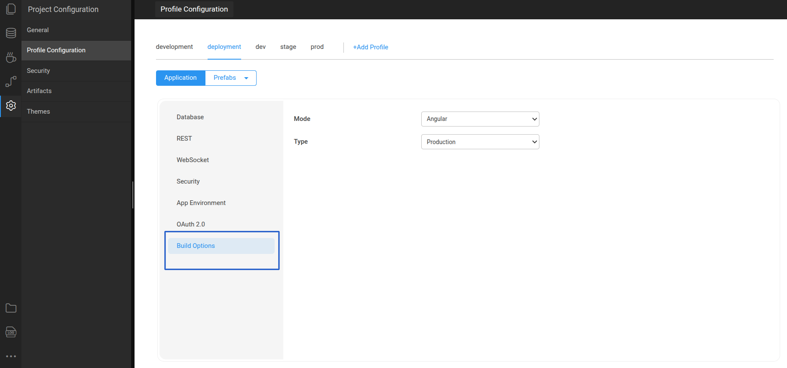

# Build Options

## Overview

WaveMaker allows you to choose how your web applications are built. Build options are defined as per configuration profiles (for example, development, deployment and custom profiles) and determine how the application artifacts are produced.

---

## Available Build Options

WaveMaker currently supports two build options:

- **Angular Build**
- **WaveMaker Build (deprecated)**

---

## Angular Build

The Angular Build option is the modern build approach for WaveMaker applications that contain generated Angular code. This option was introduced in WaveMaker 10.0.

---

### Modes

You can select one of the following modes under Angular Build:

#### Development

- Fast compile time  
- Minimal optimization  
- Runtime performance depends more on the browser  

#### Production

- Includes Angular optimizations such as:
  - Minification
  - Tree shaking
  - Dead code elimination
- Results in smaller and faster assets  

---

### Benefits

Angular Build:

- Uses an Angular CLI–compatible build process
- Produces smaller and optimized output
- Improves application and page load performance

This is the recommended build option for current WaveMaker-generated projects.

---

## WaveMaker Build (Deprecated)

The WaveMaker Build option refers to the older, classic build process that was used in earlier versions of WaveMaker (before WaveMaker 10). It uses the traditional build mechanism inherited from the Maven lifecycle.

This build option is deprecated and may be removed in future releases. It is retained mainly for backward compatibility.

---

## Setting Build Options

Build options are available in the WaveMaker Studio under:

Settings → Profile Configuration → Build Options

<VideoCard
  videoUrl="https://next-academy.wavemaker.com/Watch?wm=F1B323D0D3"
  title="Build Options"
  description="Watch for deeper understanding of build options in WaveMaker"
  thumbnailText="Build Options"
/>

