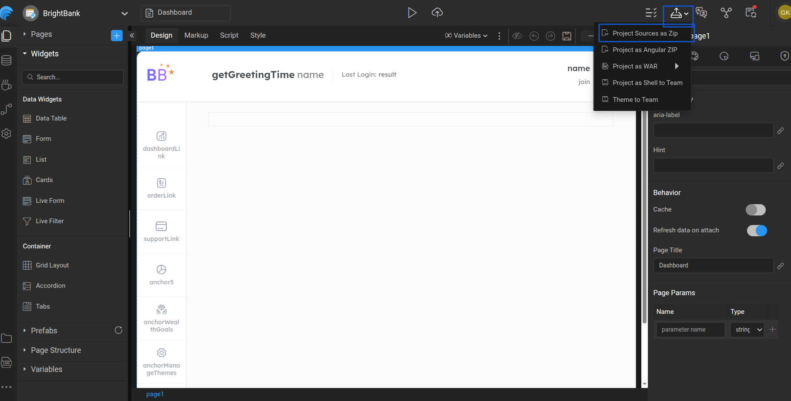

# Building Project with Maven

## Overview

This section explains how to generate a **WAR (Web Application Archive)** for a WaveMaker project using **Maven**. The generated WAR file can be deployed on a local machine or on a web server.

---
## Introduction

A Maven-based build allows you to generate a WAR file outside the WaveMaker Studio. This approach is commonly used in automated build pipelines or environments where builds are triggered from the command line.

---

## Download Project ZIP from Studio

To build the project using Maven, first download the project source from WaveMaker Studio.

1. Export the project as a ZIP file from the Studio.

   

2. Extract the downloaded ZIP file.

3. Note the extracted project location path.

4. Open a command line terminal and navigate to the project location:


   ```shell
   cd <location>

## Choose Profile and Build War file
A WaveMaker project includes two default profiles: development and deployment. When building the project, prefix the profile name with -P. If no profile is specified, the development profile is used by default.To know more about profile configuration, refer [link to release management profile config]

- Use the below command to do a maven build with the profile.

```shell
mvn clean install -P<ProfileName>
```

**For example**

```shell
mvn clean install -Pdeployment
```

- This will generate a **project war**  file in the target directory. This file has both frontend artifacts (HTML, CSS, JS, images, etc), and backend artifacts (Java Classes).
- This can be deployed into any webserver like Tomcat. Refer [Tomcat Deployment](../../../../deploy/deploy-to-web-server.md).

:::note
To learn how to generate a WAR file using Maven in WaveMaker, watch the video below:

▶️ [Generate a WAR using MAVEN](https://next-academy.wavemaker.com/Watch?wm=07E5BE8F68)
:::


<VideoCard
  videoUrl="https://next-academy.wavemaker.com/Watch?wm=07E5BE8F68"
  title="Generate a WAR using MAVEN"
  description="Watch for deeper understanding on how to generate WAR file using MAVENin WaveMaker"
  thumbnailText="Generate a WAR using MAVEN"
/>

