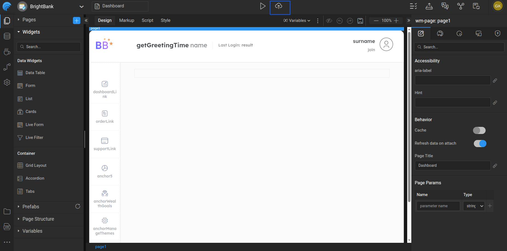

# One-Click Deployment

## Overview

This section explains how you can deploy a WaveMaker application using **One-click Deployment**.  
This feature allows you to deploy your application to the **WaveMaker Demo Cloud** directly from Studio with a single click.

## Introduction

One-click Deployment simplifies the deployment process by automatically validating, building, and deploying your application.  
It is best suited for quick testing, demos, and QA environments before setting up a full CI/CD pipeline.

## Prerequisites

Before starting One-click Deployment, ensure the following:

1. **Deployment profile is configured**  
   The Deployment Profile defines environment-specific settings such as:
   - Database connections  
   - REST / SOAP services  
   - WebSocket configurations  
   - Application security  
   These settings are managed from **Project Settings → Deployment Profile**.
   You can see more about Deployment Profile configuration here **Profile Configuration**
2. **Application changes are pushed to VCS**  
   Applications can be deployed only after the code is pushed to version control.
   If any changes are uncommitted, Studio will ask you to push them before deployment.

## Deploying an Application

1. Click the **Deploy** icon in the Studio header to initiate the deployment process.  
     
   During deployment, WaveMaker performs:
   - Application validation using Inspection Framework  
   - Build process  
   - Deployment to the Demo Cloud  

## Deployment Flow

Once deployment is triggered, it runs in the background, allowing you to continue working in Studio or close the deployment dialog. Deployment progress is communicated through toaster notifications, and an **email notification** is sent once the deployment completes. The deployment icon in the header updates to reflect the current status, and you can click the icon and select **Check Deployment Status** at any time to reopen the deployment dialog and view detailed progress.

### Deployment Status

After deployment completes, the application can either succeed or fail. If the deployment fails, you can review and fix the reported issues using the **Inspection Framework** and then redeploy the application. If the deployment is successful, the application is hosted on the WaveMaker Demo Cloud, and a demo URL is generated for access. You can launch the deployed application directly or manage it further using the Apps Portal to confgure CI/CD Pipeline in WaveMaker.

After deployment, you can perform the following actions:

- **Redeploy** – Deploy the application again to the **Demo (QA)** phase.
- **Launch Deployed App** – Open the deployed application in a browser.
- **Manage App** – Manage and configure the application in different environments using the Apps Portal.

## Related Documentation
- Deployment Profile
- Manage Deployed Apps
- CI/CD Pipeline in WaveMaker
