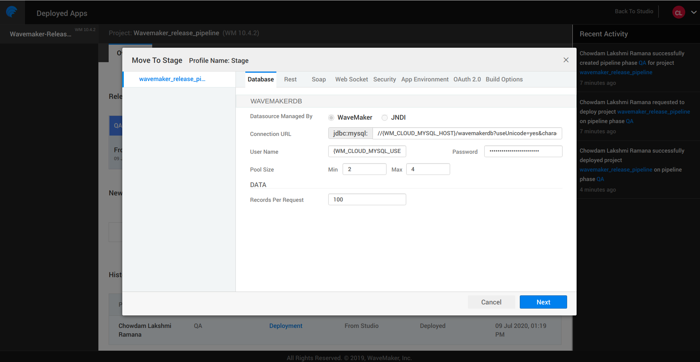

---

WaveMaker supports two phases for WMO and three phases for WME customers. One-click deployment by default deploys to Demo or QA phase. To deploy an application on different phases, you should push the application from one phase to the other phase. For pushing the application to the next phase, you have to configure the phases. Firstly, you should select a cloud provider and configure that for each phase.

:::note
Before configuring the phases, you should configure the pipeline. For WMO, see [WMO default pipeline configuration](../pipeline-configuration/default-pipelines). For WME, see [WME pipeline configurations](../pipeline-configuration/configure-pipelines).
:::

## Configure Phases

During the process of pushing from one phase to the other phase, you can configure different Databases for different phases and also configure Rest, Soap, and Web socket services as shown in the image below.

.

## Phases Configuration Profile

You can enable and disable SSL configuration at the security settings page and also configure necessary security options. Additionally, you can configure Outh2, App Environment, and Build options. For more information, see [Configuration Profiles](../configuration-profiles) and [Deployment Profile](#).

.

:::tip
You can also mention the version number and release notes for tracking purposes.  
:::

For more information, see [Manage Deployed Apps](../manage-deployed-apps).

