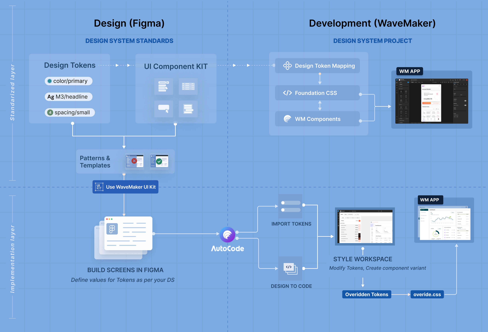

# Design System Projects

WaveMaker has introduced **[Design System](https://www.figma.com/blog/design-systems-101-what-is-a-design-system/)** based projects for building user interfaces in web and mobile applications with a structured way that is token-driven, component-governed, and theme-controlled from the foundation. This approach ensures visual consistency, controlled customization, and long-term maintainability across applications.

For this WaveMaker has created standard approach for both designers and developers to start with and be productive.
WaveMaker provides: [Figma UI KIT](https://www.figma.com/community/file/1463103184874870889) for designers to implement thier designs, Design System project for helping developers to start building applications with pixel perfect implementation managing these design tokens and components. 

Additionally, the [Autocode plugin](https://www.figma.com/community/plugin/1463127344166357646/wavemaker-autocode) was introduced to improve productive which can be used to convert Figma designs into live in screens in WaveMaker design system project with layouts, components, and design tokens automatically imported.

 

## What is a Design System Project?

A Design System project in WaveMaker is built on three core pillars:

1. **Foundation CSS**
2. **WaveMaker Components**
3. **Style Workspace**

Together, they create a governed styling architecture where design tokens flow consistently from definition to runtime.

---

### Foundation CSS

Foundation CSS is the styling backbone of a Design System project.

It is built on **CSS variables** and is responsible for:

- Defining theme tokens (color, typography, spacing, radius, elevation, etc.)
- Enabling runtime theming
- Maintaining consistent application look and feel
- Allowing token-based overrides without breaking structure

All visual properties resolve through CSS variables, ensuring that changes to tokens automatically reflect across the application.

This creates a scalable and future-proof styling layer.

---

### WaveMaker Components

WaveMaker Components in a Design System project are:

- Built to consume Foundation CSS variables
- Fully compatible with token-based styling
- Designed for predictable visual behavior
- Structured for variant support

These components do not rely on hard-coded values.  
Instead, they inherit visual definitions from the token system.

This guarantees:

- Consistency across screens
- Alignment with design system standards
- Easier maintenance and upgrades

---

### Style Workspace

The Style Workspace is the control center for managing the Design System within a project.

It enables developers to:

- Modify token values
- Create and manage component variants
- Extend styles safely
- Generate controlled overrides

When customizations are made, WaveMaker generates structured override files (for example, `override.css`) and overridden token definitions.

This ensures:

- The base system remains intact
- Customizations are isolated
- Future updates remain safe and manageable

---

## How It Works Together

In a Design System project:

- Foundation CSS defines the token structure.
- WaveMaker Components consume these tokens.
- Style Workspace manages token values and variants.
- Overrides are generated in a controlled manner.
- The final application renders consistently across screens.

This architecture separates **structure from styling**, allowing applications to evolve without compromising design integrity.

---

## Summary

Design System based projects in WaveMaker provide:

- A token-powered Foundation CSS layer
- System-compatible WaveMaker Components
- A Style Workspace for managing tokens and variants
- Structured override generation for safe customization

This approach ensures that applications are not just built — they are built on a governed, scalable design foundation.
