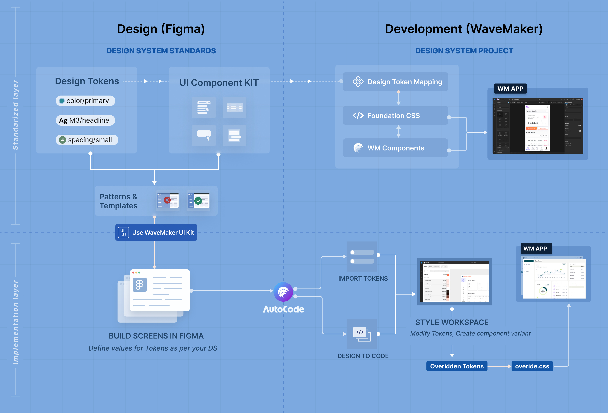

# Design System Based Projects

WaveMaker introduces **Design System based projects** — a structured way to build applications that are token-driven, component-governed, and theme-controlled from the foundation.

This approach ensures visual consistency, controlled customization, and long-term maintainability across applications.

---

 

## What is a Design System Project?

A Design System project in WaveMaker is built on three core pillars:

1. **Foundation CSS**
2. **WaveMaker Components**
3. **Style Workspace**

Together, they create a governed styling architecture where design tokens flow consistently from definition to runtime.

---

## 1. Foundation CSS

Foundation CSS is the styling backbone of a Design System project.

It is built on **CSS variables** and is responsible for:

- Defining theme tokens (color, typography, spacing, radius, elevation, etc.)
- Enabling runtime theming
- Maintaining consistent application look and feel
- Allowing token-based overrides without breaking structure

All visual properties resolve through CSS variables, ensuring that changes to tokens automatically reflect across the application.

This creates a scalable and future-proof styling layer.

---

## 2. WaveMaker Components

WaveMaker Components in a Design System project are:

- Built to consume Foundation CSS variables
- Fully compatible with token-based styling
- Designed for predictable visual behavior
- Structured for variant support

These components do not rely on hard-coded values.  
Instead, they inherit visual definitions from the token system.

This guarantees:

- Consistency across screens
- Alignment with design system standards
- Easier maintenance and upgrades

---

## 3. Style Workspace

The Style Workspace is the control center for managing the Design System within a project.

It enables developers to:

- Modify token values
- Create and manage component variants
- Extend styles safely
- Generate controlled overrides

When customizations are made, WaveMaker generates structured override files (for example, `override.css`) and overridden token definitions.

This ensures:

- The base system remains intact
- Customizations are isolated
- Future updates remain safe and manageable

---

## How It Works Together

In a Design System project:

- Foundation CSS defines the token structure.
- WaveMaker Components consume these tokens.
- Style Workspace manages token values and variants.
- Overrides are generated in a controlled manner.
- The final application renders consistently across screens.

This architecture separates **structure from styling**, allowing applications to evolve without compromising design integrity.

---

## Summary

Design System based projects in WaveMaker provide:

- A token-powered Foundation CSS layer
- System-compatible WaveMaker Components
- A Style Workspace for managing tokens and variants
- Structured override generation for safe customization

This approach ensures that applications are not just built — they are built on a governed, scalable design foundation.
