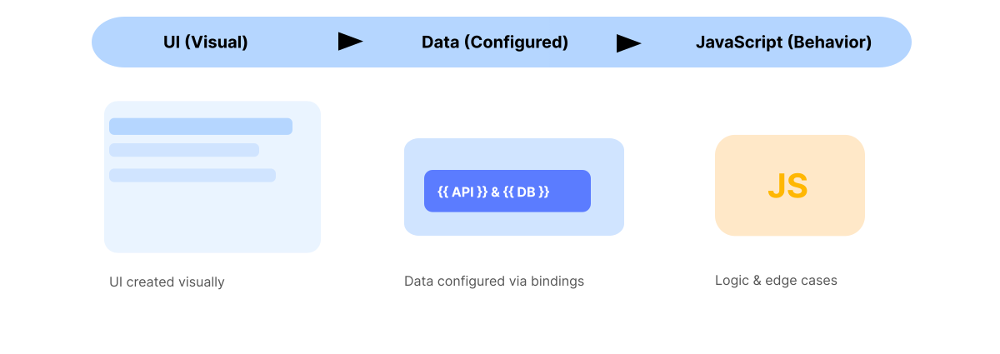
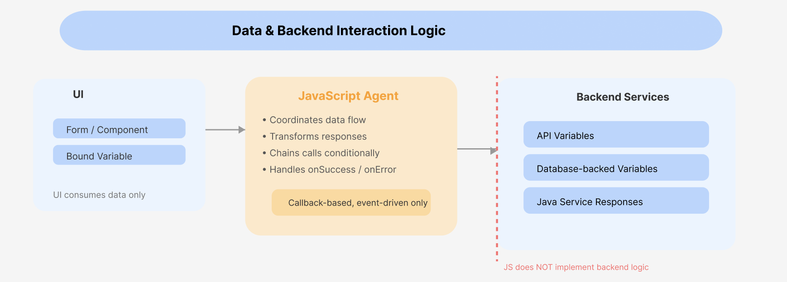
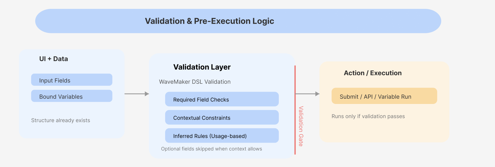

import myimg from './assets/images/img.svg';

- [When JavaScript Is Used in WaveMaker](#when-javascript-is-used-in-wavemaker)
- [How Aira Handles JavaScript Logic](#how-aira-handles-javascript-logic)


## When JavaScript Is Used in WaveMaker

WaveMaker builds application structure through visual design and configuration. Pages, components, APIs, and data sources are defined without writing code. You use JavaScript when application behavior cannot be fully defined through visual configuration alone. Its role is to implement custom logic while leaving application structure unchanged.

### Execution Context

Visual configuration executes first. JavaScript runs after UI and data bindings are executed. JavaScript complements WaveMaker features and it does not replace them.


<!--  -->


#### **UI (Visual) → Data (Configured) → JavaScript (Behavior)**

- UI elements like pages and components are created visually.
- Data sources such as APIs and databases are configured using bindings.
- JavaScript runs only to handle custom logic, validations, or edge cases.

### Example

A form submits data using built-in bindings. JavaScript runs only when validation rules or conditional behavior cannot be expressed visually.


## How Aira Handles JavaScript Logic

Aira manages all custom JavaScript through a dedicated execution agent called **wm_js_agent**. The agent attaches behavior to an existing application. It does not alter layout, markup, or application structure. All generated code follows WaveMaker’s runtime and lifecycle rules.


## JavaScript Logic Categories in Aira

Aira applies JavaScript based on the type of logic required. Each category follows strict boundaries.

### UI Logic and Event-Driven Behavior

UI logic controls how existing components behave in response to user actions or system events.

The JavaScript agent binds logic to widget events such as clicks, input changes, or visibility toggles.
If an expected event handler does not exist, the agent creates it automatically.

This logic may:

* Show or hide fields based on input
* Enable or disable actions conditionally
* Update widget values dynamically

The agent respects component lifecycle and timing, especially for dialogs, tabs, wizards, and other dynamically loaded UI.
Logic is attached only when target elements are available in the DOM.

The agent never creates or modifies components. It attaches behavior only.


### Data Modification and Interaction Logic

JavaScript coordinates data flow between the UI and backend services.

The agent works with:

* API variables
* Database-backed variables
* Java service responses

It can transform responses, chain calls conditionally, and execute logic on variable lifecycle events such as `onSuccess` or `onError`.

:::note
When variables execute, WaveMaker emits events before and after the backend call. The JavaScript agent attaches logic to the appropriate point in this lifecycle—such as validation before execution or UI updates after success—without requiring the user to manage these events manually.

When interacting with APIs or backend services, the JavaScript agent follows WaveMaker-supported callback and event-based patterns.
Promise-based or framework-agnostic async patterns are intentionally avoided to remain compliant with the platform runtime.



JavaScript coordinates and responds to backend interactions, but it does not implement backend logic or replace server-side services.
:::

### Validation Logic

Validation ensures data correctness before actions are executed. The JavaScript agent applies validation using the WaveMaker DSL validation framework. This keeps validation consistent with platform standards. The agent can apply required-field checks, contextual constraints, and inferred rules based on field usage.
Optional fields are skipped when context indicates they are not required.



Validation logic runs before submission or variable execution. No UI structure is modified during validation.

## How the JavaScript Agent Identifies Targets

Before generating code, the agent analyzes the existing application state.

It reads page metadata and DOM structure to identify components, forms, and variables already present.
It then locates relevant events or determines where new handlers must be created.

Logic is attached only after this analysis completes. No unrelated elements are touched.

### Importance of Naming and Prompt Precision

Accurate targeting depends heavily on naming.

Descriptive component and variable names allow the agent to locate elements reliably and efficiently. Poor naming increases ambiguity and slows execution.

### UI Analysis and Targeting

Before generating code, the agent analyzes the page DOM and WaveMaker metadata to locate targets. Accurate targeting depends on widget naming.

#### Good naming

- `showHidePasswordButton`
- `shippingForm`
- `submitRequestBtn`

#### Bad naming (avoid using)

- `button1`
- `formField2`
- `ABCbutton`


If the required context is missing or ambiguous, the agent does not infer intent and requests clarification before generating or attaching JavaScript logic.

Prompts should clearly specify the page, target elements, and expected behavior. Generic prompts expand the search scope and reduce predictability.

The agent never injects UI elements. It only binds logic to widgets that already exist.

## End-to-End Execution Flow

```
User Prompt
   ↓
Page Scope Resolution
   ↓
DOM and Metadata Analysis
   ↓
Widget and Variable Identification
   ↓
Event Detection or Creation
   ↓
JavaScript Logic Attachment
   ↓
Execution
```

Each step is required.
Skipping any step breaks predictability.


## Example

A page already contains a form, a submit button, and a bound API variable.

A prompt requests conditional validation and submit behavior.
The **wm_js_agent** identifies the relevant fields, applies contextual validation, creates a submit handler if missing, and attaches the logic.

The UI remains unchanged.
Only behavior is added.
