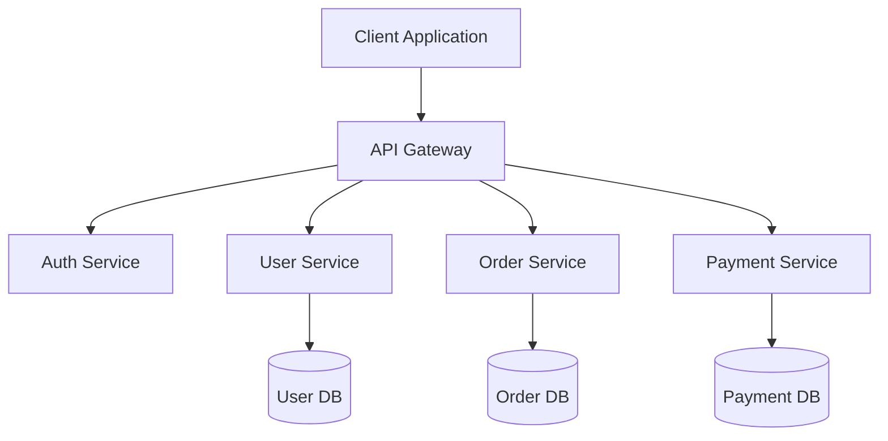

# Microservices Architecture

Understanding the architectural patterns and principles for building scalable microservices with WaveMaker.

## Overview

WaveMaker follows a modern microservices architecture that enables you to build, deploy, and scale independent services efficiently.

## Architecture Patterns

### 1. Service-Oriented Architecture (SOA)

### 2. Key Components

#### API Gateway
- Single entry point for all client requests
- Request routing and composition
- Authentication and authorization
- Rate limiting and throttling
- Load balancing

#### Service Layer
- Business logic encapsulation
- Independent deployment
- Technology heterogeneity
- Fault isolation

#### Data Layer
- Database per service pattern
- Event-driven data synchronization
- CQRS (Command Query Responsibility Segregation)

## Design Principles

### 1. Single Responsibility
Each microservice should have a single, well-defined purpose.

### 2. Loose Coupling
Services should be independent with minimal dependencies on other services.

### 3. High Cohesion
Related functionality should be grouped together within a service.

### 4. API First
Design your API contract before implementation.

## Communication Patterns

### Synchronous Communication
- REST APIs (HTTP/HTTPS)
- gRPC for high-performance scenarios
- WebSockets for real-time communication

### Asynchronous Communication
- Message queues (RabbitMQ, Kafka)
- Event-driven architecture
- Pub/Sub patterns

## Scalability Strategies

### Horizontal Scaling
- Add more instances of services
- Load balancing across instances
- Stateless service design

### Vertical Scaling
- Increase resources (CPU, memory) per instance
- Optimize code and queries
- Cache frequently accessed data

## Best Practices

1. **Keep Services Small**: Each service should be manageable by a small team
2. **Design for Failure**: Implement circuit breakers and retry mechanisms
3. **Use API Versioning**: Maintain backward compatibility
4. **Implement Health Checks**: Monitor service health and availability
5. **Centralized Logging**: Aggregate logs for easier debugging
6. **Distributed Tracing**: Track requests across services

## Anti-Patterns to Avoid

- **Distributed Monolith**: Services that are too tightly coupled
- **Shared Database**: Multiple services accessing the same database
- **Chatty APIs**: Too many network calls between services
- **God Service**: A service that does too much

## Next Steps

- [Learn about the Tech Stack](./tech-stack.md)
- [Create Database & CRUD APIs](../apis/database-crud-apis.md)
- [Implement Security](../security/authentication-authorization.md)
