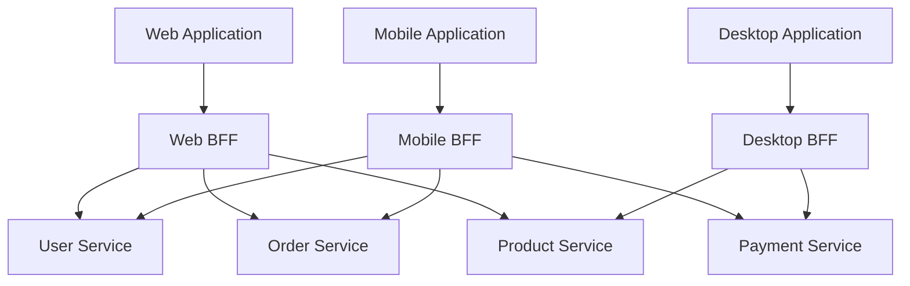

# Creating Backend for Frontend (BFF)

Learn how to implement the Backend for Frontend (BFF) pattern to optimize API communication for specific client applications.

## What is BFF?

Backend for Frontend (BFF) is an architectural pattern where you create a dedicated backend service for each frontend application (web, mobile, desktop). Each BFF is tailored to the specific needs of its client, providing:

- **Optimized data aggregation**: Combine multiple API calls into one
- **Reduced network overhead**: Minimize data transfer
- **Client-specific logic**: Handle presentation logic on the server
- **Security**: Centralize authentication and authorization

## Architecture Overview



## Creating a BFF

### Step 1: Define the BFF Structure

```java
@RestController
@RequestMapping("/bff/web/api")
public class WebBFFController {

    @Autowired
    private UserService userService;

    @Autowired
    private OrderService orderService;

    @Autowired
    private ProductService productService;

    // BFF endpoints here
}
```

### Step 2: Create Aggregated Endpoints

#### Dashboard Endpoint

Combines multiple service calls into one:

```java
@GetMapping("/dashboard")
public DashboardResponse getDashboard(@AuthenticationPrincipal User user) {
    // Fetch data from multiple services
    UserProfile profile = userService.getUserProfile(user.getId());
    List<Order> recentOrders = orderService.getRecentOrders(user.getId(), 5);
    List<Product> recommendedProducts = productService.getRecommendations(user.getId());
    NotificationSummary notifications = notificationService.getSummary(user.getId());

    // Aggregate into single response
    return DashboardResponse.builder()
        .profile(profile)
        .recentOrders(recentOrders)
        .recommendations(recommendedProducts)
        .notifications(notifications)
        .build();
}
```

**Response:**
```json
{
  "profile": {
    "id": 123,
    "username": "john_doe",
    "email": "john@example.com",
    "memberSince": "2023-01-15"
  },
  "recentOrders": [
    {
      "id": 456,
      "status": "Delivered",
      "total": 99.99,
      "items": 3
    }
  ],
  "recommendations": [
    {
      "id": 789,
      "name": "Wireless Headphones",
      "price": 79.99
    }
  ],
  "notifications": {
    "unread": 5,
    "lastNotification": "Your order has been shipped"
  }
}
```

## BFF Patterns

### 1. Data Aggregation

Combine data from multiple microservices:

```java
@GetMapping("/order/{orderId}/details")
public OrderDetailsResponse getOrderDetails(@PathVariable Long orderId) {
    // Parallel calls to multiple services
    CompletableFuture<Order> orderFuture =
        CompletableFuture.supplyAsync(() -> orderService.getOrder(orderId));

    CompletableFuture<Customer> customerFuture =
        CompletableFuture.supplyAsync(() -> {
            Order order = orderFuture.join();
            return customerService.getCustomer(order.getCustomerId());
        });

    CompletableFuture<List<OrderItem>> itemsFuture =
        CompletableFuture.supplyAsync(() -> orderService.getOrderItems(orderId));

    CompletableFuture<ShippingInfo> shippingFuture =
        CompletableFuture.supplyAsync(() -> shippingService.getShippingInfo(orderId));

    // Wait for all to complete
    CompletableFuture.allOf(orderFuture, customerFuture, itemsFuture, shippingFuture).join();

    // Build response
    return OrderDetailsResponse.builder()
        .order(orderFuture.join())
        .customer(customerFuture.join())
        .items(itemsFuture.join())
        .shipping(shippingFuture.join())
        .build();
}
```

### 2. Data Transformation

Transform backend data to match frontend needs:

```java
@GetMapping("/products/catalog")
public List<ProductCardDTO> getProductCatalog(
    @RequestParam(defaultValue = "0") int page,
    @RequestParam(defaultValue = "20") int size
) {
    Page<Product> products = productService.getProducts(page, size);

    // Transform for web display
    return products.stream()
        .map(product -> ProductCardDTO.builder()
            .id(product.getId())
            .name(product.getName())
            .price(formatPrice(product.getPrice()))
            .thumbnail(imageService.getThumbnailUrl(product.getImageId()))
            .rating(calculateAverageRating(product.getReviews()))
            .inStock(product.getStock() > 0)
            .badge(getBadge(product))
            .build()
        )
        .collect(Collectors.toList());
}

private String getBadge(Product product) {
    if (product.isNewArrival()) return "NEW";
    if (product.getDiscount() > 20) return "SALE";
    if (product.getStock() < 10) return "LIMITED";
    return null;
}
```

### 3. Request Orchestration

Handle complex workflows:

```java
@PostMapping("/checkout")
@Transactional
public CheckoutResponse processCheckout(@RequestBody CheckoutRequest request) {
    try {
        // 1. Validate cart
        Cart cart = cartService.getCart(request.getCartId());
        validateCart(cart);

        // 2. Create order
        Order order = orderService.createOrder(cart);

        // 3. Process payment
        Payment payment = paymentService.processPayment(
            order.getId(),
            request.getPaymentMethod(),
            order.getTotal()
        );

        if (!payment.isSuccessful()) {
            throw new PaymentFailedException("Payment processing failed");
        }

        // 4. Update inventory
        inventoryService.reserveItems(order.getItems());

        // 5. Send notifications
        notificationService.sendOrderConfirmation(order);

        // 6. Clear cart
        cartService.clearCart(request.getCartId());

        return CheckoutResponse.builder()
            .orderId(order.getId())
            .status("SUCCESS")
            .confirmationNumber(order.getConfirmationNumber())
            .estimatedDelivery(calculateDeliveryDate(order))
            .build();

    } catch (Exception e) {
        log.error("Checkout failed", e);
        // Compensating transactions
        rollbackCheckout(request.getCartId());
        throw new CheckoutException("Checkout failed: " + e.getMessage());
    }
}
```

### 4. Response Filtering

Filter data based on client type:

```java
@GetMapping("/user/profile")
public UserProfileResponse getUserProfile(@AuthenticationPrincipal User user) {
    UserProfile fullProfile = userService.getFullProfile(user.getId());

    // Filter based on client type
    String clientType = getClientType(); // From headers

    if ("mobile".equals(clientType)) {
        // Return lightweight profile for mobile
        return UserProfileResponse.builder()
            .id(fullProfile.getId())
            .displayName(fullProfile.getDisplayName())
            .avatar(fullProfile.getAvatarUrl())
            .build();
    } else {
        // Return full profile for web
        return UserProfileResponse.builder()
            .id(fullProfile.getId())
            .username(fullProfile.getUsername())
            .displayName(fullProfile.getDisplayName())
            .email(fullProfile.getEmail())
            .avatar(fullProfile.getAvatarUrl())
            .bio(fullProfile.getBio())
            .preferences(fullProfile.getPreferences())
            .statistics(fullProfile.getStatistics())
            .build();
    }
}
```

## Mobile BFF Example

Optimize for mobile constraints (limited bandwidth, battery):

```java
@RestController
@RequestMapping("/bff/mobile/api")
public class MobileBFFController {

    @GetMapping("/home")
    public MobileHomeResponse getHomeScreen(@AuthenticationPrincipal User user) {
        // Lightweight response for mobile
        return MobileHomeResponse.builder()
            .user(getUserSummary(user))
            .featuredProducts(getTop3FeaturedProducts())
            .recentActivity(getRecentActivity(user, 3)) // Limited items
            .quickActions(getQuickActions())
            .build();
    }

    @GetMapping("/search")
    public MobileSearchResponse search(
        @RequestParam String query,
        @RequestParam(defaultValue = "0") int page
    ) {
        // Return compressed images
        List<Product> products = productService.search(query, page, 10);

        return MobileSearchResponse.builder()
            .results(products.stream()
                .map(p -> MobileProductDTO.builder()
                    .id(p.getId())
                    .name(p.getName())
                    .price(p.getPrice())
                    .thumbnailLowRes(imageService.getLowResThumbnail(p.getImageId()))
                    .build()
                )
                .collect(Collectors.toList())
            )
            .hasMore(products.size() == 10)
            .build();
    }

    @GetMapping("/product/{id}/quick-view")
    public QuickProductView getQuickView(@PathVariable Long id) {
        // Minimal data for quick view
        Product product = productService.getProduct(id);

        return QuickProductView.builder()
            .id(product.getId())
            .name(product.getName())
            .price(product.getPrice())
            .inStock(product.getStock() > 0)
            .rating(product.getAverageRating())
            .build();
    }
}
```

## Performance Optimization

### Caching

```java
@Service
public class BFFCacheService {

    @Cacheable(value = "dashboard", key = "#userId")
    public DashboardResponse getCachedDashboard(Long userId) {
        return buildDashboard(userId);
    }

    @CacheEvict(value = "dashboard", key = "#userId")
    public void invalidateDashboardCache(Long userId) {
        // Cache invalidated
    }
}
```

### Parallel Processing

```java
@Service
public class ParallelBFFService {

    @Autowired
    private Executor taskExecutor;

    public CompletableFuture<DashboardResponse> getDashboardAsync(Long userId) {
        CompletableFuture<UserProfile> profileFuture =
            CompletableFuture.supplyAsync(() -> userService.getUserProfile(userId), taskExecutor);

        CompletableFuture<List<Order>> ordersFuture =
            CompletableFuture.supplyAsync(() -> orderService.getRecentOrders(userId, 5), taskExecutor);

        CompletableFuture<List<Product>> productsFuture =
            CompletableFuture.supplyAsync(() -> productService.getRecommendations(userId), taskExecutor);

        return CompletableFuture.allOf(profileFuture, ordersFuture, productsFuture)
            .thenApply(v -> DashboardResponse.builder()
                .profile(profileFuture.join())
                .recentOrders(ordersFuture.join())
                .recommendations(productsFuture.join())
                .build()
            );
    }
}
```

### Response Compression

```java
@Configuration
public class CompressionConfig {

    @Bean
    public FilterRegistrationBean<GzipFilter> gzipFilter() {
        FilterRegistrationBean<GzipFilter> registration = new FilterRegistrationBean<>();
        registration.setFilter(new GzipFilter());
        registration.addUrlPatterns("/bff/*");
        return registration;
    }
}
```

## Testing BFF

```java
@SpringBootTest
@AutoConfigureMockMvc
public class WebBFFControllerTest {

    @Autowired
    private MockMvc mockMvc;

    @MockBean
    private UserService userService;

    @MockBean
    private OrderService orderService;

    @Test
    public void testGetDashboard() throws Exception {
        // Mock services
        when(userService.getUserProfile(1L))
            .thenReturn(new UserProfile(1L, "john_doe", "john@example.com"));

        when(orderService.getRecentOrders(1L, 5))
            .thenReturn(Arrays.asList(new Order(100L, "Delivered", 99.99)));

        // Test endpoint
        mockMvc.perform(get("/bff/web/api/dashboard")
                .with(user("john_doe")))
            .andExpect(status().isOk())
            .andExpect(jsonPath("$.profile.username").value("john_doe"))
            .andExpect(jsonPath("$.recentOrders").isArray())
            .andExpect(jsonPath("$.recentOrders[0].id").value(100));
    }
}
```

## Best Practices

1. **Keep BFFs Thin**: Don't duplicate business logic
2. **One BFF per Client Type**: Separate concerns for web, mobile, desktop
3. **Use GraphQL**: Consider GraphQL for flexible data fetching
4. **Implement Timeouts**: Prevent cascading delays
5. **Monitor Performance**: Track aggregation overhead
6. **Version Your BFF APIs**: Allow smooth client updates
7. **Handle Failures Gracefully**: Partial responses when services fail
8. **Document Your APIs**: Clear documentation for frontend teams

## Common Pitfalls

❌ **Don't**: Duplicate business logic in BFF
✅ **Do**: Delegate to domain services

❌ **Don't**: Create a generic BFF for all clients
✅ **Do**: Tailor each BFF to its specific client

❌ **Don't**: Make synchronous calls sequentially
✅ **Do**: Use parallel/async calls when possible

❌ **Don't**: Return all data "just in case"
✅ **Do**: Return only what the client needs

## Next Steps

- [Create Mock APIs](./creating-mock-apis.md)
- [Implement Authentication](../security/authentication-authorization.md)
- [Set Up Configuration Profiles](../configurations/profiles.md)
