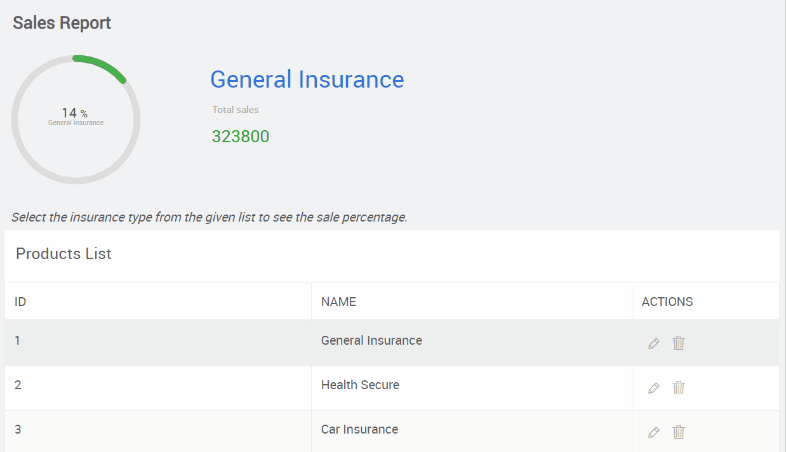
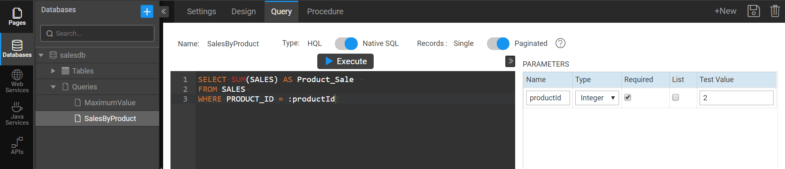
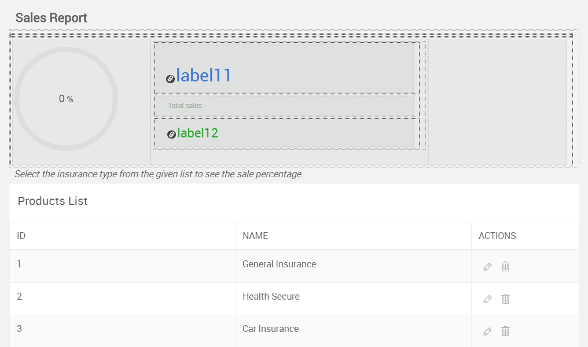
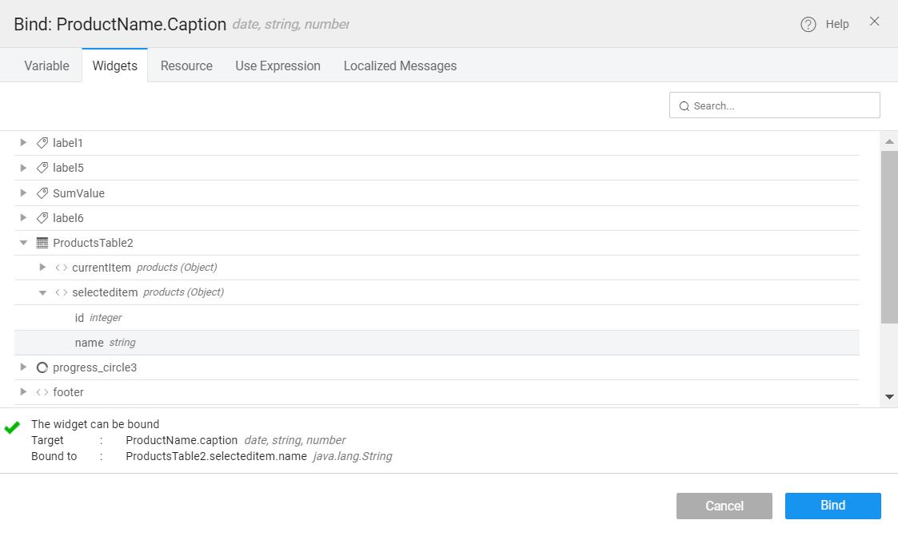
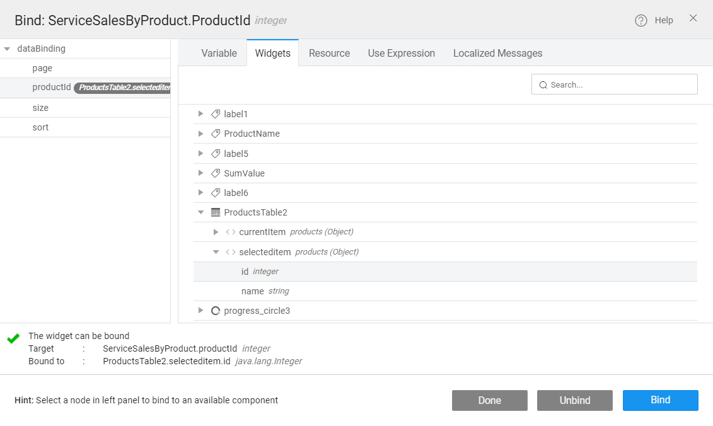
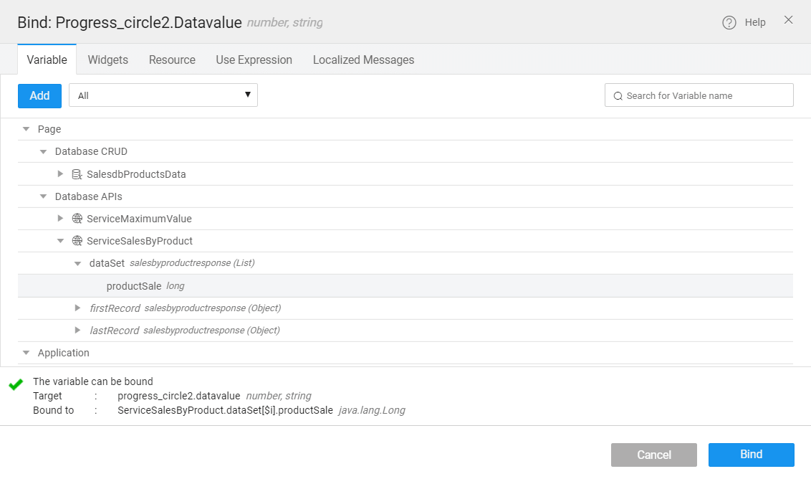
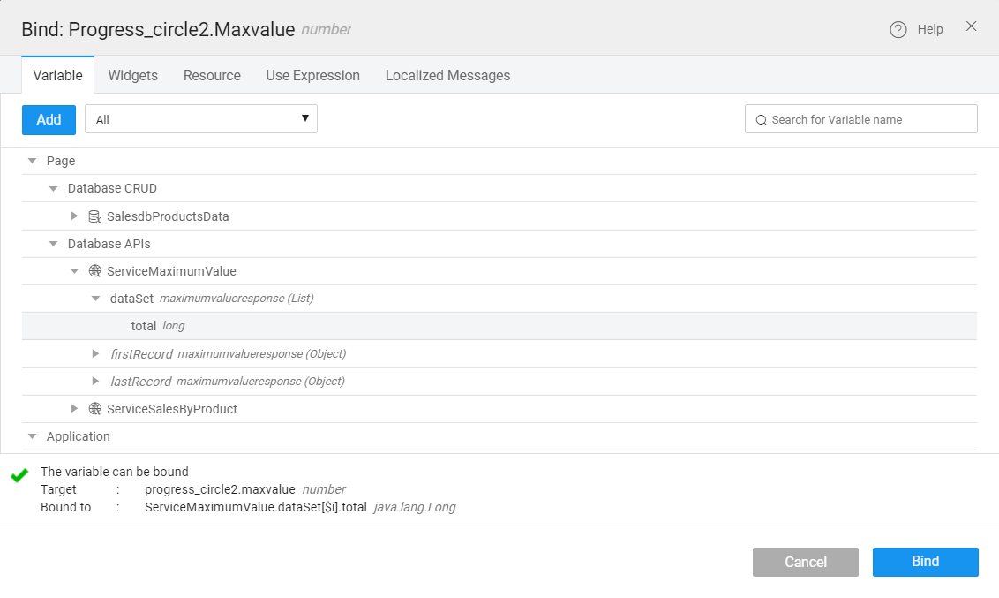

---

In this article, you will learn how to create and configure a progress circle widget in a step by step process. A progress circle is a **basic** widget type.

- You can use this widget to visualize the status of an event in a circle bar.
- You can create reports or dashboards.

To use the progress circle widget for static data, you enter values in the widget properties for default, min and max values. Also, you can execute SQL queries from the database and generate database APIs to get dynamic values; bind those values for default, min and max values in the widget properties to visualize the status or the data. 

### Use case

_On a progress circle widget, visualize the total sales percentage of the product when you click on the item name from the data table._



:::note
In the given example, we use the Product table which invokes data from the Sales table. Therefore, make sure to connect to the `salesdb` sample database. To import the sample database, see [Connecting to a Database](/learn/app-development/services/database-services/working-with-databases/).
:::

## Creating a database API

- In the DataBases menu, navigate to the **Query** tab.
- Create a query to get the total sales value from the **Sales** table. For example, write the following lines of code in the query builder to get the sum of sales.

```sql
SELECT SUM(SALES) AS TOTAL
FROM SALES
```

- Click **Execute**, and then click **Save.**
- Name the query as **MaximumValue**; it then saves as a database API.
- Click **+New**. Create another database API to get the total of each product's sale value. For example, write the following lines of code in the query builder to get the sum of total sales for each product:

```sql
SELECT SUM(SALES) AS PRODUCT_SALE 
FROM SALES
WHERE PRODUCT_ID = :productId
```

- Add parameters for the `PRODUCT_ID` including TYPE and Test Value. For examples, Type: `Integer;` Test Value: `2;`

[](./assets/img/DataBaseParams.png) 

- Click **Execute**.
- Click **Save**, and name the query as `SalesByProduct`; itsaves as a database API.

## Designing the dashboard page

- Create a Page called **Product Sales**. To create a page, see [Page Creation](/learn/app-development/ui-design/page-creation/).
- Design the page to contain the progress circle widget and a data table as shown in the image below:

[](./assets/img/Dashboard-page-design.png)

- From the widgets, drag, and drop the Grid Layout widget to design and divide the page evenly.

- Drag and drop the **Progress Circle** widget inside the grid.

- Drag and drop a **Data Table** widget.

- Configure the Data Table to show the products table.
    - Retrieve Data From → Services.
    - Select a service type → All.
    - Select a service → `salesdb`.
    - Table/Entity → Products → A variable will be created automatically, for example, `SalesdbProductsData`.
    - Records per request → 5.
    - Set Records per request, Update data on input change, Request data on page load, and click **Next**.
    - Enable ReadOnly → Simple View Only → Next.
    - Pagination → Basic → Next → Done.
- Drag and drop the labels inside the Grid Layout.
- Bind the `Label12` **Caption** with the product sales value which is a `SalesByProduct` database API.
- Bind the `Label11` **Caption** with the product name
    - Click bind for `Label11` caption.
    - From the **Widgets** tab, select `ProductTable2` → `selecteditem` → name. See image below:

[](./assets/img/BindCaption.png)

- Bind the `Label12` **Caption** with the product sales value which is a **`SalesByProduct`** database API.

## Creating a database variable

- Open the Variables configuration page.
    1. Click **New Variable**, choose **Database APIs**.
    2. In the next window, select **SalesDB** from the drop-down for the **Database** option.
    3. Choose an API type to **Query APIs**.
    4. Select the **Query** from the drop-down. For example, `executeMaximumValue`.
    5. Provide a **Name** to the variable as `ServiceMaximumValue`, and click **Done**.
    6. Similarly, add another variable. Follow the steps 1, 2, 3 in the variable configuration page.
    7. Select the **Query** from the drop-down. For example, `executeSalesByProduct`.
    8. Provide a **Name** to the variable as `ServiceSalesByProduct`, and click **Done**.
    9. For `ServiceSalesByProduct`, configure the Data to bind with `productId`.
    10. Go to the widgets tab, select `ProductsTable2` → `selecteditem` → `id`.

[](./assets/img/BindServiceandTableID.png)

- - Click **Bind**, and then **Done**.
    - Save and Close.

## Configuring the progress circle widget

- Select the progress circle and open the property settings. 
- Set the **Default Value**; for example, enter any number for a static value. For dynamic update, bind the **Default** value with the variable called _Service_ `SalesByProduct.dataSet[$i].productSale`.
    - Click bind for the Default value in the properties.
    - Go to Variable tab and select `ServiceSalesByProduct` → `dataSet` → `productSale`. See the image below:
    - Click **Bind**.

[](./assets/img/BindProgressCircleDefault.png)

- Set validation for **Minimum Value** if you want to set a value other than “0”.
- Set the **Maximum Value**; for example, enter any number for a static value. For dynamic update, bind the **Maximum** value with the variable called `ServiceMaximumValue.dataSet[$i].total`.
    - Click bind for the **Maximum** value in the properties.
    - Go to the Variable tab and select `ServiceMaximumValue` → `dataSet` → `total`.  See the image below:
    - Click **Bind.**

[](./assets/img/BindProgressCircleMaximum.png)

Click the Preview icon to view the page. When you click on each table item, the product sale value displays on the progress circle widget. Also, on the right side of the progress circle, you will see the item name and total sale value.
