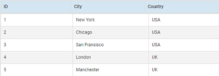
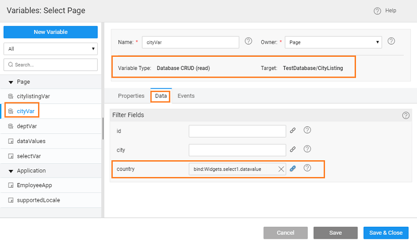
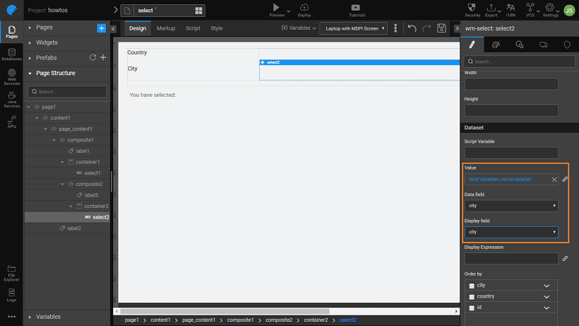

One can drive the content of a Select widget based upon the selection of another Select widget. For example, a user is provided with a list of Countries and based upon the selection, a list of Cities is displayed for selection from a second list. Let us see how to achieve this in WaveMaker. **Note**: We are using a dataset CityListing which contains the country and city details. 

1. Drag and drop two Select and one Label widgets onto the canvas.
2. [Create a Database CRUD Variable](./how-tos/assets/img/var_sel.png) for the above CityListing table (say, _citylistingVar_). 
3. Bind the first Select widget to the _citylistingVar _dataset. Set the Display Field and Data Field to the Country field of the dataset. 
4. [Create another Database CRUD variable](./how-tos/assets/img/var_sel.png) (say, _cityVar_), bind it to the CityListing dataset and set filter on the Country field to the Country Select widget datavalue. 
5. Bind the second Select widget to the variable (_cityVar) _created in the above step. Set the Display Field and Data Field to the City field. 
6. Run the application, select country and see the city list change.

<!-- <!-- [Select Use Cases](/learn/app-development/widgets/form-widgets/select-use-cases/) --> -->

- [1. How to use list of values for select widget configuration](./configuring-select-widget-static-list-values.md)
- [2. How to use variable for select widget configuration](./configuring-select-widget-variable.md)
- [3. How to use display and data value fields for select widget configuration](./configuring-select-widget-display-data-fields.md)
- [4. How to use database fields for select widget configuration](./configuring-select-widget-database-fields.md)
- [5. How to configure cascading select](./configuring-cascading-select.md)
